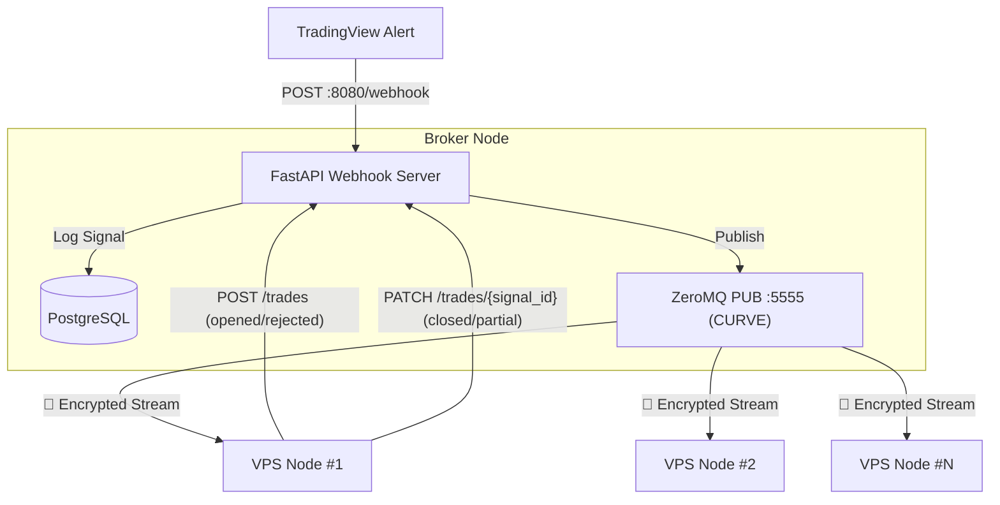

# 🚀 Algo Trading MT5 Worker

This is the execution-end of the Event-Driven trading system. It acts as a ZeroMQ subscriber waiting for highly structured trading signals from the central Broker, then executes them directly into the MetaTrader 5 Terminal.

## 🏗️ System Architecture



---

## 📂 Project Structure

```text
worker/
├── core/                # Signal processing logic
│   └── signal_handler.py # Routes signals to correct MT5 execution flow
├── mt5/                 # MetaTrader 5 integration
│   ├── mt5.py           # MT5 terminal connection bridge
│   └── executor.py      # MT5 trade execution primitives
├── schemas/             # Pydantic data schemas
│   └── broker_schema.py # Signal & position validation schemas
├── services/            # Business & Infrastructure services
│   ├── callback_service.py      # HTTP callbacks to broker (POST/PATCH /trades)
│   ├── db_service.py            # Database access layer
│   ├── mt5_process.py           # MT5 subprocess manager
│   ├── notifications_service.py # Telegram notification logic
│   └── zmq_service.py           # ZeroMQ signal subscriber
├── app.py               # Application factory & process lifespan
├── db.py                # Local SQLite persistence layer
├── logger.py            # Structured logging configuration
├── main.py              # Application entry point
└── settings.py          # Environment & app configuration
```

---

## 🧠 Signal Execution Logic

Every incoming signal is parsed into a `SignalSchema` and passed to `SignalHandler.handle()`, which routes it to the correct MT5 execution sequence based on the `action` field.

### Action Groups

| Group | Action(s) | MT5 Behaviour |
| --- | --- | --- |
| **1 — Entry** | `LONG` / `SHORT` | Force-close any stale position → open a fresh market order with hard SL set on the server |
| **2 — Partial Exit** | `TP1` | Partial close using signal `quantity` converted to lots → move remaining position SL to breakeven (`price_open`) |
| **3 — Full Exit** | `TP2` / `SL` / `R_SL` | Close ALL open lots using **actual MT5 `position.volume`** — signal `quantity` is intentionally ignored |

### Key Design Decisions

- **Stale position cleanup (Entry):** Before opening any new LONG/SHORT, the handler queries MT5 and force-closes any leftover position for that symbol. This prevents accidental hedging and guarantees each cycle starts flat.

- **Ticket-linked partial close (TP1):** The partial close request always carries the original `position=ticket` so MT5 correctly treats it as a partial close rather than an opposing hedge order.

- **Actual volume on full close (TP2/SL/R_SL):** The signal `quantity` is **never used** for full exit calculations. The handler reads the live `position.volume` directly from MT5 to avoid dust-lot rounding errors.

- **Breakeven SL after TP1:** After the partial close succeeds, a `TRADE_ACTION_SLTP` request moves the server-side SL to `price_open` (entry price), protecting the remaining runner against connectivity loss.

- **GIL-isolated subprocess:** All MT5 and ZMQ blocking code runs in a separate OS process. The parent process only manages subprocess lifetime, keeping the event loop fully responsive.

### MT5Executor Primitives (`worker/mt5/executor.py`)

| Method | Used By |
| --- | --- |
| `open_position(signal)` | Entry (Group 1) |
| `partial_close_position(symbol, volume, ticket?)` | TP1 (Group 2) |
| `update_position_sl(symbol, new_sl, ticket?)` | TP1 breakeven update |
| `close_all_positions(symbol, reason)` | Full exit (Group 3) |
| `get_open_positions(symbol)` | Pre-flight guard in all groups |
| `convert_quantity_to_lots(symbol, quantity)` | Entry & TP1 volume calc |
| `calculate_lot_size(symbol, entry, sl, risk_pct)` | Entry volume calc (risk-based) |

---

## ⚡ Quick Start

### 1. Requirements

Ensure you are running on Windows, as the Python `MetaTrader5` module restricts usage to Windows environments only.

### 2. Setup

Because we orchestrate dependencies via `uv`, setup is instantaneous.

```bash
# Creates a virtual environment and installs all dependencies from pyproject.toml
uv sync
```

### 3. Configure .env

Copy .env.example to .env and fill in the MT5 connection details (Exness Demo/Real) along with the ZeroMQ Broker configuration.

```bash
cp .env.example .env
```

Please ensure that you have enabled "Allow Algo Trading" inside Options > Expert Advisors of the MetaTrader 5 Terminal.

### 4. Operation

Start the Worker (from the root directory):

```bash
make start
```

The Worker will initialize the `worker_data.sqlite` database, connect to MT5 in an isolated subprocess, and open a Subscribe socket to ZeroMQ. You can monitor the logs printed directly to the screen.
