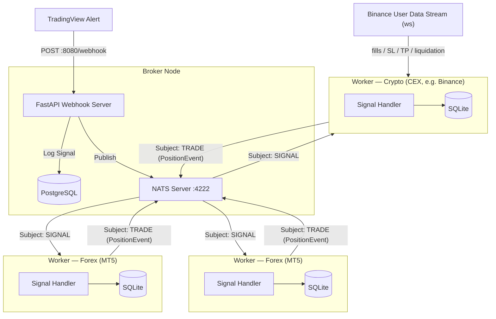
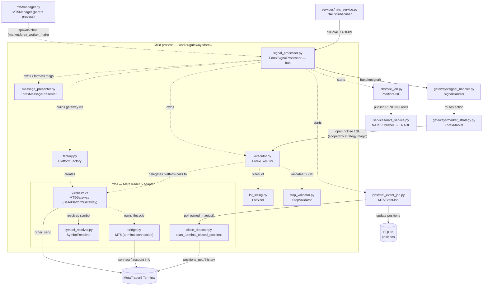

# 🚀 Algo Trading Worker

This is the execution-end of the Event-Driven trading system. It acts as a NATS subscriber waiting for highly structured trading signals from the central Broker, then executes them on the configured market gateway — **FOREX** via the MetaTrader 5 Terminal (Windows) or **CRYPTO** via a centralized exchange such as Binance (any OS). The market is selected by `MARKET_TYPE`, and the two paths share the same NATS/SQLite/notification core through a factory + Template-Method design.

---

## ⚡ Quick Start

### 1. Requirements

Depends on the market:

- **FOREX (`MARKET_TYPE=FOREX`)** must run on **Windows** — the `MetaTrader5` module and the MT5 terminal are Windows-only.
- **CRYPTO (`MARKET_TYPE=CRYPTO`)** is pure Python (REST + websocket) and runs on **any OS** (Linux, macOS, Windows) — no MT5/MetaTrader5 dependency.

### 2. Setup

Because we orchestrate dependencies via `uv`, setup is instantaneous.

```bash
# Creates a virtual environment and installs all dependencies from pyproject.toml
uv sync
```

### 3. Configure .env

Run the interactive initializer — it creates `.env` from `.env.example` (or updates an existing one in place) and walks you through every setting:

```bash
make init
```

- **Defaults everywhere** — each variable shows a default (your current `.env` value if present, otherwise the `.env.example` default); press Enter to keep it.
- **Market-aware** — pick `MARKET_TYPE` (`FOREX` or `CRYPTO`) and it prompts only for the matching credential group: **MT5 connection** for FOREX, or **Crypto CEX / exchange API keys** for CRYPTO.
- **Re-runnable** — existing values are reused as defaults and edited in place (no duplicates); a timestamped `.env.bak-*` backup is written before each update.

The full list of variables and their defaults lives in [`.env.example`](.env.example).

> **FOREX only:** enable **Allow Algo Trading** under *Options → Expert Advisors* in the MetaTrader 5 Terminal before starting the worker.

### 4. Operation

Start the Worker (from the root directory):

```bash
make start
```

The Worker initialises the `worker_data.sqlite` database, starts the market worker, and subscribes to the configured NATS subjects. The worker runs differently per market:

- **FOREX** — in an isolated child **process** (GIL isolation for the MetaTrader5 C extension), supervised by a watchdog. Daemon threads inside it: MT5 health-check, `MT5EventJob` (terminal-close detection), `PositionCDC`, and `NotificationJob`.
- **CRYPTO** — in a background **thread** (the pure-Python gateway needs no process isolation). Daemon threads: the exchange user-data event stream (Binance websocket), `CryptoReconcileJob` (missed-fill safety net), `PositionCDC`, and `NotificationJob`.

You can monitor the logs printed directly to the screen. Both markets start the same way (`make start`); `MARKET_TYPE` decides which gateway is loaded.

---

## 📖 Key Concepts

### Market

The `MARKET_TYPE` environment variable defines which trading market the worker operates on:

| Value | Description |
| --- | --- |
| `FOREX` | Foreign exchange — instruments like `XAUUSD`, `EURUSD`, etc. Execution goes through the **MT5** gateway (Windows only). |
| `CRYPTO` | Cryptocurrency — perpetual futures on instruments like `BTCUSDT`. Execution goes through a **CEX** gateway (any OS). |

The market type drives the entire execution path: which gateway is loaded, which environment variables are required, and whether the worker runs as a subprocess (FOREX) or a background thread (CRYPTO).

### Gateway

A gateway is the integration layer between this worker and the actual trading platform. Each market has its own gateway implementation:

| Market | Gateway | Technology |
| --- | --- | --- |
| `FOREX` | **MT5** (`worker/gateways/forex/mt5/`) | MetaTrader 5 terminal via the `MetaTrader5` C extension. Windows-only. Managed as an isolated child process due to GIL constraints. |
| `CRYPTO` | **CEX** (`worker/gateways/crypto/`) | Centralized Exchange via REST + WebSocket. Exchange-agnostic by design — the first concrete implementation is **Binance** Futures (`worker/gateways/crypto/binance/`). Adding a new exchange only requires implementing `BaseExchangeGateway` and registering it in `ExchangeFactory`. |

The selected gateway handles all order execution, position queries, and real-time event streaming (MT5 terminal events for FOREX; exchange user-data WebSocket for CRYPTO). Business logic above the gateway layer is market-agnostic.

---

## ⏰ Clock sync / NTP requirement (CRYPTO)

Binance rejects any **signed** request whose timestamp runs more than **1000 ms
ahead** of server time (error `-1021`); `recvWindow` only forgives a clock that
is *behind*, so it cannot rescue a fast clock. The worker self-defends — it
measures the offset against Binance at `connect()` and re-syncs + retries once on
a `-1021` — but that is a safety net, not a substitute for a correct host clock.

**Fix the source: keep the host clock disciplined by NTP.**

- **Linux host (VPS / server):** enable a time daemon —
  `sudo timedatectl set-ntp true` (systemd-timesyncd), or install `chrony`
  (`sudo apt install -y chrony && sudo systemctl enable --now chrony`). Verify
  with `timedatectl` / `chronyc tracking`.
- **Windows host:** make sure the Windows Time service is running and synced —
  `w32tm /resync` (and `w32tm /query /status` to verify). Clocks commonly drift
  after the machine sleeps/hibernates, the usual cause of `-1021` in dev.

**Verify:** the worker logs the measured skew at startup —
`[Binance] Clock offset vs server: <X> ms (rtt=… ms)`. After NTP is healthy this
should be a few tens of ms (≈ rtt), not seconds. A large offset there, or
repeated `-1021 … re-syncing` warnings, means the host clock is not disciplined.

---

## 🏗️ System Architecture



### Crypto (CEX) integration

`MARKET_TYPE=CRYPTO` selects the crypto worker instead of the MT5 worker. The
crypto path is fully **exchange-agnostic** via the factory pattern and never
imports MetaTrader5 or any `worker.gateways.forex.mt5.*` module:

| Layer | Type | Role |
| --- | --- | --- |
| `worker/gateways/crypto/base.py` | `BaseExchangeGateway` (ABC) | CEX contract: orders, positions, stops, account |
| `worker/gateways/crypto/factory.py` | `ExchangeFactory` | Builds the configured exchange (first: Binance) |
| `worker/gateways/crypto/binance/gateway.py` | `BinanceFuturesGateway` | Binance USDⓈ-M Futures REST via the official `binance_common` transport (signing, retries, rate-limit errors) |
| `worker/gateways/crypto/binance/user_data_stream.py` | `BinanceUserDataStream` | Official-SDK websocket User Data Stream ingesting fills / SL / TP / liquidation / external manual closes (+ pure parser) |
| `worker/gateways/crypto/executor.py` | `CryptoExecutor` | Implements the generic executor protocol over a gateway |
| `worker/gateways/crypto/signal_processor.py` | `CryptoSignalProcessor` | NATS loop + executor/handler + crypto jobs |
| `worker/gateways/crypto/reconcile_job.py` | `CryptoReconcileJob` | Periodic reconciler — diffs DB-open rows against live exchange positions in both directions: marks missed closes, and imports untracked live positions as `MANUAL`-strategy DB rows; two-scan confirmation either way |

Adding a new exchange = implement `BaseExchangeGateway` + register it in
`ExchangeFactory`. No business-logic change.

Binance specifics use the **official** `binance-sdk-derivatives-trading-usds-futures`
(and its `binance_common` transport): REST calls go through `binance_common.send_request`
(HMAC signing, timestamps, retries/backoff, typed rate-limit errors) and the User
Data Stream uses the SDK websocket (auto-reconnect). All of this lives only inside
`worker/gateways/crypto/binance/` — the gateway abstraction keeps it out of the
executor/strategy/processor, so it never leaks upward.

Required env when `MARKET_TYPE=CRYPTO` (Binance): `CRYPTO_API_KEY`,
`CRYPTO_API_SECRET`, `CRYPTO_ACCOUNT_ID`, and `CRYPTO_QUOTE_ASSET` (defaults to
`USDT`) — enforced by the settings validator. `CRYPTO_EXCHANGE` defaults to
`BINANCE`; `CRYPTO_TESTNET` is optional, and `CRYPTO_HEDGE_MODE` (default
`true`) is the Position Mode the worker enforces on the account at startup (see
below). MT5 credentials are **not** required. See `.env.example`.

### Position Mode — Hedge vs One-way (CRYPTO / Binance)

Binance Futures accounts run in one of two **Position Modes**. Rather than
relying on the operator to set it on the exchange (Binance app/web → Futures →
Preferences → Position Mode), the worker **reconciles** the account into
`CRYPTO_HEDGE_MODE` right after connecting — the generic
`BaseExchangeGateway.set_position_mode()` hook, implemented by the Binance
gateway via `POST /fapi/v1/positionSide/dual`. So `CRYPTO_HEDGE_MODE` is the
mode the worker *drives the account into*, and it selects the order payload:

| `CRYPTO_HEDGE_MODE` | Exchange mode | Order payload |
| --- | --- | --- |
| `true` (default) | Hedge | Every order (market open/close, stop-loss, take-profit) carries an explicit `positionSide` (`LONG`/`SHORT`); `reduceOnly` is omitted entirely — Binance rejects it in Hedge Mode. |
| `false` | One-way | No `positionSide` sent; `reduceOnly` marks closing orders instead. Binance infers direction from `side` alone. |

The switch is best-effort: Binance returns `-4059` ("*No need to change
position side.*") when the account is already in the requested mode (treated as
success), and can reject the switch (e.g. `-4068`) when open positions or orders
exist — that is logged and the worker proceeds on the account's current mode, in
which case a mismatch still surfaces as Binance error `-4061` ("*Order's
position side does not match user's setting.*") on the first order.

The worker still only ever tracks **one net position per symbol** regardless
of this setting: it does not open or manage simultaneous LONG and SHORT
positions on the same symbol even when the account is in Hedge Mode. Strategy
isolation on a shared symbol remains logical-only, as described in [Signal
Execution — Key Design Decisions](#-signal-execution--key-design-decisions).

### Per-symbol leverage initialisation (CRYPTO)

USDⓈ-M futures leverage is **sticky on the exchange**: whatever value was set
the last time on a symbol (manually in the UI or by a previous worker run) is
what the next order is sized against. Without an init pass, a sub-account
capped at 5x can silently leave a symbol at its old 20x setting (or vice
versa), and an order can fail with `-2019 Margin is insufficient` even when
risk-sizing math is correct.

`CryptoSignalProcessor` runs `LeverageInitJob` on demand, triggered by a `SYSTEM`
`CRYPTO_LEVERAGE_INIT` message — normally returned by the broker as the direct
reply to this worker's `WORKER_CONNECTED` handshake (see
[SYSTEM Subject](#-system-subject)), so the pass still effectively happens right
after connect without the worker needing to run it itself. For each symbol in
`CRYPTO_LEVERAGE_INIT_SYMBOLS`:

1. `gateway.get_max_leverage(symbol)` (Binance: `GET /fapi/v1/leverageBracket`)
   returns the account-side ceiling. Sub-account / VIP caps are reflected here
   automatically — a sub-account limited to 5x returns 5; an unrestricted
   account returns the exchange-wide max (e.g. 125 for BTCUSDT).
2. The target is `min(exchange_max, MAX_LEVERAGE_CAP)`.
3. `gateway.set_leverage(symbol, target)` (Binance: `POST /fapi/v1/leverage`)
   applies it.

Some account-level caps (sub-account / VIP tier) are **not** exposed by
`leverageBracket` and surface only when `set_leverage` is POSTed, as a `-4421`
rejection whose message names the real ceiling (e.g. *"…greater than 5x"*). The
gateway parses that ceiling and retries once at it, so the symbol still lands on
its true limit instead of being abandoned. If Binance ever rewords the message
so the parser misses it, `set_leverage` retries one last time at
`min(MIN_LEVERAGE_CAP, target)` — a known-safe floor — rather than leaving the
symbol at its dangerous default. If the account is restricted below that floor,
the retry also fails and the symbol is logged for manual fixing.

| Env var | Default | Purpose |
| --- | --- | --- |
| `CRYPTO_LEVERAGE_INIT_SYMBOLS` | empty (skip) | Comma-separated raw signal symbols to initialise (`BTCUSDT.P,ETHUSDT.P` or `BTCUSD,ETHUSD`). Resolved through the executor's symbol resolver, so the form mirrors how upstream signals address the symbol. |
| `MAX_LEVERAGE_CAP` | `10` | Upper bound applied per symbol. A sub-account at 5x lands on 5; an unrestricted account lands on this cap. |
| `MIN_LEVERAGE_CAP` | `5` | Last-resort floor used only when a `-4421` account cap cannot be parsed from the error message. Set to the lowest leverage your sub-accounts can take; if an account is restricted below it, the retry still fails and the symbol is left for manual fixing. |

Failure modes are isolated: a failed `get_max_leverage` (network blip, symbol
typo) skips that symbol with a warning and **never falls back to the cap**
blindly — picking the cap for an account that is actually limited to 5x is
the failure mode this job exists to prevent. Any uncaught crash inside the
job is logged and swallowed so the worker keeps running; symbols are left at
their current exchange-side leverage until the next `CRYPTO_LEVERAGE_INIT`
trigger.

The pass can be re-triggered at any time — without restarting the worker — via
another `SYSTEM` `CRYPTO_LEVERAGE_INIT` message, which may also override the
symbol set and cap for that one run.

---

## 🧩 FOREX Gateway Module Flow (`worker/gateways/forex/`)

How the FOREX files wire together at runtime. `ForexSignalProcessor` is the hub: it builds the platform gateway via `PlatformFactory` (today an `MT5Gateway` — the **only** MT5-coupled code), wraps it in a platform-agnostic `ForexExecutor` (with `LotSizer` + `StopValidator`), formats messages via `ForexMessagePresenter`, and starts the background jobs. The `MT5Gateway` owns the terminal connection (`bridge`) and symbol resolution (`SymbolResolver`). The handler and market strategy are market-agnostic and shared with CRYPTO. Solid arrows are the live signal path; dotted arrows are composition (who builds/owns whom).



---

## 📂 Project Structure

```text
worker/
├── gateways/            # External trading-platform integrations + shared signal pipeline
│   ├── config.py                 # ExecutionConfig value object (risk/volume params)
│   ├── market_strategy.py        # MarketStrategyFactory + ExecutorBackedMarket / Forex / Crypto
│   ├── processor.py              # BaseSignalProcessor — shared NATS loop (Template Method)
│   ├── signal_handler.py         # Routes signals to the correct execution flow
│   ├── forex/           # FOREX — platform-agnostic layer + per-platform adapters (mt6 slots in beside mt5)
│   │   ├── base.py                   # BasePlatformGateway (ABC) + SymbolSpec / Tick / PlatformPosition
│   │   ├── factory.py                # PlatformFactory — selects the forex platform
│   │   ├── executor.py               # ForexExecutor (TradeExecutorProtocol)
│   │   ├── lot_sizing.py             # LotSizer — risk-based lot-size math
│   │   ├── stop_validator.py         # StopValidator — SL/TP distance validation
│   │   ├── message_presenter.py      # ForexMessagePresenter (Telegram strings)
│   │   ├── signal_processor.py       # ForexSignalProcessor — forex hooks over the base
│   │   └── mt5/             # First concrete platform — MetaTrader 5 (Windows only)
│   │       ├── gateway.py            # MT5Gateway (BasePlatformGateway over the MetaTrader5 C extension)
│   │       ├── bridge.py             # MT5 terminal connection lifecycle (initialize/login/shutdown)
│   │       ├── symbol_resolver.py    # SymbolResolver — base → tradeable platform symbol
│   │       ├── close_detector.py     # Terminal-close event scanner (polling)
│   │       └── manager.py            # MT5Manager (alias of WorkerProcessManager)
│   └── crypto/          # CRYPTO — centralized exchanges (CEX); any OS
│       ├── base.py                   # BaseExchangeGateway (ABC) + ExchangePosition
│       ├── executor.py               # CryptoExecutor (TradeExecutorProtocol)
│       ├── factory.py                # ExchangeFactory — selects the CEX
│       ├── message_presenter.py      # CryptoMessagePresenter
│       ├── reconcile_job.py          # CryptoReconcileJob — missed-fill safety-net + manual-position import (two-scan confirmation)
│       ├── signal_processor.py       # CryptoSignalProcessor — crypto hooks over the base
│       └── binance/                  # First concrete exchange
│           ├── gateway.py            # BinanceFuturesGateway (official binance_common transport)
│           └── user_data_stream.py   # BinanceUserDataStream (official-SDK websocket) + parser
├── interfaces/          # Protocol types for dependency inversion
│   ├── db_protocol.py            # Segregated persistence protocols
│   ├── executor_protocol.py      # TradeExecutorProtocol (broker-neutral)
│   ├── mt5_executor_protocol.py  # MT5ExecutorProtocol (legacy alias)
│   ├── mt5_gateway_protocol.py   # Mt5GatewayProtocol (MetaTrader5 surface, used by MT5Gateway)
│   ├── publisher_protocol.py     # MessagePublisherProtocol
│   ├── message_sender_protocol.py # MessageSenderProtocol (notifier send_message contract)
│   └── trade_presenter_protocol.py # TradePresenterProtocol
├── jobs/                # Background polling jobs (daemon threads)
│   ├── cdc_job.py                # PositionCDC — Change Data Capture to NATS TRADE
│   ├── mt5_event_job.py          # MT5EventJob — terminal-close detection (FOREX)
│   └── notification_job.py       # NotificationJob — outbox dispatcher (Telegram retries)
├── schemas/             # Pydantic / dataclass data schemas
│   ├── admin_schema.py           # AdminActionEnum + AdminMessageSchema + Specific action Schema (NATS ADMIN subject)
│   ├── job_schema.py             # LogAuthorEnum (broker / terminal / exchange)
│   ├── trade_result.py           # TradeResult value object (ok()/fail() factories)
│   ├── metatrader_schema.py      # Back-compat re-export of TradeResult
│   ├── nats_schema.py            # NatsSubjectEnum (SIGNAL, ADMIN, SYSTEM, TRADE)
│   ├── notification_schema.py    # NotificationPlatformEnum / NotificationChannelEnum / NotificationModeEnum
│   ├── position_schema.py        # PositionStatusEnum + PositionEvent / PositionEventType
│   └── signal_schema.py          # Signal validation schemas
├── services/            # Infrastructure services
│   ├── db_service.py             # Persistence facade (positions, logs, outbox)
│   ├── nats_service.py           # NATSSubscriber & NATSPublisher (over the NatsClient lifecycle)
│   └── notification_service.py   # TelegramNotification + OutboxNotifier wrapper
├── db/                  # SQLite persistence layer
│   ├── connection.py             # Connection factory
│   ├── repository.py             # SQL + gateway-neutral column ↔ app-domain mapping
│   └── schema.py                 # Table DDL (gateway-neutral columns)
├── utils/               # Shared utilities
│   └── logging.py                # Structured logging helpers
├── app.py               # Application factory, FastAPI lifespan
├── context.py           # WorkerContext — market-agnostic services (DB, notifiers, outbox)
├── logger.py            # Structured logging configuration
├── main.py              # Application entry point
├── market.py            # Gateway orchestrators (FOREX=process, CRYPTO=thread) + worker entry points + factory
├── nats_client.py       # NatsClient — single NATS connection lifecycle in a daemon thread
├── process_manager.py   # WorkerProcessManager — generic subprocess supervisor
├── worker_runtime.py    # run_worker() — shared child-process bootstrap
└── settings.py          # Environment & app configuration (per-market validation)
```

---

## 🧠 Signal Execution Logic

Every incoming signal is parsed into a `SignalSchema` and passed to `SignalHandler.handle()`, which routes it — based on the `action` field — to the correct method on the market-agnostic `BaseMarketStrategy` (`ForexMarket` or `CryptoMarket`). The action-group logic below is identical for both markets; only the concrete executor/gateway underneath differs.

### Action Groups

| Group | Action(s) | Behaviour |
| --- | --- | --- |
| **1 — Entry** | `LONG` / `SHORT` | Force-close any stale position for the same strategy → open a fresh market order with a hard SL set on the broker/exchange server. Gated by `MAX_OPEN_ORDERS`: an entry that would exceed the open-position cap is rejected (status `REJECTED`) and never sent to the broker — see [Key Design Decisions](#-signal-execution--key-design-decisions). |
| **2 — Partial Exit** | `TP1` | Partial close using the resolved TP1 percent of live volume (or signal `quantity` when `VOLUME_DECISION_ENABLED=false`) → optionally move remaining SL to breakeven (`price_open`). TP1 percent and breakeven flag are resolved from the signal (`tp1_percent`, `move_sl_to_be`) or overridden by config (`USE_CUSTOM_POSITION_TP1_PERCENT` / `TP1_MOVE_SL_TO_BREAKEVEN`). |
| **3 — Full Exit** | `TP2` / `SL` / `R_SL` | Close ALL open volume using the **actual live `position.volume`** — signal `quantity` is intentionally ignored |
| **4 — Flat** | `FLAT` | Close all `OPENED`/`TP1` positions for the strategy+symbol at market price, marks status `FLATTED` |

#### Scale-In (Averaging) Positions

A signal may carry an optional `is_scale_position` boolean and a nested `scaling` object (`tp`, `sl`, `quantity`). **The broker has already applied these multipliers** — `sl`, `tp1`, `tp2`, and `quantity` arrive as their final, scaled values. The `scaling` object is passed through as metadata only. The worker therefore uses the payload's SL/TP/quantity **verbatim** for order entry, notifications, and persistence; it never re-scales them.

The one exception is risk-based sizing. When `VOLUME_DECISION_ENABLED=true`, the worker computes the entry volume itself from risk/capital/SL and **ignores** `signal.quantity`. To keep a scale-in entry proportional, the executor re-applies `scaling.quantity` to that self-computed volume (sizing is linear in risk, so the lot/qty scales by the same factor). `scaling.tp`/`scaling.sl` are never re-applied.

| Mode | What sizes the entry | Where `scaling.quantity` applies |
| --- | --- | --- |
| `VOLUME_DECISION_ENABLED=false` (payload-quantity) | `signal.quantity` (already broker-scaled) | Not re-applied — used as-is |
| `VOLUME_DECISION_ENABLED=true` (risk sizing) | risk % / capital / SL → computed volume | Re-applied to the computed volume |

A signal without `is_scale_position: true` is passed through untouched (any `scaling` object is ignored), and an absent `scaling.quantity` leaves the computed volume unchanged.

```json
{
  "strategy": "MT5_GOLD_M5_V1",
  "timestamp": "2026-04-18T21:55:00Z",
  "action": "LONG",
  "symbol": "XAUUSD",
  "price": 2000.0,
  "quantity": 1.0,
  "sl": 1791.0,
  "tp1": 2222.0,
  "tp2": 2255.0,
  "is_scale_position": true,
  "scaling": { "tp": 1.1, "sl": 0.9, "quantity": 2.0 }
}
```

With the payload above, the worker executes against the SL/TP/quantity exactly as sent (`tp1=2222.0`, `tp2=2255.0`, `sl=1791.0`, `quantity=1.0`). In payload-quantity mode it enters `1.0`; in risk-sizing mode it computes the lot from risk and then multiplies by `scaling.quantity` (`2.0`).

#### FLAT Payload (minimal — no price/quantity required)

```json
{
  "strategy": "MT5_GOLD_M5_V1",
  "timestamp": "2026-04-18T21:55:00Z",
  "action": "FLAT",
  "symbol": "XAUUSD"
}
```

---

## 🛡️ ADMIN Subject

ADMIN carries out-of-band administrative commands that operate outside the normal strategy signal flow, all handled by the shared `BaseSignalProcessor._handle_admin_message`. Messages travel on **one of two subjects**:

| Subject | Name | Scope | Routing fields |
| --- | --- | --- | --- |
| **Public** | `ADMIN` | Fanned out by the broker to every worker | `market` / `gateway` **optional** filters — **no `account_id`** |
| **Private** | `ADMIN.<market>.<gateway>.<account_id>` | Addressed to exactly one worker | `market` / `gateway` / `account_id` **required** |

Every worker subscribes to the public `ADMIN` subject **and** to its own private `ADMIN.<market>.<gateway>.<account_id>` subject (built from `MARKET_TYPE`, the gateway/platform setting, and the account id — `MT5_LOGIN` for FOREX, `CRYPTO_ACCOUNT_ID` for CRYPTO). This lets the broker target a single account precisely without fanning a message out to everyone.

`AdminActionEnum` actions: **`FLAT`** (both subjects — close positions), and **`BLOCK_SIGNAL`** / **`ALLOW_SIGNAL`** (private subject only — toggle whether the worker executes incoming SIGNALs).

### Action: `FLAT`

Closes open positions across one or more strategies/symbols in a single command.

#### Public subject (`ADMIN`)

The broker fans a public FLAT out to every worker; each filters only on the **optional** `market`/`gateway` dimensions. A public FLAT carries **no `account_id`** (the public subject is not account-scoped — a stray `account_id` field is ignored).

| Filter | Behaviour when present |
| --- | --- |
| `market` | Silently ignored if it does not match the worker's `MARKET_TYPE`; processed normally if it matches or is absent |
| `gateway` | Silently ignored if it does not match the worker's gateway/platform setting (`MT5_PLATFORM` for FOREX, `CRYPTO_EXCHANGE` for CRYPTO); processed normally if it matches or is absent |
| `strategy` | Restricts close to positions whose `strategy` column equals this value |
| `symbol` | Restricts close to positions for this symbol |

Omitting `market`/`gateway`/`strategy`/`symbol` closes every tracked open position on every worker that receives it.

```json
{
  "action": "FLAT",
  "timestamp": "2026-06-02T08:00:00+00:00",
  "strategy": "my_strategy",
  "symbol": "XAUUSD",
  "market": "FOREX",
  "gateway": "MT5"
}
```

#### Private subject (`ADMIN.<market>.<gateway>.<account_id>`)

An account-scoped FLAT is published to a worker's private subject. Here `market`, `gateway`, and `account_id` are **required**: the subject already addresses one worker, and the worker re-validates that all three fields match its own identity before acting (defence-in-depth against a misrouted publish). `account_id` alone is **not** a unique worker identity — the same raw id can collide across markets/gateways (e.g. an email used as `account_id` also matching a CRYPTO gateway name), which is exactly why the full composite `market`/`gateway`/`account_id` is required and re-checked. `strategy`/`symbol` remain optional close filters.

```json
{
  "action": "FLAT",
  "timestamp": "2026-06-02T08:00:00+00:00",
  "strategy": "my_strategy",
  "symbol": "XAUUSD",
  "market": "FOREX",
  "gateway": "MT5",
  "account_id": "123456"
}
```

#### Execution flow

The broker/exchange is always the source of truth: live positions are closed **first**, then the DB is reconciled against what actually closed.

1. Parse the envelope (`AdminMessageSchema`); drop silently on validation error, and dispatch by `action` (`FLAT` below; `BLOCK_SIGNAL`/`ALLOW_SIGNAL` handled separately). An unknown action is logged and ignored.
2. Parse the subject-specific payload — `AdminFlatSchema` (public) or `PrivateAdminFlatSchema` (private, which requires `market`/`gateway`/`account_id`); drop silently on validation error.
3. Route to this worker: on the **public** subject, skip unless the optional `market`/`gateway` filters match; on the **private** subject, skip unless `market`/`gateway`/`account_id` all match this worker's identity. Either way, skip is silent (no log noise).
4. Ensure the broker/exchange connection; abort if unreachable.
5. **Close live positions** (`_close_live_positions_for_flat`): fetch live positions — for a given `symbol` via `get_open_positions(symbol, strategy=…)`, otherwise account-wide via `get_all_open_positions(strategy=…)` — and call `close_single_position(pos, reason="FLAT")` on each. Track every key *attempted* and the subset that *closed successfully*.
6. **Reconcile the DB** (`_reconcile_flat_db`) against the open rows matching the filter. For each DB row:
   - **Matched a successful live close** → update `status → FLATTED`, set `closed_price`/return code, send `⚡ Admin FLAT Closed` Telegram notification.
   - **Never seen live on the broker** (not in the attempted set) → already closed externally → mark `FLATTED` to sync the DB (no order sent).
   - **Close was attempted but failed** → the position is **still live**, so the row is left **OPEN** and flagged loudly for manual attention — the DB never falsely reports a position flat.

### Actions: `BLOCK_SIGNAL` / `ALLOW_SIGNAL`

Toggle whether the worker **executes incoming SIGNALs**. `BLOCK_SIGNAL` suspends signal execution; `ALLOW_SIGNAL` resumes it. Both are **account-scoped**, so they are accepted on the **private subject only** (`ADMIN.<market>.<gateway>.<account_id>`) — the same action arriving on the public `ADMIN` subject is ignored. The payload (`PrivateAdminSignalControlSchema`) requires `market` / `gateway` / `account_id`, and the worker re-validates all three against its own identity before applying the toggle.

While blocked (`_signals_blocked = True`), every incoming SIGNAL is skipped at the single execution funnel `_process_signal` — this covers **both** live signals and `RETRY_SIGNALS` replays. Open positions are **untouched**: they can still be closed out-of-band via an `ADMIN` `FLAT`, which is the escape hatch even while signals are blocked. A real state change is logged and sends a `🛑 Signals Blocked` / `✅ Signals Allowed` Telegram notification; repeating the current state is a no-op (no duplicate alert).

The flag is **in-memory only** — a worker restart resets it to *allowed*. There is no DB/schema change; if a durable block is needed, the broker can re-issue `BLOCK_SIGNAL` after the worker re-announces `WORKER_CONNECTED`.

```json
{
  "action": "BLOCK_SIGNAL",
  "timestamp": "2026-06-02T08:00:00+00:00",
  "market": "FOREX",
  "gateway": "MT5",
  "account_id": "123456"
}
```

### Key Design Decisions

- **Broker is the source of truth (close-first, then reconcile):** A DB row is marked `FLATTED` only when its live close actually succeeded *or* the position was never live on the broker. A row whose close was attempted but *failed* is deliberately left OPEN, so the DB can never claim a position is flat while it is still live.
- **Per-market match key, not symbol-only:** The admin FLAT correlates each live position with its DB row via `_flat_match_key` / `_flat_db_match_keys` — FOREX matches by ticket (checking both `ref_id` and `ref_source_id` so re-ticketed positions still match), CRYPTO by resolved exchange symbol. Two FOREX strategies running the same symbol are therefore handled independently.
- **Graceful handling of already-closed positions:** If a position is tracked in SQLite but no longer live on the broker, it is marked `FLATTED` without sending a close order, so the DB stays consistent even after a connectivity gap.
- **`PositionCDC` propagation:** After status updates, the CDC job picks up the `PENDING` rows and publishes `PositionEvent(event=UPDATED, status=FLATTED, …)` to the Broker via the NATS `TRADE` subject — no special handling required.

---

## 🚦 SYSTEM Subject

The `SYSTEM` NATS subject carries operational/maintenance commands that drive worker-side actions outside the trade-signal flow (no order is placed). Inbound messages are received by `BaseSignalProcessor._handle_system_message`, which validates the common envelope (`action` + `timestamp`) and dispatches the action to the market-specific `_handle_system_action` hook. An action a market does not understand is logged and ignored — so a `SYSTEM` message meant for another market type is harmless. FOREX currently handles no inbound `SYSTEM` actions besides the `WORKER_CONNECTED` reply.

### WORKER_CONNECTED handshake (request/reply)

Right after connecting to NATS, `BaseSignalProcessor._announce_worker_connected` sends `WORKER_CONNECTED` on `SYSTEM` as a NATS **request** (`nc.request`, not a fire-and-forget publish) so the broker always replies on a private inbox rather than staying silent. The broker's reply is one of three actions:

| Reply action | Meaning | Worker behaviour |
| --- | --- | --- |
| `CRYPTO_LEVERAGE_INIT` | Crypto worker, config attached | Routed through the normal `_handle_system_action` hook — applies `symbols` + `default_leverage` exactly as if received on the subscription (see below); handshake complete |
| `WORKER_CONNECTED_ACK` | Non-crypto (or no init needed) | Handshake complete, nothing further to apply |
| `WORKER_CONNECTED_ERROR` | Broker received it but couldn't process it (missing settings, invalid leverage config, …) | Logged with `reason` for operator attention; not retried — a config problem on the broker side isn't fixed by resending the same request |

If the broker doesn't reply within the request timeout (5s), the worker retries with backoff (5s → 10s → 20s, capped) **indefinitely** — the handshake is idempotent on the broker side and gates trading (crypto specifically needs `default_leverage` before it's safe to size an order), so the worker blocks here rather than falling back to running without config. A random 0–500ms jitter is added before the very first attempt only, to desynchronise a reconnect storm (every connected worker reconnects and re-announces at roughly the same instant after a NATS/broker restart). From the 3rd consecutive timeout onward, the retry log escalates from `WARNING` to `ERROR` so it's forwarded to Telegram (`TelegramLogHandler`), alerting an operator that the broker looks unreachable rather than just transiently slow.

The worker still keeps its normal `SYSTEM` subscription for `CRYPTO_LEVERAGE_INIT` regardless of the reply above: an older broker that hasn't been updated yet falls back to a plain `publish` (no reply), and a pre-request-reply worker still receives `CRYPTO_LEVERAGE_INIT` the old way — so broker and worker upgrades can roll out independently, in either order.

#### WORKER_CONNECTED Payload (worker → broker, request)

```json
{
  "action": "WORKER_CONNECTED",
  "account_id": "CRYPTO-BINANCE-7654321",
  "timestamp": "2026-06-30T00:00:00+00:00",
  "market": "CRYPTO",
  "gateway": "BINANCE"
}
```

#### WORKER_CONNECTED_ERROR Payload (broker → worker, reply)

```json
{
  "action": "WORKER_CONNECTED_ERROR",
  "account_id": "CRYPTO-BINANCE-7654321",
  "timestamp": "2026-06-30T00:00:00+00:00",
  "reason": "missing leverage settings for account"
}
```

### Action: `CRYPTO_LEVERAGE_INIT` (CRYPTO)

Runs the [per-symbol leverage initialisation](#per-symbol-leverage-initialisation-crypto) pass — the only way it runs, since there is no longer a startup pass. Normally returned by the broker as the reply to this worker's `WORKER_CONNECTED` handshake (see above); can also be sent standalone (subscription fallback) after editing a sub-account's leverage cap or onboarding new symbols.

| Field | Behaviour when present | Behaviour when omitted |
| --- | --- | --- |
| `symbols` | Initialise exactly this list of raw signal symbols | Falls back to `CRYPTO_LEVERAGE_INIT_SYMBOLS` |
| `default_leverage` | Used as the cap — each symbol is set to `min(exchange_max, default_leverage)` | Falls back to `MAX_LEVERAGE_CAP` |

#### CRYPTO_LEVERAGE_INIT Payload

```json
{
  "action": "CRYPTO_LEVERAGE_INIT",
  "timestamp": "2026-06-30T00:00:00+00:00",
  "symbols": ["BTC", "ETH"],
  "default_leverage": 10
}
```

`action`, `timestamp` and `account_id` are required; `symbols` and `default_leverage` are optional overrides.

#### Execution flow (SYSTEM)

1. Parse `SystemSchema`; drop silently on validation error.
2. Ensure the broker/exchange connection; abort if unreachable.
3. Dispatch to `CryptoSignalProcessor._handle_system_action`, which parses `SystemCryptoLeverageInitSchema` and calls `_run_leverage_init(symbols=…, max_leverage_cap=…)`. Per-symbol failure isolation and the "never fall back to the cap blindly" guarantee are unchanged; an uncaught crash inside the job is logged and swallowed so the message never takes the worker down.

---

## 🧠 Signal Execution — Key Design Decisions

- **Per-strategy position isolation on a shared symbol:** `get_open_positions`, `close_all_positions`, `partial_close_position`, and `update_position_sl` all accept an optional `strategy` parameter that `SignalHandler` populates from `signal.strategy`. This ensures two strategies trading the same symbol (e.g. a Long-only and a Short-only strategy) cannot accidentally touch each other's positions — every entry, exit, and SL update is scoped to the originating strategy. Isolation differs per gateway:

  - **FOREX (magic-based):** Each strategy is assigned a dedicated MT5 magic number via `STRATEGY_MAGIC_MAP`. `open_position` stamps a new order with `_magic_for(signal.strategy)` and `get_open_positions(symbol, strategy)` filters live MT5 positions by that same magic — native MT5-level isolation, no DB lookup. Every FOREX strategy that trades must be mapped (an unmapped strategy raises). Closing operations stamp the closing deal with `pos.magic`, and `owned_magics()` (all mapped values) defines the magics the worker recognises as its own, used by account-wide queries (`get_all_open_positions`) and terminal-close detection (`MT5EventJob`).
  - **CRYPTO (logical):** A centralized exchange holds a single net position per symbol in one-way mode, so there is no magic equivalent (`strategy_code` is `NULL`). Strategy isolation is logical only — enforced by the one-active-per-`(strategy, symbol)` DB invariant and the `strategy` column.

- **Stale position cleanup (Entry):** Before opening any new LONG/SHORT, the handler queries the broker/exchange for stale positions belonging to the *same strategy* on that symbol and force-closes them — leaving positions from other strategies on the same symbol untouched. It then reconciles **every** active (`OPENED`/`TP1`) DB row for that `(strategy, symbol)` to `FORCED_CLOSED`, independently of whether the broker still reported a live position: a prior position may have been closed externally (exchange SL/liquidation, a manual close, or a missed close event), leaving an orphaned `OPENED` row the broker no longer reports. Clearing it is required — otherwise the fresh entry below would collide with the one-active-per-`(strategy, symbol)` unique index on insert and leave the new trade live but untracked. Only then is the new position opened.

- **Max-open-orders exposure cap (`MAX_OPEN_ORDERS`):** Before any new `LONG`/`SHORT` is sent to the broker, the shared `BaseSignalProcessor._max_open_orders_rejection` guard counts the active (`OPENED`/`TP1`) positions across **every** strategy and symbol. If the count is already at the cap, the entry is rejected: `_reject_signal` audit-logs it, inserts a `REJECTED` position row (via `PositionRepository.insert_rejected_position`), and sends an `Order Rejected` operator notification — but **no order is placed**. The `REJECTED` row is picked up by `PositionCDC` and forwarded to the broker on the `TRADE` subject with status `REJECTED`, so a blocked signal is visible end-to-end even though nothing was traded. A re-entry or scale-in on a symbol the strategy already holds **replaces** the existing position rather than opening a new slot, so it is never counted against the cap. Exits (`TP1`/`TP2`/`SL`/`R_SL`/`FLAT`) are never gated — a position can always be closed even at the cap. The guard is market-agnostic (identical for FOREX and CRYPTO); `MAX_OPEN_ORDERS=0` disables it.

- **Data self-healing on inconsistency:** `SignalHandler._get_db_position` enforces the one-active-position-per-(strategy, symbol) invariant at read time. If more than one `OPENED`/`TP1` row is found (possible after a crash before the unique index existed), the oldest row is kept and all extras are immediately marked `FORCED_CLOSED` with an explanatory comment, so the DB self-heals on the next signal rather than silently producing split-brain state.

- **SQLite as source of truth for exit signals:** Before executing any exit action (`TP1`, `TP2`, `SL`, `R_SL`), `SignalHandler` queries the local SQLite `positions` table for a tracked record matching the signal's `strategy + symbol`. If no record is found the signal is rejected — this prevents acting on untracked or already-closed positions. On success, `source_ticket` in the result is always taken from the DB record (not from the live broker ticket) so `_process_message` always updates the correct DB row, even in edge cases where the broker re-tickets a position after a partial close.

- **`source_ticket` Lifecycle Tracking:** The `source_ticket` acts as the unique identifier for a specific trading *position*. When a new trade is opened (Entry), the broker/exchange assigns an ID which becomes the `source_ticket`. When subsequent signals (`TP1`, `TP2`, `SL`, `R_SL`) arrive, they are resolved against the SQLite record to retrieve the original `source_ticket`. For a given trade, the `source_ticket` remains completely constant across its entire lifecycle. This prevents ambiguity across multiple concurrent active trades on different symbols.

- **Ticket-linked partial close (TP1):** The partial close request always carries the original `position=ticket` so MT5 correctly treats it as a partial close rather than an opposing hedge order.

- **TP1 volume — percent-based or signal quantity:** When `VOLUME_DECISION_ENABLED=true`, TP1 closes a percentage of the current live position volume instead of using `signal.quantity`. The percentage is resolved in priority order: if `USE_CUSTOM_POSITION_TP1_PERCENT=true`, always use `POSITION_TP1_PERCENT` from config; otherwise use `signal.tp1_percent` if present, falling back to `POSITION_TP1_PERCENT`. The executor's `normalize_volume()` rounds the result to the broker/exchange's quantity step and clamps it to the `[min, max]` range before sending the order.

- **Actual volume on full close (TP2/SL/R_SL):** The signal `quantity` is **never used** for full exit calculations. The handler reads the live `position.volume` directly from the broker/exchange to avoid dust-lot rounding errors.

- **Breakeven SL after TP1 (configurable):** After the partial close succeeds, whether to move the server-side SL to `price_open` (entry price) is resolved in priority order: `TP1_MOVE_SL_TO_BREAKEVEN` in config (if set, overrides everything) → `signal.move_sl_to_be` (per-trade flag from the broker) → `false` (default when neither is set). When the resolved value is `true`, `update_position_sl` moves the SL to `price_open`, protecting the remaining runner against connectivity loss (a `TRADE_ACTION_SLTP` on MT5, a `STOP_MARKET` on a CEX); if the breakeven SL cannot be placed, the runner is immediately emergency-closed. When `false`, TP1 is partial-close-only: the original entry SL stays in place.

- **Local Execution Forensics (`worker_data.sqlite`):** To aid in immediate execution debugging and lifecycle tracking natively on the VPS, every processed signal is persisted to the local `position_logs` SQLite table. This audit trail captures the full original NATS JSON message, the target order reference (`ref_id`), the originating reference (`ref_source_id`), and all execution context mapping directly back to the Broker's state.

- **GIL-isolated subprocess (FOREX only):** All MT5 and NATS blocking code runs in a separate OS process (`market.forex_worker_main`, via the shared `worker_runtime.run_worker`). The parent FastAPI process only manages subprocess lifetime via `GatewayProcessOrchestrator` + the generic `WorkerProcessManager` (`MT5Manager` is a thin alias), keeping the event loop fully responsive. The manager accepts a `worker_fn` parameter so the entry point is injectable and testable. **CRYPTO** skips this entirely: the pure-Python gateway runs in a background thread (`ThreadGatewayOrchestrator`) under the app.

- **Dependency-injection boundary — the gateway is the seam:** The `MetaTrader5` module is a native C extension that exposes a single **process-global** connection — `mt5.initialize()` / `mt5.login()` mutate ambient process state, and every `mt5.*` call implicitly targets that one connection. There is no connection *object* to construct or pass around, and because the calls are GIL-blocking the connection is confined to the child process and its daemon threads (the parent FastAPI process never imports the module at all). This dictates where dependency injection actually pays off:

  - **`ForexExecutor` depends only on a `BasePlatformGateway`** (built by `PlatformFactory`), never on MetaTrader5. The agnostic order logic — translating a signal into an order, lot-size math (`LotSizer`), stop validation (`StopValidator`) — runs against the gateway contract, so the whole order layer is unit-testable with a fake gateway and runs off-Windows. This mirrors `CryptoExecutor` over `BaseExchangeGateway`.
  - **`MT5Gateway` (the concrete adapter) takes an injected `mt5_api: Mt5GatewayProtocol`.** Its order/data methods (`place_order` / `close_position` / `modify_sl` / `get_symbol_spec` / `get_tick` / `get_positions`) hold the only `mt5.*` call-sites in the order path, so production injects the live `MetaTrader5` module while unit tests inject a `FakeMt5`. Symbol resolution (`SymbolResolver`) takes the same injected handle.
  - **`bridge.py` and `close_detector.py` deliberately call the module-global `MetaTrader5` directly.** `bridge` *owns* the singleton's lifecycle (`initialize` / `login` / `shutdown`), and `close_detector` is a free-function scanner that runs **inside the `MT5EventJob` daemon thread**, reading the very same process-global connection. There is no FastAPI-level composition root in those background threads to thread an injected handle down from, and "injecting" a singleton that can only ever have one real instance would be ceremony with no testability payoff.

- **Hard SL vs. NATS SL — callback gap (mitigated by MT5EventJob):** When a LONG/SHORT is opened, the SL is registered directly on the MT5 server (`request["sl"]`), so MT5 will auto-close the position even if the NATS signal pipeline is delayed. If the hard SL fires before the NATS `SL` signal arrives, `_handle_full_close` finds no open position, returns `success=False`, and no event is published. `MT5EventJob` closes this gap by detecting the disappearance independently and updating the SQLite `positions` table, which then triggers `PositionCDC` to publish the `TRADE` event to the Broker.

- **Notification outbox (store-and-forward):** In-process notification calls (`ctx.notifier` and `ctx.channel_notifier`) do **not** hit the Telegram API directly — they enqueue a row in the SQLite `notifications` table via `OutboxNotifier`. A separate `NotificationJob` daemon thread drains the table every 1 s and performs the actual HTTP send, retrying failed messages with exponential backoff (`5s → 30s → 2m → 10m`) up to `max_attempts` (default `5`). This decouples signal handling from Telegram's availability/latency and prevents Telegram outages from blocking the NATS event loop. **Startup/shutdown banners** are sent **directly** via `ctx.direct_notifier` (bypassing the outbox) so the user sees them immediately — even before the DB/notification dispatcher is ready or after they are torn down.

- **Error-log forwarding (opt-in):** With `TELEGRAM_ENABLED` and `TELEGRAM_LOG_ERRORS_ENABLED` set, `get_logger` attaches a shared `TelegramLogHandler` that forwards every `ERROR`-level (or above) log record to Telegram. `emit` only formats the record and pushes it onto a bounded queue; a background **thread** performs the blocking `send_message`, so logging never stalls the NATS loop and works even inside the FOREX child process (which has no event loop). The handler is process-aware — a forked child (re)starts its own worker thread — and self-limits: a filter drops records from the send path itself (no feedback loop), identical messages are deduplicated within `TELEGRAM_LOG_DEDUP_WINDOW` seconds, and the queue drops records under saturation. `TELEGRAM_LOG_BOT_TOKEN` / `TELEGRAM_LOG_CHAT_ID` route these alerts through a dedicated bot/chat (falling back to `TELEGRAM_BOT_TOKEN` / `TELEGRAM_CHAT_ID`).

### MT5EventJob — Terminal-Close Polling (`worker/jobs/mt5_event_job.py`)

`MT5EventJob` runs as a daemon thread inside the child process alongside the NATS signal loop and the MT5 health-check thread. Its sole purpose is to detect positions that the MT5 server closed autonomously — without a corresponding NATS signal reaching the pipeline in time.

#### How it works

Every 5 seconds the job calls `scan_terminal_closed_positions()` (`worker/gateways/forex/mt5/close_detector.py`), which:

1. Calls `mt5.positions_get()` filtered by **every magic number this worker owns** (all `STRATEGY_MAGIC_MAP` values, via `ForexExecutor.owned_magics()`) → `current_tickets`
2. Diffs against an internal `seen_tickets` set maintained across polls
3. For each ticket that disappeared, calls `mt5.history_deals_get(position=ticket)` to find the closing deal
4. Reads `deal.reason` to classify the closure:

| MT5 `deal.reason` | `TerminalCloseReason` | Action |
| --- | --- | --- |
| `DEAL_REASON_SL` | `SL` | DB updated → `PositionCDC` publishes TRADE event |
| `DEAL_REASON_TP` | `TP` | DB updated → `PositionCDC` publishes TRADE event |
| `DEAL_REASON_SO` | `STOP_OUT` | DB updated → `PositionCDC` publishes TRADE event |
| `DEAL_REASON_CLIENT` / `MOBILE` / `WEB` | `MANUAL` | Telegram only — no DB update (ambiguous intent) |
| `DEAL_REASON_EXPERT` | *(skipped)* | none — closed by our own `order_send` |

1. For terminal-initiated closures, emits a `TerminalClosedEvent` dataclass carrying: `source_ticket`, `deal_ticket`, `symbol`, `close_reason`, `close_price`, `close_volume`, `close_time`, `entry_price`, `sl`, `tp`, and an `AccountSnapshot`.

On each event the job then:

- **4.1** Sends a Telegram notification with full position and account context.
- **4.2** Writes a row to `position_logs` with `author = 'terminal'` (vs `'broker'` for NATS-triggered rows) and updates `positions.status → TERMINAL_CLOSED`. `PositionCDC` then picks up the pending row and publishes a `TRADE` event to the Broker via NATS.

#### Resilience during MT5 reconnect

| MT5 state | `positions_get()` result | `seen_tickets` | Events fired |
| --- | --- | --- | --- |
| Connected | valid list | updated each scan | normal |
| Disconnected | `None` | **preserved** | none — scan skipped |
| Reconnected | valid list | diff against preserved state | catch-up for any SL/TP that fired during outage |

When `positions_get()` returns `None` (terminal offline), the scan is skipped and `seen_tickets` is left untouched. This prevents false-positive "position closed" events and ensures that once MT5 comes back online, any positions that were closed during the outage are detected on the next scan.

Over the **weekend-closed window** (Fri 22:00 → Sun 22:00 UTC) the connection is deliberately closed by the health thread, so `MT5EventJob` skips polling entirely rather than logging a "terminal offline" warning every 5 s — see [FOREX weekend market-closed handling](#forex-weekend-market-closed-handling).

The job shares the process-level `stop_event` (`multiprocessing.Event`) with the health-check thread and the NATS loop, so it shuts down cleanly as part of the normal worker lifecycle — no independent restart mechanism is needed.

### CryptoReconcileJob — Missed-Fill & Manual-Position Reconciliation (`worker/gateways/crypto/reconcile_job.py`)

`CryptoReconcileJob` runs as a daemon thread (`crypto-reconcile`, 45 s poll) alongside the Binance user-data websocket stream, `PositionCDC`, and `NotificationJob`. It is the CRYPTO durability backstop, playing the same role `MT5EventJob` plays for FOREX, but the exchange only exposes positions via a single point-in-time snapshot (no `history_deals_get` equivalent), so instead of classifying a close reason it diffs one `get_all_open_positions()` call (Binance `positionRisk`) against the DB's open rows in **both directions**:

1. **Missed closes** — a DB-open row (`OPENED`/`TP1`) whose resolved symbol is no longer live on the exchange. Backstops the user-data stream for a fill it missed (reconnect gap, handler exception, worker downtime during an SL/TP/liquidation).
2. **Manual opens** — a live exchange position whose resolved symbol matches no DB-open row, i.e. opened directly on the exchange (UI / app / a third party) and never routed through a worker signal. This is the opposite drift from (1), and is what lets **manually-opened positions get imported and managed by the worker** even though they never came from a NATS `SIGNAL`.

#### Two-scan confirmation

Both directions require the same symbol to be flagged on **two consecutive scans** before acting, mirroring `MT5EventJob`'s use of `seen_tickets` across polls:

| Case | Suspect set (kept across scans) | Confirmed action |
| --- | --- | --- |
| Missed close | `_suspected`, keyed by `ref_source_id` | DB-open + exchange-flat this scan **and** the previous one → `handler(row)` |
| Manual open | `_suspected_manual`, keyed by resolved exchange symbol | Exchange-open + DB-untracked this scan **and** the previous one → `manual_handler(pos)` |

This absorbs the brief lag between a fill and its appearance in (or disappearance from) `positionRisk`: a freshly opened worker position is never mistaken for a missed close, and a worker-opened position still mid-persist (DB insert not yet committed) is never mistaken for a manual one. If the live-position fetch itself raises, the entire scan is skipped and **both** suspect sets are left untouched — a transient API error can never be read as "everything is flat" or "everything is manual".

#### Missed-close handling (`CryptoSignalProcessor._on_missed_close`)

The exact close reason/price is unknown (the live user-data event is what normally carries those), so the row is marked `TERMINAL_CLOSED` with a best-effort mark price (`gateway.get_mark_price`) and a comment flagging it as reconciled. `PositionCDC` then publishes the status downstream as usual, and a `Position Reconciled — Closed on Exchange` Telegram notification is sent.

#### Manual-position import (`CryptoSignalProcessor._on_manual_position`)

A confirmed manual position is persisted as a brand-new `OPENED` row so the worker manages it exactly like a signal-opened position from this point on — `PositionCDC` publishes it as a `CREATED` TRADE event, and the existing close backstops (user-data stream, missed-close reconciliation above) later flatten it by resolved symbol, same as any other position:

| Field | Value |
| --- | --- |
| `strategy` | Synthetic `MANUAL` strategy — never a real signal strategy, so it can never collide with the one-active-per-`(strategy, symbol)` invariant |
| `ref_id` / `ref_source_id` | `MANUAL-<symbol>-<uuid8>` — the uuid suffix means a symbol that is manually opened, closed, then re-opened gets a fresh id each time instead of upserting onto the prior, already-closed trade |
| `action` / `volume` / `opened_price` | Read straight off the live `ExchangePosition` (`side`, `volume`, `price_open`) |
| `sl` / `tp1` / `gateway_message` | `None` — there is no originating signal to record |

Idempotency doesn't depend on the generated id: the reconciler only ever imports a symbol the DB isn't already tracking, so the same live position can't be imported twice even though each import mints a fresh id. A `Manual Position Imported` Telegram notification (`CryptoMessagePresenter.position_imported_manual`) is sent per import, with the symbol, side, quantity, entry price, and generated `ref_source_id`.

`manual_handler` is an optional constructor argument on `CryptoReconcileJob` — leaving it unset keeps the job close-only (its original behaviour before manual-position import existed); `CryptoSignalProcessor` wires `_on_manual_position` in when it starts the job.

### PositionCDC — NATS Trade Publisher (`worker/jobs/cdc_job.py`)

`PositionCDC` implements Change Data Capture on the local SQLite `positions` table. It polls every 2 seconds for rows whose `sync_status` is `PENDING` (set automatically on insert or update), serialises them as `PositionEvent` messages, and publishes them to the NATS `TRADE` subject. After a successful publish the row is marked `PUBLISHED`.

#### PositionEvent fields

| Field | Source |
| --- | --- |
| `event` | `CREATED` (first sync) or `UPDATED` (subsequent syncs) |
| `account_id` | Worker account id — `MT5_LOGIN` (FOREX) or `CRYPTO_ACCOUNT_ID` (CRYPTO) |
| `account_name` | `MT5_NAME` (FOREX) or `CRYPTO_ACCOUNT_ID` (CRYPTO) |
| `market` | `MARKET_TYPE` from settings (e.g. `forex`, `crypto`) |
| `gateway` | Gateway/platform name (e.g. `MT5`, `BINANCE`) — sent alongside `account_id` because the raw account id is not unique on its own (it can collide across markets/gateways) |
| `account_balance` / `account_leverage` | Snapshot from the gateway's account (`account_info_fn`) at poll time (CRYPTO reports balance only; leverage is `null`) |
| `signal_id`, `sl`, `tp1`, `tp2`, `risk_percent`, `magic` | Extracted from the original signal JSON stored in `positions.gateway_message` |

The Broker handler is expected to be idempotent (upsert by `market + gateway + account_id + ticket`), so at-least-once delivery is safe even if the worker restarts mid-publish.

### NotificationJob — Telegram Outbox Dispatcher (`worker/jobs/notification_job.py`)

`NotificationJob` is the worker side of the notification outbox pattern. It polls the SQLite `notifications` table every 1 second and dispatches due rows via the appropriate Telegram sender, keeping Telegram I/O completely off the NATS event loop.

#### Routing

The job is constructed with a `{channel → TelegramNotification}` map built by `WorkerContext`:

| `channel` value | Maps to | Backing chat IDs |
| --- | --- | --- |
| `INDIVIDUAL` | `ctx.direct_notifier` | `TELEGRAM_CHAT_ID` (management) |
| `COMMUNITY` | `ctx.direct_channel_notifier` | `TELEGRAM_CHAT_CHANNEL_ID` (comma-separated signal channels) |

In-process callers stay decoupled: they hold an `OutboxNotifier` whose `send_message()` just inserts a row tagged with the right `channel` and `category` — the dispatcher does the routing.

#### Retry semantics

| Outcome | Action |
| --- | --- |
| Success (HTTP 200 for every chat ID) | `DELETE` the row (hard-delete; no `status` column required) |
| Partial / total failure | `attempts += 1`, set `next_attempt_at = now + backoff[attempts]`, store `last_error` |
| `attempts >= max_attempts` (default `5`) | Row becomes dead-letter — skipped by the polling query and left in place for inspection |

Backoff schedule (indexed by attempt, capped at last): **5s → 30s → 2m → 10m**. The polling query is `WHERE attempts < max_attempts AND (next_attempt_at IS NULL OR next_attempt_at <= now)` and is served by the `idx_notifications_pending` index.

#### Direct-send escape hatches

Two notification paths intentionally bypass the outbox:

1. **Startup / shutdown banners** sent via `ctx.direct_notifier` — must surface even before `NotificationJob` is running or after it has been torn down.
2. **NATS connection events** still go through the outbox via `ctx.nats_enqueue`, but they use the `NATS_EVENT` category so they can be filtered out of analytics if desired.

### ForexExecutor Primitives (`worker/gateways/forex/executor.py`)

`ForexExecutor` implements the broker-neutral `TradeExecutorProtocol` (the same surface `CryptoExecutor` provides), delegating every platform call to its injected `BasePlatformGateway`:

| Method | Used By |
| --- | --- |
| `open_position(signal)` | Entry (Group 1) |
| `partial_close_position(symbol, close_volume, position_ticket?, strategy?)` | TP1 (Group 2) |
| `update_position_sl(symbol, new_sl, position_ticket?, strategy?)` | TP1 breakeven update |
| `close_all_positions(symbol, reason, strategy?)` | Full exit (Group 3) & broker FLAT |
| `close_single_position(pos, reason)` | Admin FLAT — closes one position by position object |
| `get_open_positions(symbol, strategy?)` | Pre-flight guard in all groups |
| `get_all_open_positions(strategy?)` | Admin FLAT — all positions, by strategy |
| `convert_quantity_to_lots(symbol, quantity)` | Entry & TP1 volume calc |
| `normalize_volume(symbol, volume)` | Rounds/clamps volume to broker lot step & limits |

Risk-based entry sizing (`calculate_lot_size`) and lot-step rounding live in the `LotSizer` collaborator; `_resolve_entry_volume` invokes it internally during `open_position`.

---

## 🗄️ SQLite Schema (`worker_data.sqlite`)

Three tables are created on startup by `db_init()` using WAL journal mode. There are no runtime migrations — the schema is created from scratch (drop the sqlite file to recreate).

The `positions` / `position_logs` columns are **gateway-neutral** because the same tables back both markets (FOREX/MT5 and CRYPTO/CEX). `worker/db/repository.py` is the single boundary that maps these physical columns to the application-domain names callers use (and parses the TEXT ref ids ↔ `int`), so the NATS `PositionEvent` contract and consumers are unaffected:

| DB column (generic) | App-domain key | Notes |
| --- | --- | --- |
| `ref_id` | `ticket` | TEXT in DB, `int` in app |
| `ref_source_id` | `source_ticket` | TEXT in DB, `int` in app |
| `strategy_code` | `magic` | INTEGER (MT5 magic; `NULL` for crypto) |
| `gateway_return_code` | `mt5_retcode` | INTEGER broker/exchange status code |
| `gateway_message` | `message` | Raw signal/event JSON |

### `positions` — Live position state

The canonical record for each open trade. `PositionCDC` watches this table for `sync_status = PENDING` rows to publish as NATS `TRADE` events.

| Column | Type | Description |
| --- | --- | --- |
| `id` | INTEGER PK | Auto-increment row ID |
| `ref_source_id` | TEXT UNIQUE | Originating order/position reference at open — never changes across the position's lifetime |
| `ref_id` | TEXT | Current order/deal reference (may differ from `ref_source_id` after a partial close re-tickets) |
| `strategy` | TEXT | Strategy name from signal (e.g. `MT5_GOLD_M5_V1`) |
| `symbol` | TEXT | Instrument symbol (e.g. `XAUUSD`, `BTCUSD`) |
| `action` | TEXT | `long` or `short` |
| `volume` | REAL | Lot/contract size at open |
| `opened_price` | REAL | Fill price at entry |
| `closed_price` | REAL | Fill price at close (null while open) |
| `status` | TEXT | See **Position Status Lifecycle** below |
| `gateway_return_code` | INTEGER | Last broker/exchange return code |
| `comment` | TEXT | Last broker/exchange comment string |
| `gateway_message` | TEXT | Full original signal JSON (used by `PositionCDC` to extract `signal_id`, `sl`, `tp1`, etc.) |
| `strategy_code` | INTEGER | Broker isolation handle (MT5 magic; `NULL` for crypto) |
| `market_type` | TEXT | `FOREX` / `CRYPTO` tag |
| `sync_status` | TEXT | `PENDING` → `PUBLISHED` — drives CDC delivery |
| `sync_time` | DATETIME | Timestamp of last successful publish |
| `created_at` / `updated_at` | DATETIME | Row timestamps; `updated_at` is used as an optimistic-lock key in `mark_position_synced` |

#### Constraints

A partial unique index `uidx_positions_one_active_per_strategy_symbol` enforces at most one `OPENED` or `TP1` row per `(strategy, symbol)` pair. Closed/force-closed rows are unrestricted. The index is created together with the table (`CREATE UNIQUE INDEX IF NOT EXISTS`).

#### Position Status Lifecycle

```text
(entry rejected) ──► REJECTED           (MAX_OPEN_ORDERS cap — never sent to broker)

OPENED ──► TP1 ──► TP2
       │         └──► SL
       │         └──► R_SL
       │         └──► TERMINAL_CLOSED  (MT5EventJob: SL/TP/Stop-Out fired server-side)
       │         └──► FORCED_CLOSED    (new entry signal arrived while position open)
       └──► FLATTED                    (FLAT signal)
```

| Status | Set by | Meaning |
| --- | --- | --- |
| `OPENED` | Entry signal (or `CryptoReconcileJob` manual-position import, `strategy=MANUAL`) | Position is live |
| `TP1` | TP1 signal | Partially closed; runner is still active |
| `TP2` | TP2 signal | Fully closed at take-profit 2 |
| `SL` | SL signal | Fully closed at stop-loss (NATS-triggered) |
| `R_SL` | R_SL signal | Fully closed at revised stop-loss |
| `TERMINAL_CLOSED` | `MT5EventJob` / exchange event | Broker/exchange closed the position (SL/TP/Stop-Out/manual) before a NATS signal arrived |
| `FORCED_CLOSED` | New entry signal / liquidation | Position was force-closed (opposing/same-direction entry, or a crypto liquidation) |
| `FLATTED` | FLAT signal | Position was closed by an administrative flat command |
| `REJECTED` | `MAX_OPEN_ORDERS` guard | Entry blocked by a worker-side policy before it reached the broker — recorded for audit and forwarded to the broker, but no order was placed |

### `position_logs` — Immutable execution audit trail

An append-only log of every signal processed and its execution result. Never updated — only inserted.

| Column | Type | Description |
| --- | --- | --- |
| `strategy` / `symbol` / `action` | TEXT | Signal identity |
| `ref_id` / `ref_source_id` | TEXT | Order/deal references at time of execution (`ticket` / `source_ticket` in the app) |
| `volume` / `price` / `sl` / `tp1` | REAL | Execution parameters |
| `gateway_return_code` | INTEGER | Broker/exchange result code (`10009` = MT5 filled, etc.) |
| `gateway_message` | TEXT | Full signal/event JSON |
| `market_type` | TEXT | `FOREX` / `CRYPTO` tag |
| `author` | TEXT | `broker` (NATS signal), `terminal` (MT5 detection), or `exchange` (CEX event) |
| `timestamp` | DATETIME | Wall-clock time of insertion |

### `notifications` — Telegram outbox (store-and-forward)

A durable queue of pending Telegram messages. `NotificationJob` polls this table every 1 s, sends due rows, and hard-deletes on success. Failed sends increment `attempts` and reschedule via exponential backoff (`5s → 30s → 2m → 10m`). Rows whose `attempts >= max_attempts` become dead-letters and are left in place.

| Column | Type | Description |
| --- | --- | --- |
| `id` | INTEGER PK | Auto-increment row ID |
| `platform` | TEXT | `TELEGRAM` (extensible to Slack/Discord/etc.) |
| `channel` | TEXT | `INDIVIDUAL` (management chat) or `COMMUNITY` (signal channels) |
| `category` | TEXT | Free-form tag (e.g. `TRADE_EVENT`, `MT5_MANAGEMENT`, `NATS_EVENT`) for filtering/analytics |
| `message_text` | TEXT | HTML payload sent to Telegram |
| `mode` | TEXT | `VERBOSE` / `SILENT` / `ERROR` from `NOTIFICATION_MODE` (default `VERBOSE`). `INDIVIDUAL` rows are always enqueued `VERBOSE`; only `COMMUNITY` rows carry the configured mode |
| `attempts` | INTEGER | Number of failed delivery attempts so far |
| `max_attempts` | INTEGER | Cap (default `5`); row becomes dead-letter when reached |
| `last_error` | TEXT | Error string from the last failed attempt |
| `next_attempt_at` | DATETIME | Earliest retry time; `NULL` = ready immediately |
| `created_at` / `updated_at` | DATETIME | Row timestamps |

Indexed on `(next_attempt_at, id)` to make the dispatcher's poll query O(log n).

---

## 🔄 Process Lifecycle & Watchdog

How the worker is hosted depends on the market (`create_market_orchestrator`):

- **FOREX** — a child **process** (the parent FastAPI process never loads the MT5 C extension), supervised by a watchdog:

  ```text
  FastAPI (parent)
    └── GatewayProcessOrchestrator (FOREX)
          ├── WorkerProcessManager.start()  — spawns child process
          ├── Watchdog task                 — checks every 10 s (WATCHDOG_INTERVAL)
          │     └── if child died → WorkerProcessManager.restart()
          └── WorkerProcessManager.stop()   — on FastAPI shutdown
  ```

- **CRYPTO** — no GIL isolation needed (pure-Python gateway), so it runs in a background **thread** under the FastAPI app (`ThreadGatewayOrchestrator`, same watchdog/restart contract as FOREX), launched the same way via `make start`.

Daemon threads running alongside the NATS message loop:

| Thread | Markets | Interval | Purpose |
| --- | --- | --- | --- |
| `forex-health` | FOREX | 15 s (`MT5_HEALTH_INTERVAL`); 15 min while market closed | Checks MT5 connection; sends Telegram alert on disconnect/reconnect, and relaunches/restarts the terminal when needed. Parks the connection over the weekend-closed window (see below) |
| `MT5EventJob` | FOREX | 5 s; paused while market closed | Detects terminal-side position closes (SL/TP/Stop-Out) |
| `binance-user-stream` | CRYPTO | push | Websocket user-data stream → exchange-side fills / SL / TP / liquidation |
| `crypto-reconcile` | CRYPTO | 45 s | `CryptoReconcileJob` — polls live positions; reconciles DB-open rows that are exchange-flat on two consecutive scans (missed-fill safety net) and imports exchange-open positions untracked in the DB (manual opens) on two consecutive scans |
| `PositionCDC` | both | 2 s | Publishes `PENDING` position rows to NATS `TRADE` subject |
| `NotificationJob` | both | 1 s | Drains the `notifications` outbox and dispatches Telegram messages (with exponential-backoff retries) |

All threads share the same `stop_event` — a `multiprocessing.Event` for FOREX, a `threading.Event` for CRYPTO — and exit cleanly when it is set.

### FOREX weekend market-closed handling

The FOREX market is closed from **Friday 22:00 UTC to Sunday 22:00 UTC**, when the broker's trade server is offline for its weekly maintenance. During this window MT5 legitimately reports "disconnected" — it is **not** a crash, and reconnecting cannot succeed until the market reopens. Left unchecked, the `forex-health` thread would treat it like a weekday outage and hammer the server every 15 s (up to 15 reconnect attempts, then `taskkill terminal64.exe` + relaunch + 15 more), flooding the logs and Telegram all weekend.

Instead, both FOREX threads become market-hours-aware via `is_market_closed()` (`worker/settings.py`), which returns `True` inside the Fri 22:00 → Sun 22:00 UTC window:

| Thread | While the market is closed |
| --- | --- |
| `forex-health` | Closes the MT5 connection **once** (`gateway.close()`), sends a single **"Market Closed"** Telegram notice, then idles at `MT5_HEALTH_INTERVAL_WEEKEND` (default 15 min) — no reconnect attempts, no terminal relaunch — until the market reopens. |
| `MT5EventJob` | Pauses its 5 s polling (also at the 15-min cadence). A closed connection makes `positions_get()` return `None`, so without this it would log a "terminal offline" warning on every scan. |

On **reopen** (Sunday 22:00 UTC = Monday 05:00 UTC+7) the first health check reconnects through the normal path and emits the usual *reconnecting → connected* Telegram pair; `MT5EventJob` resumes polling and catches up on any SL/TP that fired at the open. Open-market behaviour is otherwise unchanged — a genuine disconnect still triggers the full aggressive relaunch/reconnect path immediately.

The window and cadence are module constants in `worker/settings.py`:

| Constant | Default | Meaning |
| --- | --- | --- |
| `MARKET_CLOSE_HOUR_UTC` | `22` | Friday: market is closed at/after this UTC hour |
| `MARKET_OPEN_HOUR_UTC` | `22` | Sunday: market reopens at/after this UTC hour |
| `MT5_HEALTH_INTERVAL_WEEKEND` | `900` (15 min) | Health-check / poll cadence while the market is closed |

> **DST note:** `22:00 UTC` matches the New-York close (17:00 ET) in winter. During northern-hemisphere summer the market opens/closes an hour earlier — set both hour constants to `21` if your broker follows it.
