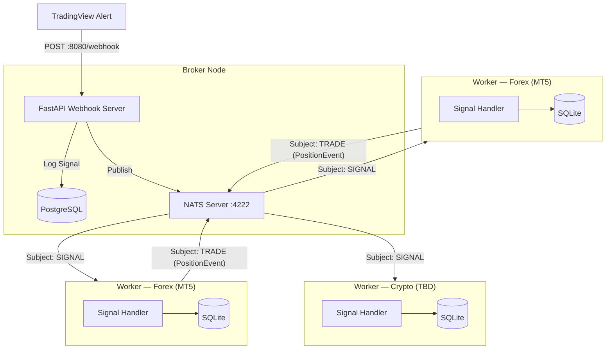
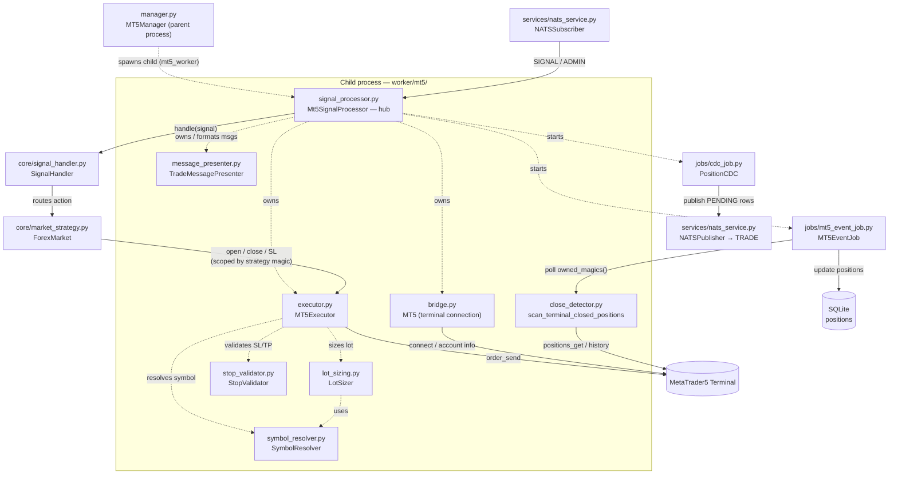

# 🚀 Algo Trading Worker

This is the execution-end of the Event-Driven trading system. It acts as a NATS subscriber waiting for highly structured trading signals from the central Broker, then executes them directly into the MetaTrader 5 Terminal.

---

## ⚡ Quick Start

### 1. Requirements

Ensure you are running on Windows, as the Python `MetaTrader5` module restricts usage to Windows environments only.

### 2. Setup

Because we orchestrate dependencies via `uv`, setup is instantaneous.

```bash
# Creates a virtual environment and installs all dependencies from pyproject.toml
uv sync
```

### 3. Configure .env

Copy `.env.example` to `.env` and fill in the MT5 connection details along with the NATS Broker configuration.

```bash
cp .env.example .env
```

#### All Environment Variables

| Variable | Required | Default | Description |
| --- | --- | --- | --- |
| **NATS** | | | |
| `NATS_URL` | ✅ | — | NATS server URL (e.g. `nats://broker-host:4222`) |
| `NATS_TOKEN` | | `null` | NATS authentication token |
| `SIGNAL_SUBJECTS` | ✅ | — | Comma-separated NATS subjects to subscribe (e.g. `MT5_GOLD,MT5_BTCUSD`) |
| **MT5** | | | |
| `MT5_SERVER` | ✅ | — | Broker server name (e.g. `Exness-MT5Trial6`) |
| `MT5_LOGIN` | ✅ | — | MT5 account number |
| `MT5_PASSWORD` | ✅ | — | MT5 account password |
| `MT5_PATH` | | auto-detect | Full path to `terminal64.exe`; if omitted the module reads from Windows registry |
| `MT5_NAME` | | `null` | Display name sent in every `PositionEvent` to the Broker |
| `MARKET_TYPE` | | `FOREX` | `FOREX` or `CRYPTO` — selects the market orchestrator |
| `MAGIC_NUMBER` | | `20260409` | EA magic number stamped on every order; used as the base filter for all positions in MT5 |
| `STRATEGY_MAGIC_MAP` | | `{}` | JSON object mapping strategy names to their own magic numbers (e.g. `{"SCALP": 20260001, "SWING": 20260002}`). When set, each strategy's orders are stamped with its dedicated magic number instead of the shared `MAGIC_NUMBER`, enabling native MT5-level isolation without a DB lookup. |
| `SLIPPAGE_DEVIATION` | | `20` | Max allowed slippage in points (100 points ≈ \$1.00 on most Forex instruments) |
| **Risk Management** | | | |
| `VOLUME_DECISION_ENABLED` | | `true` | When `true`, lot size is calculated from capital + risk % instead of signal `quantity` |
| `CAPITAL` | | `1000` | Notional capital used for lot-size calculation |
| `CAPITAL_CURRENCY` | | `USC` | Currency of `CAPITAL` (informational, shown in startup notification) |
| `RISK_PERCENTAGE` | | `3.0` | % of capital risked per trade when `VOLUME_DECISION_ENABLED=true` |
| `USE_ACCOUNT_EQUITY` | | `false` | When `true`, uses live account equity instead of `CAPITAL` for lot-size base |
| `POSITION_TP1_PERCENT` | | `30.0` | % of live volume closed at TP1 when `VOLUME_DECISION_ENABLED=true` |
| **Telegram** | | | |
| `TELEGRAM_ENABLED` | ✅ | — | `true` / `false` — master switch for all Telegram notifications |
| `TELEGRAM_BOT_TOKEN` | ✅ | — | Bot API token from @BotFather |
| `TELEGRAM_CHAT_ID` | ✅ | — | **Management chat**: service start/stop, MT5 health, NATS events |
| `TELEGRAM_CHAT_CHANNEL_ID` | | `""` | **Signal channels**: comma-separated channel IDs (e.g. `-1001234,-1009876`). Broadcasts order fills/failures, terminal closes, and force-close events to all listed channels |
| **Broker** | | | |
| `BROKER_API_URL` | ✅ | — | Base URL of the central Broker API (used by `PositionCDC` HTTP fallback) |
| `BROKER_API_KEY` | ✅ | — | API key sent as Bearer token to the Broker API |
| **App** | | | |
| `APP_HOST` | | `0.0.0.0` | FastAPI bind host |
| `APP_PORT` | | `8000` | FastAPI bind port |
| `LOG_LEVEL` | | `INFO` | Python log level (`DEBUG`, `INFO`, `WARNING`, `ERROR`) |

> **Telegram dual-channel setup:** `TELEGRAM_CHAT_ID` is for private management alerts (sent to you as the operator). `TELEGRAM_CHAT_CHANNEL_ID` accepts a comma-separated list of channel IDs for broadcasting to multiple communities — each receives every order fill, failure, terminal close, and force-close event. If `TELEGRAM_CHAT_CHANNEL_ID` is left empty, it falls back to `TELEGRAM_CHAT_ID`.

Please ensure that you have enabled "Allow Algo Trading" inside Options > Expert Advisors of the MetaTrader 5 Terminal.

### 4. Operation

Start the Worker (from the root directory):

```bash
make start
```

The Worker will initialise the `worker_data.sqlite` database, spawn an isolated MT5 subprocess, and subscribe to the configured NATS subjects. Inside the subprocess three daemon threads run in parallel: the MT5 health-check, `MT5EventJob` (terminal-close detection), and `PositionCDC` (change-data-capture publisher to the NATS `TRADE` subject). You can monitor the logs printed directly to the screen.

---

## 🏗️ System Architecture



---

## 🧩 MT5 Module Flow (`worker/mt5/`)

How the files inside `worker/mt5/` wire together at runtime. `Mt5SignalProcessor` is the hub: it owns the connection (`bridge`), the order layer (`executor` + its three collaborators), the message formatter (`message_presenter`), and starts the background jobs. Solid arrows are the live signal path; dotted arrows are composition (who builds/owns whom).



---

## 📂 Project Structure

```text
worker/
├── core/                # Signal processing logic
│   ├── market_strategy.py        # MarketStrategyFactory & base strategy interface
│   └── signal_handler.py         # Routes signals to correct MT5 execution flow
├── interfaces/          # Protocol types for dependency inversion
│   ├── db_protocol.py            # DBServiceProtocol
│   └── mt5_executor_protocol.py  # MT5ExecutorProtocol
├── jobs/                # Background polling jobs (daemon threads)
│   ├── cdc_job.py                # PositionCDC — Change Data Capture to NATS TRADE
│   ├── mt5_event_job.py          # MT5EventJob — terminal-close detection
│   └── notification_job.py       # NotificationJob — outbox dispatcher (Telegram retries)
├── mt5/                 # MetaTrader 5 integration
│   ├── bridge.py                 # MT5 terminal connection bridge
│   ├── executor.py               # MT5 trade execution primitives
│   ├── close_detector.py         # Terminal-close event scanner (polling)
│   ├── manager.py                # MT5Manager — subprocess lifecycle (parent process)
│   └── signal_processor.py       # Mt5SignalProcessor — child-process signal loop
├── schemas/             # Pydantic data schemas
│   ├── admin_schema.py           # AdminActionEnum + AdminSignalSchema (NATS ADMIN subject)
│   ├── job_schema.py             # LogAuthorEnum and job-specific schemas
│   ├── metatrader_schema.py      # TradeResult TypedDict (MT5 order_send result)
│   ├── nats_schema.py            # NatsSubjectEnum (SIGNAL, ADMIN, TRADE)
│   ├── notification_schema.py    # NotificationPlatformEnum / NotificationChannelEnum
│   ├── position_schema.py        # PositionStatusEnum + PositionEvent / PositionEventType
│   └── signal_schema.py          # Signal validation schemas
├── services/            # Infrastructure services
│   ├── db_service.py             # Database access layer (positions, logs, outbox)
│   ├── nats_service.py           # NATSSubscriber & NATSPublisher
│   └── notification_service.py   # TelegramNotification + OutboxNotifier wrapper
├── utils/               # Shared utilities
│   └── logging.py                # Structured logging helpers
├── app.py               # Application factory, FastAPI lifespan & watchdog
├── context.py           # WorkerContext — market-agnostic services (DB, notifiers, outbox)
├── db.py                # Local SQLite persistence layer
├── logger.py            # Structured logging configuration
├── main.py              # Application entry point
├── market.py            # Market orchestrator (selects MT5 vs crypto worker)
├── mt5_worker.py        # Child-process entry point (worker_initialized)
└── settings.py          # Environment & app configuration
```

---

## 🧠 Signal Execution Logic

Every incoming signal is parsed into a `SignalSchema` and passed to `SignalHandler.handle()`, which routes it to the correct MT5 execution sequence based on the `action` field.

### Action Groups

| Group | Action(s) | MT5 Behaviour |
| --- | --- | --- |
| **1 — Entry** | `LONG` / `SHORT` | Force-close any stale position → open a fresh market order with hard SL set on the server |
| **2 — Partial Exit** | `TP1` | Partial close using `POSITION_TP1_PERCENT` % of live volume (or signal `quantity` if disabled) → move remaining SL to breakeven (`price_open`) |
| **3 — Full Exit** | `TP2` / `SL` / `R_SL` | Close ALL open lots using **actual MT5 `position.volume`** — signal `quantity` is intentionally ignored |
| **4 — Flat** | `FLAT` | Close all `OPENED`/`TP1` positions for the strategy+symbol at market price, marks status `FLATTED` |

#### FLAT Payload (minimal — no price/quantity required)

```json
{
  "strategy": "MT5_GOLD_M5_V1",
  "timestamp": "2026-04-18T21:55:00Z",
  "action": "FLAT",
  "symbol": "XAUUSD"
}
```

---

## 🛡️ ADMIN Subject

The `ADMIN` NATS subject carries out-of-band administrative commands that operate outside the normal strategy signal flow. Messages are received by `Mt5SignalProcessor._handle_admin_message`.

### Action: `FLAT`

Closes open positions across one or more strategies/symbols in a single command. Accepts three **optional** filter attributes — any combination can be specified; omitting all three closes every tracked open position on the account.

| Filter | Behaviour when present |
| --- | --- |
| `account_id` | Silently ignored if it does not match the worker's `MT5_LOGIN`; processed normally if it matches or is absent |
| `strategy` | Restricts close to positions whose `strategy` column equals this value |
| `symbol` | Restricts close to positions for this symbol |

#### ADMIN FLAT Payload

```json
{
  "action": "FLAT",
  "timestamp": "2026-06-02T08:00:00+00:00",
  "strategy": "my_strategy",
  "symbol": "XAUUSD",
  "account_id": "123456"
}
```

All fields except `action` and `timestamp` are optional.

#### Execution flow

1. Parse `AdminSignalSchema`; drop silently on validation error.
2. If `account_id` is present and does not match `MT5_LOGIN` → skip (no log noise).
3. Check MT5 connection; abort if unreachable.
4. Query SQLite `positions` for rows with `status IN ('OPENED', 'TP1')` matching the optional filters.
5. Fetch all live MT5 positions (`positions_get()` natively filtered by the strategy's `magic_number`, if provided) and intersect by ticket.
6. For each position **in DB but absent from MT5** → mark `FLATTED` immediately (already closed server-side).
7. For each matched live MT5 position → call `close_single_position(pos, reason="FLAT")`:
   - On success: update DB `status → FLATTED`, set `closed_price`, send `⚡ Admin FLAT Closed` Telegram notification.
   - On failure: log error, skip DB update.

### Key Design Decisions

- **Ticket-based matching, not symbol-based:** Unlike the broker FLAT signal (which closes everything for a given symbol), the admin FLAT cross-references DB tickets against live MT5 tickets. This means two strategies running the same symbol are handled independently — only positions whose tickets appear in the filtered DB result set are closed.
- **Graceful handling of already-closed positions:** If a position is tracked in SQLite but no longer open in MT5, it is marked `FLATTED` without attempting an MT5 close order, so the DB stays consistent even after a connectivity gap.
- **`PositionCDC` propagation:** After status updates, the CDC job picks up the `PENDING` rows and publishes `PositionEvent(event=UPDATED, status=FLATTED, …)` to the Broker via the NATS `TRADE` subject — no special handling required.

---

## 🧠 Signal Execution — Key Design Decisions

- **Per-strategy position isolation on a shared symbol:** `get_open_positions`, `close_all_positions`, `partial_close_position`, and `update_position_sl` all accept an optional `strategy` parameter that `SignalHandler` populates from `signal.strategy`. This ensures two strategies trading the same symbol (e.g. a Long-only and a Short-only strategy) cannot accidentally touch each other's positions — every entry, exit, and SL update is scoped to the originating strategy. Isolation uses a two-layer scheme resolved by `MT5Executor`:

  1. **Magic-based (primary):** Each strategy can be assigned its own MT5 magic number via `STRATEGY_MAGIC_MAP` (JSON object, e.g. `{"SCALP": 20260001, "SWING": 20260002}`). `open_position` stamps a new order with `_magic_for(signal.strategy)`, and `get_open_positions(symbol, strategy)` filters live MT5 positions by that same magic. When a strategy has a dedicated magic, isolation is **native at the MT5 level — no DB lookup required**.
  2. **DB-based (fallback):** For strategies *not* present in `STRATEGY_MAGIC_MAP`, all orders share the base `MAGIC_NUMBER`, so membership is disambiguated against the authoritative `strategy` column in the positions table (`get_open_positions_by_strategy`), matching live MT5 tickets to the tickets that column records.

  Closing operations (`close_single_position`, `partial_close_position`, `close_all_positions`) stamp the closing deal with `pos.magic` — the magic of the position being closed — so the close deal always carries the same magic as its position. `owned_magics()` (base + all mapped values) defines the full set of magics the worker recognises as its own, used by account-wide queries (`get_all_open_positions`) and terminal-close detection (`MT5EventJob`).

- **Stale position cleanup (Entry):** Before opening any new LONG/SHORT, the handler queries MT5 for stale positions belonging to the *same strategy* on that symbol and force-closes them — leaving positions from other strategies on the same symbol untouched. After the MT5 close succeeds, the corresponding SQLite record(s) are immediately updated to `FORCED_CLOSED` so the DB stays consistent. Only then is the new position opened.

- **Data self-healing on inconsistency:** `SignalHandler._get_db_position` enforces the one-active-position-per-(strategy, symbol) invariant at read time. If more than one `OPENED`/`TP1` row is found (possible after a crash before the unique index existed), the oldest row is kept and all extras are immediately marked `FORCED_CLOSED` with an explanatory comment, so the DB self-heals on the next signal rather than silently producing split-brain state.

- **SQLite as source of truth for exit signals:** Before executing any exit action (`TP1`, `TP2`, `SL`, `R_SL`), `SignalHandler` queries the local SQLite `positions` table for a tracked record matching the signal's `strategy + symbol`. If no record is found the signal is rejected — this prevents acting on untracked or already-closed positions. On success, `source_ticket` in the result is always taken from the DB record (not from the live MT5 ticket) so `_process_message` always updates the correct DB row, even in edge cases where the broker re-tickets a position after a partial close.

- **`source_ticket` Lifecycle Tracking:** The `source_ticket` acts as the unique identifier for a specific trading *position*. When a new trade is opened (Entry), MT5 assigns an ID which becomes the `source_ticket`. When subsequent signals (`TP1`, `TP2`, `SL`, `R_SL`) arrive, they are resolved against the SQLite record to retrieve the original `source_ticket`. For a given trade, the `source_ticket` remains completely constant across its entire lifecycle. This prevents ambiguity across multiple concurrent active trades on different symbols.

- **Ticket-linked partial close (TP1):** The partial close request always carries the original `position=ticket` so MT5 correctly treats it as a partial close rather than an opposing hedge order.

- **TP1 volume — percent-based or signal quantity:** When `VOLUME_DECISION_ENABLED=true`, TP1 closes `POSITION_TP1_PERCENT` % of the current live position volume (read from MT5) instead of using `signal.quantity`. `MT5Executor.normalize_volume()` rounds the result to the broker's lot step and clamps it to the broker's `[min_lot, max_lot]` range before sending the order.

- **Actual volume on full close (TP2/SL/R_SL):** The signal `quantity` is **never used** for full exit calculations. The handler reads the live `position.volume` directly from MT5 to avoid dust-lot rounding errors.

- **Breakeven SL after TP1:** After the partial close succeeds, a `TRADE_ACTION_SLTP` request moves the server-side SL to `price_open` (entry price), protecting the remaining runner against connectivity loss.

- **Local Execution Forensics (`worker_data.sqlite`):** To aid in immediate execution debugging and lifecycle tracking natively on the VPS, every processed signal is persisted to a local `order_logs` SQLite table. This audit trail captures the full original NATS JSON `message`, the MT5 target `ticket`, the original `source_ticket`, and all execution context mapping directly back to the Broker's state.

- **GIL-isolated subprocess:** All MT5 and NATS blocking code runs in a separate OS process (`mt5_worker.worker_initialized`). The parent FastAPI process only manages subprocess lifetime via `MT5Manager`, keeping the event loop fully responsive. `MT5Manager` accepts a `worker_fn` parameter so the entry point is injectable and testable.

- **Dependency-injection boundary — why only the executor takes an injected gateway:** The `MetaTrader5` module is a native C extension that exposes a single **process-global** connection — `mt5.initialize()` / `mt5.login()` mutate ambient process state, and every `mt5.*` call implicitly targets that one connection. There is no connection *object* to construct or pass around, and because the calls are GIL-blocking the connection is confined to the child process and its daemon threads (the parent FastAPI process never imports the module at all). This dictates where dependency injection actually pays off:

  - **`MT5Executor` and its collaborators (`SymbolResolver`, `LotSizer`, `StopValidator`) take an injected `mt5_api: Mt5GatewayProtocol`.** These are pure call-sites holding non-trivial logic (translating a signal into an `order_send` request, lot-size math, stop validation), so the injectable gateway is a genuine test seam: production passes the live `MetaTrader5` module, while unit tests pass a `FakeMt5` — letting the whole order layer run off-Windows.
  - **`bridge.py` and `close_detector.py` deliberately call the module-global `MetaTrader5` directly.** `bridge` *owns* the singleton's lifecycle (`initialize` / `login` / `shutdown`), and `close_detector` is a free-function scanner that runs **inside the `MT5EventJob` daemon thread**, reading the very same process-global connection. There is no FastAPI-level composition root in those background threads to thread an injected handle down from, and "injecting" a singleton that can only ever have one real instance would be ceremony with no testability payoff. They are kept as thin pass-throughs to the C extension, with the test-worthy logic pushed up into the executor/strategy layer above them.

- **Hard SL vs. NATS SL — callback gap (mitigated by MT5EventJob):** When a LONG/SHORT is opened, the SL is registered directly on the MT5 server (`request["sl"]`), so MT5 will auto-close the position even if the NATS signal pipeline is delayed. If the hard SL fires before the NATS `SL` signal arrives, `_handle_full_close` finds no open position, returns `success=False`, and no event is published. `MT5EventJob` closes this gap by detecting the disappearance independently and updating the SQLite `positions` table, which then triggers `PositionCDC` to publish the `TRADE` event to the Broker.

- **Notification outbox (store-and-forward):** In-process notification calls (`ctx.notifier` and `ctx.channel_notifier`) do **not** hit the Telegram API directly — they enqueue a row in the SQLite `notifications` table via `OutboxNotifier`. A separate `NotificationJob` daemon thread drains the table every 1 s and performs the actual HTTP send, retrying failed messages with exponential backoff (`5s → 30s → 2m → 10m`) up to `max_attempts` (default `5`). This decouples MT5 signal handling from Telegram's availability/latency and prevents Telegram outages from blocking the NATS event loop. **Startup/shutdown banners** are sent **directly** via `ctx.direct_notifier` (bypassing the outbox) so the user sees them immediately — even before the DB/notification dispatcher is ready or after they are torn down.

### MT5EventJob — Terminal-Close Polling (`worker/jobs/mt5_event_job.py`)

`MT5EventJob` runs as a daemon thread inside the child process alongside the NATS signal loop and the MT5 health-check thread. Its sole purpose is to detect positions that the MT5 server closed autonomously — without a corresponding NATS signal reaching the pipeline in time.

#### How it works

Every 5 seconds the job calls `scan_terminal_closed_positions()` (`worker/mt5/close_detector.py`), which:

1. Calls `mt5.positions_get()` filtered by **every magic number this worker owns** (base `MAGIC_NUMBER` + all `STRATEGY_MAGIC_MAP` values, via `MT5Executor.owned_magics()`) → `current_tickets`
2. Diffs against an internal `seen_tickets` set maintained across polls
3. For each ticket that disappeared, calls `mt5.history_deals_get(position=ticket)` to find the closing deal
4. Reads `deal.reason` to classify the closure:

| MT5 `deal.reason` | `TerminalCloseReason` | Action |
| --- | --- | --- |
| `DEAL_REASON_SL` | `SL` | DB updated → `PositionCDC` publishes TRADE event |
| `DEAL_REASON_TP` | `TP` | DB updated → `PositionCDC` publishes TRADE event |
| `DEAL_REASON_SO` | `STOP_OUT` | DB updated → `PositionCDC` publishes TRADE event |
| `DEAL_REASON_CLIENT` / `MOBILE` / `WEB` | `MANUAL` | Telegram only — no DB update (ambiguous intent) |
| `DEAL_REASON_EXPERT` | *(skipped)* | none — closed by our own `order_send` |

1. For terminal-initiated closures, emits a `TerminalClosedEvent` dataclass carrying: `source_ticket`, `deal_ticket`, `symbol`, `close_reason`, `close_price`, `close_volume`, `close_time`, `entry_price`, `sl`, `tp`, and an `AccountSnapshot`.

On each event the job then:

- **4.1** Sends a Telegram notification with full position and account context.
- **4.2** Writes a row to `position_logs` with `author = 'terminal'` (vs `'broker'` for NATS-triggered rows) and updates `positions.status → TERMINAL_CLOSED`. `PositionCDC` then picks up the pending row and publishes a `TRADE` event to the Broker via NATS.

#### Resilience during MT5 reconnect

| MT5 state | `positions_get()` result | `seen_tickets` | Events fired |
| --- | --- | --- | --- |
| Connected | valid list | updated each scan | normal |
| Disconnected | `None` | **preserved** | none — scan skipped |
| Reconnected | valid list | diff against preserved state | catch-up for any SL/TP that fired during outage |

When `positions_get()` returns `None` (terminal offline), the scan is skipped and `seen_tickets` is left untouched. This prevents false-positive "position closed" events and ensures that once MT5 comes back online, any positions that were closed during the outage are detected on the next scan.

The job shares the process-level `stop_event` (`multiprocessing.Event`) with the health-check thread and the NATS loop, so it shuts down cleanly as part of the normal worker lifecycle — no independent restart mechanism is needed.

### PositionCDC — NATS Trade Publisher (`worker/jobs/cdc_job.py`)

`PositionCDC` implements Change Data Capture on the local SQLite `positions` table. It polls every 2 seconds for rows whose `sync_status` is `PENDING` (set automatically on insert or update), serialises them as `PositionEvent` messages, and publishes them to the NATS `TRADE` subject. After a successful publish the row is marked `PUBLISHED`.

#### PositionEvent fields

| Field | Source |
| --- | --- |
| `event` | `CREATED` (first sync) or `UPDATED` (subsequent syncs) |
| `account_id` | `MT5_LOGIN` from settings |
| `account_name` | `MT5_NAME` from settings |
| `market_type` | `MARKET_TYPE` from settings (e.g. `forex`, `crypto`) |
| `account_balance` / `account_leverage` | Snapshot from `bridge.get_account_status()` at poll time |
| `signal_id`, `sl`, `tp1`, `tp2`, `risk_percent`, `magic` | Extracted from the original signal JSON stored in `positions.message` |

The Broker handler is expected to be idempotent (upsert by `account_id + ticket`), so at-least-once delivery is safe even if the worker restarts mid-publish.

### NotificationJob — Telegram Outbox Dispatcher (`worker/jobs/notification_job.py`)

`NotificationJob` is the worker side of the notification outbox pattern. It polls the SQLite `notifications` table every 1 second and dispatches due rows via the appropriate Telegram sender, keeping Telegram I/O completely off the NATS event loop.

#### Routing

The job is constructed with a `{channel → TelegramNotification}` map built by `WorkerContext`:

| `channel` value | Maps to | Backing chat IDs |
| --- | --- | --- |
| `INDIVIDUAL` | `ctx.direct_notifier` | `TELEGRAM_CHAT_ID` (management) |
| `COMMUNITY` | `ctx.direct_channel_notifier` | `TELEGRAM_CHAT_CHANNEL_ID` (comma-separated signal channels) |

In-process callers stay decoupled: they hold an `OutboxNotifier` whose `send_message()` just inserts a row tagged with the right `channel` and `category` — the dispatcher does the routing.

#### Retry semantics

| Outcome | Action |
| --- | --- |
| Success (HTTP 200 for every chat ID) | `DELETE` the row (hard-delete; no `status` column required) |
| Partial / total failure | `attempts += 1`, set `next_attempt_at = now + backoff[attempts]`, store `last_error` |
| `attempts >= max_attempts` (default `5`) | Row becomes dead-letter — skipped by the polling query and left in place for inspection |

Backoff schedule (indexed by attempt, capped at last): **5s → 30s → 2m → 10m**. The polling query is `WHERE attempts < max_attempts AND (next_attempt_at IS NULL OR next_attempt_at <= now)` and is served by the `idx_notifications_pending` index.

#### Direct-send escape hatches

Two notification paths intentionally bypass the outbox:

1. **Startup / shutdown banners** sent via `ctx.direct_notifier` — must surface even before `NotificationJob` is running or after it has been torn down.
2. **NATS connection events** still go through the outbox via `ctx.nats_enqueue`, but they use the `NATS_EVENT` category so they can be filtered out of analytics if desired.

### MT5Executor Primitives (`worker/mt5/executor.py`)

| Method                                                        | Used By                                          |
| ------------------------------------------------------------- | ------------------------------------------------ |
| `open_position(signal)`                                       | Entry (Group 1)                                  |
| `partial_close_position(symbol, volume, ticket?, strategy?)`  | TP1 (Group 2)                                    |
| `update_position_sl(symbol, new_sl, ticket?, strategy?)`      | TP1 breakeven update                             |
| `close_all_positions(symbol, reason, strategy?)`              | Full exit (Group 3) & broker FLAT                |
| `close_single_position(pos, reason)`                          | Admin FLAT — closes one position by MT5 object   |
| `get_open_positions(symbol, strategy?)`                       | Pre-flight guard in all groups                   |
| `get_all_open_positions(strategy?)`                           | Admin FLAT — fetch all positions across symbols, optionally scoped by strategy |
| `convert_quantity_to_lots(symbol, quantity)`                  | Entry & TP1 volume calc                          |
| `calculate_lot_size(symbol, entry, sl, risk_pct)`             | Entry volume calc (risk-based)                   |
| `normalize_volume(symbol, volume)`                            | Rounds/clamps volume to broker lot step & limits |

---

## 🗄️ SQLite Schema (`worker_data.sqlite`)

Three tables are created on startup by `db_init()` using WAL journal mode. After table creation, `db_init()` runs `_apply_migrations()`, which applies idempotent schema changes on every startup (safe to re-run).

### `positions` — Live position state

The canonical record for each open trade. `PositionCDC` watches this table for `sync_status = PENDING` rows to publish as NATS `TRADE` events.

| Column | Type | Description |
| --- | --- | --- |
| `id` | INTEGER PK | Auto-increment row ID |
| `source_ticket` | INTEGER UNIQUE | Original MT5 ticket at open — never changes across the position's lifetime |
| `ticket` | INTEGER | Current MT5 ticket (may differ from `source_ticket` after a partial close re-tickets) |
| `strategy` | TEXT | Strategy name from signal (e.g. `MT5_GOLD_M5_V1`) |
| `symbol` | TEXT | Instrument symbol (e.g. `XAUUSD`) |
| `action` | TEXT | `long` or `short` |
| `volume` | REAL | Lot size at open |
| `opened_price` | REAL | Fill price at entry |
| `closed_price` | REAL | Fill price at close (null while open) |
| `status` | TEXT | See **Position Status Lifecycle** below |
| `mt5_retcode` | INTEGER | Last MT5 return code |
| `comment` | TEXT | Last MT5 comment string |
| `message` | TEXT | Full original signal JSON (used by `PositionCDC` to extract `signal_id`, `sl`, `tp1`, etc.) |
| `sync_status` | TEXT | `PENDING` → `PUBLISHED` — drives CDC delivery |
| `sync_time` | DATETIME | Timestamp of last successful publish |
| `created_at` / `updated_at` | DATETIME | Row timestamps; `updated_at` is used as an optimistic-lock key in `mark_position_synced` |

#### Constraints & Migrations

A partial unique index `uidx_positions_one_active_per_strategy_symbol` enforces at most one `OPENED` or `TP1` row per `(strategy, symbol)` pair. Closed/force-closed rows are unrestricted. The index is created by `_apply_migrations()` on startup (`CREATE UNIQUE INDEX IF NOT EXISTS`) so it is applied automatically to existing databases on first upgrade.

#### Position Status Lifecycle

```text
OPENED ──► TP1 ──► TP2
       │         └──► SL
       │         └──► R_SL
       │         └──► TERMINAL_CLOSED  (MT5EventJob: SL/TP/Stop-Out fired server-side)
       │         └──► FORCED_CLOSED    (new entry signal arrived while position open)
       └──► FLATTED                    (FLAT signal)
```

| Status | Set by | Meaning |
| --- | --- | --- |
| `OPENED` | Entry signal | Position is live |
| `TP1` | TP1 signal | Partially closed; runner is still active |
| `TP2` | TP2 signal | Fully closed at take-profit 2 |
| `SL` | SL signal | Fully closed at stop-loss (NATS-triggered) |
| `R_SL` | R_SL signal | Fully closed at revised stop-loss |
| `TERMINAL_CLOSED` | `MT5EventJob` | Server closed the position (SL/TP/Stop-Out) before NATS signal arrived |
| `FORCED_CLOSED` | New entry signal | Position was force-closed because an opposing/same-direction entry arrived |
| `FLATTED` | FLAT signal | Position was closed by an administrative flat command |

### `position_logs` — Immutable execution audit trail

An append-only log of every signal processed and its MT5 execution result. Never updated — only inserted.

| Column | Type | Description |
| --- | --- | --- |
| `strategy` / `symbol` / `action` | TEXT | Signal identity |
| `ticket` / `source_ticket` | INTEGER | MT5 ticket references at time of execution |
| `volume` / `price` / `sl` / `tp1` | REAL | Execution parameters |
| `mt5_retcode` | INTEGER | MT5 result code (`10009` = filled, etc.) |
| `message` | TEXT | Full signal JSON |
| `author` | TEXT | `broker` (NATS signal) or `terminal` (MT5EventJob detection) |
| `timestamp` | DATETIME | Wall-clock time of insertion |

### `notifications` — Telegram outbox (store-and-forward)

A durable queue of pending Telegram messages. `NotificationJob` polls this table every 1 s, sends due rows, and hard-deletes on success. Failed sends increment `attempts` and reschedule via exponential backoff (`5s → 30s → 2m → 10m`). Rows whose `attempts >= max_attempts` become dead-letters and are left in place.

| Column | Type | Description |
| --- | --- | --- |
| `id` | INTEGER PK | Auto-increment row ID |
| `platform` | TEXT | `TELEGRAM` (extensible to Slack/Discord/etc.) |
| `channel` | TEXT | `INDIVIDUAL` (management chat) or `COMMUNITY` (signal channels) |
| `category` | TEXT | Free-form tag (e.g. `TRADE_EVENT`, `MT5_MANAGEMENT`, `NATS_EVENT`) for filtering/analytics |
| `message_text` | TEXT | HTML payload sent to Telegram |
| `attempts` | INTEGER | Number of failed delivery attempts so far |
| `max_attempts` | INTEGER | Cap (default `5`); row becomes dead-letter when reached |
| `last_error` | TEXT | Error string from the last failed attempt |
| `next_attempt_at` | DATETIME | Earliest retry time; `NULL` = ready immediately |
| `created_at` / `updated_at` | DATETIME | Row timestamps |

Indexed on `(next_attempt_at, id)` to make the dispatcher's poll query O(log n).

---

## 🔄 Process Lifecycle & Watchdog

The parent FastAPI process (`app.py`) never loads the MT5 C extension. All MT5 and NATS work runs inside an isolated child process managed by `MT5Manager`.

```text
FastAPI (parent)
  └── ForexMarketOrchestrator
        ├── MT5Manager.start()   — spawns child process
        ├── Watchdog task        — checks every 10 s (WATCHDOG_INTERVAL)
        │     └── if child died → MT5Manager.restart()
        └── MT5Manager.stop()   — on FastAPI shutdown
```

Inside the child process four daemon threads run alongside the NATS message loop:

| Thread | Interval | Purpose |
| --- | --- | --- |
| `mt5-health` | 15 s (`MT5_HEALTH_INTERVAL`) | Checks MT5 connection; sends Telegram alert on disconnect/reconnect |
| `MT5EventJob` | 5 s | Detects server-side position closes (SL/TP/Stop-Out) |
| `PositionCDC` | 2 s | Publishes `PENDING` position rows to NATS `TRADE` subject |
| `NotificationJob` | 1 s | Drains the `notifications` outbox and dispatches Telegram messages (with exponential-backoff retries) |

All threads share the same `stop_event` (`multiprocessing.Event`) and exit cleanly when it is set.
