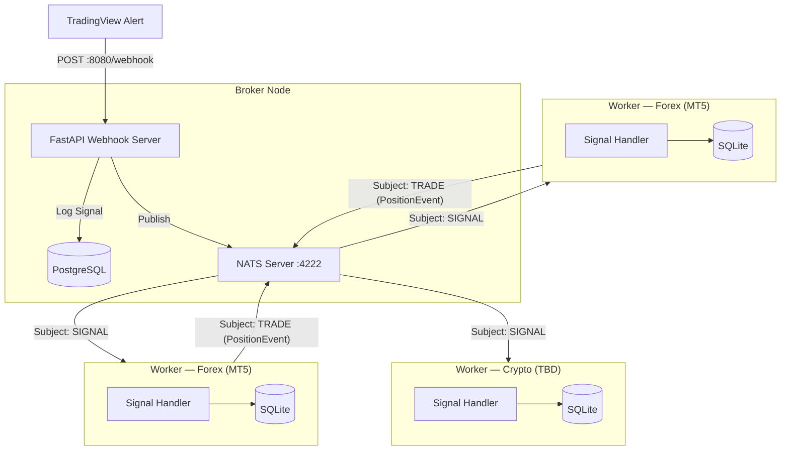

# 🚀 Algo Trading Worker

This is the execution-end of the Event-Driven trading system. It acts as a NATS subscriber waiting for highly structured trading signals from the central Broker, then executes them directly into the MetaTrader 5 Terminal.

## 🏗️ System Architecture



---

## 📂 Project Structure

```text
worker/
├── core/                # Signal processing logic
│   ├── market_strategy.py        # MarketStrategyFactory & base strategy interface
│   └── signal_handler.py         # Routes signals to correct MT5 execution flow
├── jobs/                # Background polling jobs (daemon threads)
│   ├── cdc_job.py                # PositionCDC — Change Data Capture to NATS TRADE
│   └── mt5_event_job.py          # MT5EventJob — terminal-close detection
├── mt5/                 # MetaTrader 5 integration
│   ├── mt5.py                    # MT5 terminal connection bridge
│   ├── executor.py               # MT5 trade execution primitives
│   ├── jobs.py                   # Terminal-close event scanner (polling)
│   └── manager.py                # MT5Manager — subprocess lifecycle + signal helpers
├── schemas/             # Pydantic data schemas
│   ├── broker_schema.py          # Signal & position validation schemas
│   ├── job_schema.py             # LogAuthorEnum and job-specific schemas
│   ├── nats_schema.py            # NatsSubjectEnum (SIGNAL, ADMIN, TRADE)
│   ├── position_schema.py        # PositionStatusEnum
│   ├── publisher_schema.py       # NATS publisher schemas
│   └── trade_event_schema.py     # PositionEvent & PositionEventType
├── services/            # Infrastructure services
│   ├── db_service.py             # Database access layer
│   ├── nats_service.py           # NATSSubscriber & NATSPublisher
│   └── notification_service.py   # Telegram notification logic
├── utils/               # Shared utilities
│   └── logging.py                # Structured logging helpers
├── app.py               # Application factory, FastAPI lifespan & watchdog
├── db.py                # Local SQLite persistence layer
├── logger.py            # Structured logging configuration
├── main.py              # Application entry point
├── mt5_worker.py        # Child-process entry point (worker_initialized)
└── settings.py          # Environment & app configuration
```

---

## 🧠 Signal Execution Logic

Every incoming signal is parsed into a `SignalSchema` and passed to `SignalHandler.handle()`, which routes it to the correct MT5 execution sequence based on the `action` field.

### Action Groups

| Group | Action(s) | MT5 Behaviour |
| --- | --- | --- |
| **1 — Entry** | `LONG` / `SHORT` | Force-close any stale position → open a fresh market order with hard SL set on the server |
| **2 — Partial Exit** | `TP1` | Partial close using `POSITION_TP1_PERCENT` % of live volume (or signal `quantity` if disabled) → move remaining SL to breakeven (`price_open`) |
| **3 — Full Exit** | `TP2` / `SL` / `R_SL` | Close ALL open lots using **actual MT5 `position.volume`** — signal `quantity` is intentionally ignored |
| **4 — Flat** | `FLAT` | Close all `OPENED`/`TP1` positions for the strategy+symbol at market price, marks status `FLATTED` |

#### FLAT Payload (minimal — no price/quantity required)

```json
{
  "strategy": "MT5_GOLD_M5_V1",
  "timestamp": "2026-04-18T21:55:00Z",
  "action": "FLAT",
  "symbol": "XAUUSD"
}
```

### Key Design Decisions

- **Stale position cleanup (Entry):** An account holds at most 1 position per symbol at a time. Before opening any new LONG/SHORT, the handler queries MT5 and force-closes any existing position for that symbol — regardless of whether the new signal is in the same or opposite direction. After the MT5 close succeeds, the corresponding SQLite record(s) are immediately updated to `FORCED_CLOSED` so the DB stays consistent. Only then is the new position opened. This guarantees each cycle starts flat and prevents accidental hedging.

- **SQLite as source of truth for exit signals:** Before executing any exit action (`TP1`, `TP2`, `SL`, `R_SL`), `SignalHandler` queries the local SQLite `positions` table for a tracked record matching the signal's `strategy + symbol`. If no record is found the signal is rejected — this prevents acting on untracked or already-closed positions. On success, `source_ticket` in the result is always taken from the DB record (not from the live MT5 ticket) so `_process_message` always updates the correct DB row, even in edge cases where the broker re-tickets a position after a partial close.

- **`source_ticket` Lifecycle Tracking:** The `source_ticket` acts as the unique identifier for a specific trading _position_. When a new trade is opened (Entry), MT5 assigns an ID which becomes the `source_ticket`. When subsequent signals (`TP1`, `TP2`, `SL`, `R_SL`) arrive, they are resolved against the SQLite record to retrieve the original `source_ticket`. For a given trade, the `source_ticket` remains completely constant across its entire lifecycle. This prevents ambiguity across multiple concurrent active trades on different symbols.

- **Ticket-linked partial close (TP1):** The partial close request always carries the original `position=ticket` so MT5 correctly treats it as a partial close rather than an opposing hedge order.

- **TP1 volume — percent-based or signal quantity:** When `VOLUME_DECISION_ENABLED=true`, TP1 closes `POSITION_TP1_PERCENT` % of the current live position volume (read from MT5) instead of using `signal.quantity`. `MT5Executor.normalize_volume()` rounds the result to the broker's lot step and clamps it to the broker's `[min_lot, max_lot]` range before sending the order.

- **Actual volume on full close (TP2/SL/R_SL):** The signal `quantity` is **never used** for full exit calculations. The handler reads the live `position.volume` directly from MT5 to avoid dust-lot rounding errors.

- **Breakeven SL after TP1:** After the partial close succeeds, a `TRADE_ACTION_SLTP` request moves the server-side SL to `price_open` (entry price), protecting the remaining runner against connectivity loss.

- **Local Execution Forensics (`worker_data.sqlite`):** To aid in immediate execution debugging and lifecycle tracking natively on the VPS, every processed signal is persisted to a local `order_logs` SQLite table. This audit trail captures the full original NATS JSON `message`, the MT5 target `ticket`, the original `source_ticket`, and all execution context mapping directly back to the Broker's state.

- **GIL-isolated subprocess:** All MT5 and NATS blocking code runs in a separate OS process (`mt5_worker.worker_initialized`). The parent FastAPI process only manages subprocess lifetime via `MT5Manager`, keeping the event loop fully responsive. `MT5Manager` accepts a `worker_fn` parameter so the entry point is injectable and testable.

- **Hard SL vs. NATS SL — callback gap (mitigated by MT5EventJob):** When a LONG/SHORT is opened, the SL is registered directly on the MT5 server (`request["sl"]`), so MT5 will auto-close the position even if the NATS signal pipeline is delayed. If the hard SL fires before the NATS `SL` signal arrives, `_handle_full_close` finds no open position, returns `success=False`, and no event is published. `MT5EventJob` closes this gap by detecting the disappearance independently and updating the SQLite `positions` table, which then triggers `PositionCDC` to publish the `TRADE` event to the Broker.

### MT5EventJob — Terminal-Close Polling (`worker/jobs/mt5_event_job.py`)

`MT5EventJob` runs as a daemon thread inside the child process alongside the NATS signal loop and the MT5 health-check thread. Its sole purpose is to detect positions that the MT5 server closed autonomously — without a corresponding NATS signal reaching the pipeline in time.

#### How it works

Every 5 seconds the job calls `scan_terminal_closed_positions()` (`worker/mt5/jobs.py`), which:

1. Calls `mt5.positions_get()` filtered by `magic_number` → `current_tickets`
2. Diffs against an internal `seen_tickets` set maintained across polls
3. For each ticket that disappeared, calls `mt5.history_deals_get(position=ticket)` to find the closing deal
4. Reads `deal.reason` to classify the closure:

| MT5 `deal.reason` | `TerminalCloseReason` | Action |
| --- | --- | --- |
| `DEAL_REASON_SL` | `SL` | DB updated → `PositionCDC` publishes TRADE event |
| `DEAL_REASON_TP` | `TP` | DB updated → `PositionCDC` publishes TRADE event |
| `DEAL_REASON_SO` | `STOP_OUT` | DB updated → `PositionCDC` publishes TRADE event |
| `DEAL_REASON_CLIENT` / `MOBILE` / `WEB` | `MANUAL` | Telegram only — no DB update (ambiguous intent) |
| `DEAL_REASON_EXPERT` | _(skipped)_ | none — closed by our own `order_send` |

1. For terminal-initiated closures, emits a `TerminalClosedEvent` dataclass carrying: `source_ticket`, `deal_ticket`, `symbol`, `close_reason`, `close_price`, `close_volume`, `close_time`, `entry_price`, `sl`, `tp`, and an `AccountSnapshot`.

On each event the job then:

- **4.1** Sends a Telegram notification with full position and account context.
- **4.2** Writes a row to `position_logs` with `author = 'terminal'` (vs `'broker'` for NATS-triggered rows) and updates `positions.status → TERMINAL_CLOSED`. `PositionCDC` then picks up the pending row and publishes a `TRADE` event to the Broker via NATS.

#### Resilience during MT5 reconnect

| MT5 state | `positions_get()` result | `seen_tickets` | Events fired |
| --- | --- | --- | --- |
| Connected | valid list | updated each scan | normal |
| Disconnected | `None` | **preserved** | none — scan skipped |
| Reconnected | valid list | diff against preserved state | catch-up for any SL/TP that fired during outage |

When `positions_get()` returns `None` (terminal offline), the scan is skipped and `seen_tickets` is left untouched. This prevents false-positive "position closed" events and ensures that once MT5 comes back online, any positions that were closed during the outage are detected on the next scan.

The job shares the process-level `stop_event` (`multiprocessing.Event`) with the health-check thread and the NATS loop, so it shuts down cleanly as part of the normal worker lifecycle — no independent restart mechanism is needed.

### PositionCDC — NATS Trade Publisher (`worker/jobs/cdc_job.py`)

`PositionCDC` implements Change Data Capture on the local SQLite `positions` table. It polls every 2 seconds for rows whose `sync_status` is `PENDING` (set automatically on insert or update), serialises them as `PositionEvent` messages, and publishes them to the NATS `TRADE` subject. After a successful publish the row is marked `PUBLISHED`.

#### PositionEvent fields

| Field | Source |
| --- | --- |
| `event` | `CREATED` (first sync) or `UPDATED` (subsequent syncs) |
| `account_id` | `MT5_LOGIN` from settings |
| `account_name` | `MT5_NAME` from settings |
| `market_type` | `MARKET_TYPE` from settings (e.g. `forex`, `crypto`) |
| `account_balance` / `account_leverage` | Snapshot from `bridge.get_account_status()` at poll time |
| `signal_id`, `sl`, `tp1`, `tp2`, `risk_percent`, `magic` | Extracted from the original signal JSON stored in `positions.message` |

The Broker handler is expected to be idempotent (upsert by `account_id + ticket`), so at-least-once delivery is safe even if the worker restarts mid-publish.

### MT5Executor Primitives (`worker/mt5/executor.py`)

| Method                                            | Used By                                          |
| ------------------------------------------------- | ------------------------------------------------ |
| `open_position(signal)`                           | Entry (Group 1)                                  |
| `partial_close_position(symbol, volume, ticket?)` | TP1 (Group 2)                                    |
| `update_position_sl(symbol, new_sl, ticket?)`     | TP1 breakeven update                             |
| `close_all_positions(symbol, reason)`             | Full exit (Group 3) & FLAT                       |
| `get_open_positions(symbol)`                      | Pre-flight guard in all groups                   |
| `convert_quantity_to_lots(symbol, quantity)`      | Entry & TP1 volume calc                          |
| `calculate_lot_size(symbol, entry, sl, risk_pct)` | Entry volume calc (risk-based)                   |
| `normalize_volume(symbol, volume)`                | Rounds/clamps volume to broker lot step & limits |

---

## ⚡ Quick Start

### 1. Requirements

Ensure you are running on Windows, as the Python `MetaTrader5` module restricts usage to Windows environments only.

### 2. Setup

Because we orchestrate dependencies via `uv`, setup is instantaneous.

```bash
# Creates a virtual environment and installs all dependencies from pyproject.toml
uv sync
```

### 3. Configure .env

Copy `.env.example` to `.env` and fill in the MT5 connection details along with the NATS Broker configuration.

```bash
cp .env.example .env
```

Key variables:

```env
# NATS
NATS_URL=nats://broker-host:4222
NATS_TOKEN=your-token-here

# Which NATS subjects this worker listens to (comma-separated)
SIGNAL_SUBJECTS=MT5_GOLD,MT5_BTCUSD

# MT5 account identity (sent in every PositionEvent to the Broker)
MT5_NAME=WangDemo1
MARKET_TYPE=FOREX   # FOREX or CRYPTO

# TP1 volume (percent of live position size, used when VOLUME_DECISION_ENABLED=true)
VOLUME_DECISION_ENABLED=true
POSITION_TP1_PERCENT=30.0
```

Please ensure that you have enabled "Allow Algo Trading" inside Options > Expert Advisors of the MetaTrader 5 Terminal.

### 4. Operation

Start the Worker (from the root directory):

```bash
make start
```

The Worker will initialise the `worker_data.sqlite` database, spawn an isolated MT5 subprocess, and subscribe to the configured NATS subjects. Inside the subprocess three daemon threads run in parallel: the MT5 health-check, `MT5EventJob` (terminal-close detection), and `PositionCDC` (change-data-capture publisher to the NATS `TRADE` subject). You can monitor the logs printed directly to the screen.
