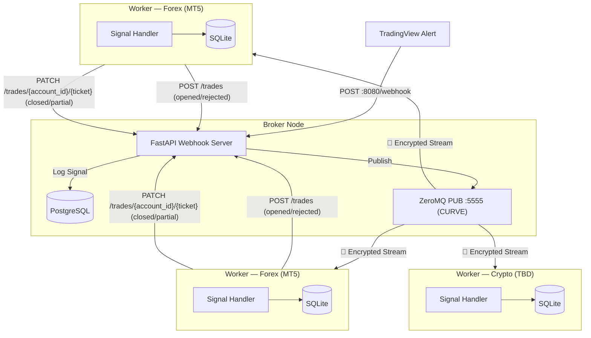

# 🚀 Algo Trading Worker

This is the execution-end of the Event-Driven trading system. It acts as a ZeroMQ subscriber waiting for highly structured trading signals from the central Broker, then executes them directly into the MetaTrader 5 Terminal.

## 🏗️ System Architecture



---

## 📂 Project Structure

```text
worker/
├── core/                # Signal processing logic
│   └── signal_handler.py # Routes signals to correct MT5 execution flow
├── mt5/                 # MetaTrader 5 integration
│   ├── mt5.py           # MT5 terminal connection bridge
│   ├── executor.py      # MT5 trade execution primitives
│   └── jobs.py          # Terminal-close event scanner (polling)
├── schemas/             # Pydantic data schemas
│   └── broker_schema.py # Signal & position validation schemas
├── services/            # Business & Infrastructure services
│   ├── callback_service.py      # HTTP callbacks to broker (POST/PATCH /trades)
│   ├── db_service.py            # Database access layer
│   ├── job_service.py           # MT5EventJob background polling thread
│   ├── mt5_process.py           # MT5 subprocess manager
│   ├── notification_service.py # Telegram notification logic
│   └── zmq_service.py           # ZeroMQ signal subscriber
├── app.py               # Application factory & process lifespan
├── db.py                # Local SQLite persistence layer
├── logger.py            # Structured logging configuration
├── main.py              # Application entry point
└── settings.py          # Environment & app configuration
```

---

## 🧠 Signal Execution Logic

Every incoming signal is parsed into a `SignalSchema` and passed to `SignalHandler.handle()`, which routes it to the correct MT5 execution sequence based on the `action` field.

### Action Groups

| Group                | Action(s)             | MT5 Behaviour                                                                                                    |
| -------------------- | --------------------- | ---------------------------------------------------------------------------------------------------------------- |
| **1 — Entry**        | `LONG` / `SHORT`      | Force-close any stale position → open a fresh market order with hard SL set on the server                        |
| **2 — Partial Exit** | `TP1`                 | Partial close using signal `quantity` converted to lots → move remaining position SL to breakeven (`price_open`) |
| **3 — Full Exit**    | `TP2` / `SL` / `R_SL` | Close ALL open lots using **actual MT5 `position.volume`** — signal `quantity` is intentionally ignored          |
| **4 — Flat**         | `FLAT`                | Close all `OPENED`/`TP1` positions for the strategy+symbol at market price, marks status `FLATTED`               |

#### FLAT Payload (minimal — no price/quantity required)

```json
{
  "strategy": "MT5_GOLD_M5_V1",
  "timestamp": "2026-04-18T21:55:00Z",
  "action": "FLAT",
  "symbol": "XAUUSD"
}
```

### Key Design Decisions

- **Stale position cleanup (Entry):** An account holds at most 1 position per symbol. Before opening any new LONG/SHORT, the handler queries MT5 and force-closes any leftover position for that identical symbol. This ignores the new signal if a manual trade is open independently, but within the algo context, it guarantees each cycle starts flat and prevents accidental hedging.
- **`source_ticket` Lifecycle Tracking:** The `source_ticket` acts as the unique identifier for a specific trading _position_. When a new trade is opened (Entry), MT5 assigns an ID which becomes the `source_ticket`. When subsequent signals (`TP1`, `TP2`, `SL`, `R_SL`) arrive, they refer back to that original `source_ticket`. For a given trade, the `source_ticket` remains completely constant across its entire lifecycle. This prevents ambiguity across multiple concurrent active trades on different symbols.

- **Ticket-linked partial close (TP1):** The partial close request always carries the original `position=ticket` so MT5 correctly treats it as a partial close rather than an opposing hedge order.

- **Actual volume on full close (TP2/SL/R_SL):** The signal `quantity` is **never used** for full exit calculations. The handler reads the live `position.volume` directly from MT5 to avoid dust-lot rounding errors.

- **Breakeven SL after TP1:** After the partial close succeeds, a `TRADE_ACTION_SLTP` request moves the server-side SL to `price_open` (entry price), protecting the remaining runner against connectivity loss.

- **Local Execution Forensics (`worker_data.sqlite`):** To aid in immediate execution debugging and lifecycle tracking natively on the VPS, every processed signal is persisted to a local `order_logs` SQLite table. This audit trail captures the full original ZeroMQ JSON `message`, the MT5 target `ticket`, the original `source_ticket`, and all execution context mapping directly back to the Broker's state.

- **GIL-isolated subprocess:** All MT5 and ZMQ blocking code runs in a separate OS process. The parent process only manages subprocess lifetime, keeping the event loop fully responsive.

- **Hard SL vs. ZMQ SL — callback gap (mitigated by MT5EventJob):** When a LONG/SHORT is opened, the SL is registered directly on the MT5 server (`request["sl"]`), so MT5 will auto-close the position even if the ZMQ signal pipeline is delayed. If the hard SL fires before the ZMQ `SL` signal arrives, `_handle_full_close` finds no open position, returns `success=False`, and no callback is dispatched through the normal path. `MT5EventJob` (see below) closes this gap by detecting the disappearance independently and firing the broker API callback retroactively.

### MT5EventJob — Terminal-Close Polling (`worker/services/job_service.py`)

`MT5EventJob` runs as a daemon thread inside the child process alongside the ZMQ signal loop and the MT5 health-check thread. Its sole purpose is to detect positions that the MT5 server closed autonomously — without a corresponding ZMQ signal reaching the pipeline in time.

#### How it works

Every 5 seconds the job calls `scan_terminal_closed_positions()` (`worker/mt5/jobs.py`), which:

1. Calls `mt5.positions_get()` filtered by `magic_number` → `current_tickets`
2. Diffs against an internal `seen_tickets` set maintained across polls
3. For each ticket that disappeared, calls `mt5.history_deals_get(position=ticket)` to find the closing deal
4. Reads `deal.reason` to classify the closure:

| MT5 `deal.reason` | `TerminalCloseReason` | Broker callback sent |
| --- | --- | --- |
| `DEAL_REASON_SL` | `SL` | `notify_closed` (with SL price) |
| `DEAL_REASON_TP` | `TP` | `notify_closed` |
| `DEAL_REASON_SO` | `STOP_OUT` | `notify_closed` (with SL price) |
| `DEAL_REASON_CLIENT` / `MOBILE` / `WEB` | `MANUAL` | none (ambiguous intent) |
| `DEAL_REASON_EXPERT` | _(skipped)_ | none — closed by our own `order_send` |

1. For terminal-initiated closures, emits a `TerminalClosedEvent` dataclass carrying: `source_ticket`, `deal_ticket`, `symbol`, `close_reason`, `close_price`, `close_volume`, `close_time`, `entry_price`, `sl`, `tp`, and an `AccountSnapshot`.

On each event the job then:

- **4.1** Sends a Telegram notification with full position and account context.
- **4.2** Writes a row to `order_logs` with `author = 'terminal'` (vs `'broker'` for ZMQ-triggered rows), then calls the appropriate `CallbackService` method.

#### Resilience during MT5 reconnect

| MT5 state | `positions_get()` result | `seen_tickets` | Events fired |
| --- | --- | --- | --- |
| Connected | valid list | updated each scan | normal |
| Disconnected | `None` | **preserved** | none — scan skipped |
| Reconnected | valid list | diff against preserved state | catch-up for any SL/TP that fired during outage |

When `positions_get()` returns `None` (terminal offline), the scan is skipped and `seen_tickets` is left untouched. This prevents false-positive "position closed" events and ensures that once MT5 comes back online, any positions that were closed during the outage are detected on the next scan.

The job shares the process-level `stop_event` (`multiprocessing.Event`) with the health-check thread and the ZMQ loop, so it shuts down cleanly as part of the normal worker lifecycle — no independent restart mechanism is needed.

### MT5Executor Primitives (`worker/mt5/executor.py`)

| Method                                            | Used By                        |
| ------------------------------------------------- | ------------------------------ |
| `open_position(signal)`                           | Entry (Group 1)                |
| `partial_close_position(symbol, volume, ticket?)` | TP1 (Group 2)                  |
| `update_position_sl(symbol, new_sl, ticket?)`     | TP1 breakeven update           |
| `close_all_positions(symbol, reason)`             | Full exit (Group 3)            |
| `get_open_positions(symbol)`                      | Pre-flight guard in all groups |
| `convert_quantity_to_lots(symbol, quantity)`      | Entry & TP1 volume calc        |
| `calculate_lot_size(symbol, entry, sl, risk_pct)` | Entry volume calc (risk-based) |

---

## ⚡ Quick Start

### 1. Requirements

Ensure you are running on Windows, as the Python `MetaTrader5` module restricts usage to Windows environments only.

### 2. Setup

Because we orchestrate dependencies via `uv`, setup is instantaneous.

```bash
# Creates a virtual environment and installs all dependencies from pyproject.toml
uv sync
```

### 3. Configure .env

Copy .env.example to .env and fill in the MT5 connection details (Exness Demo/Real) along with the ZeroMQ Broker configuration.

```bash
cp .env.example .env
```

Please ensure that you have enabled "Allow Algo Trading" inside Options > Expert Advisors of the MetaTrader 5 Terminal.

### 4. Operation

Start the Worker (from the root directory):

```bash
make start
```

The Worker will initialize the `worker_data.sqlite` database, connect to MT5 in an isolated subprocess, and open a Subscribe socket to ZeroMQ. You can monitor the logs printed directly to the screen
