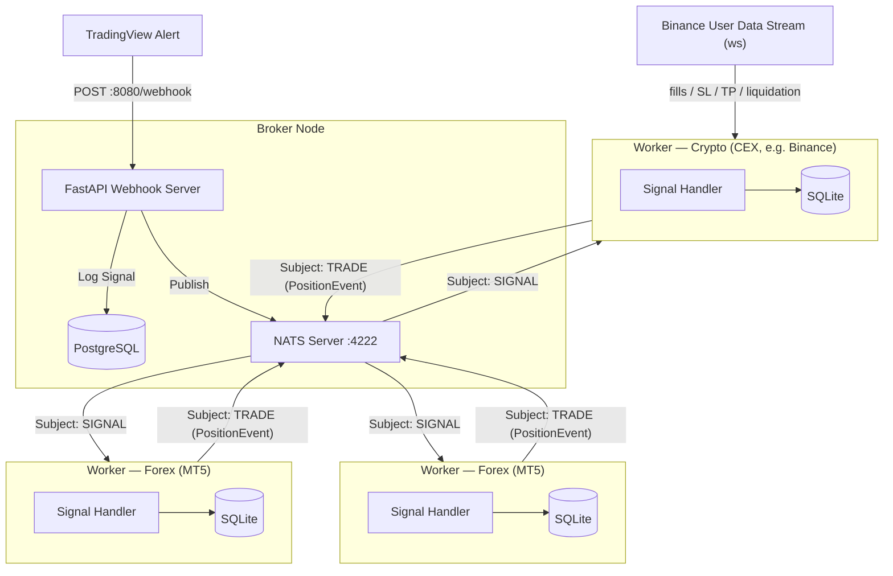
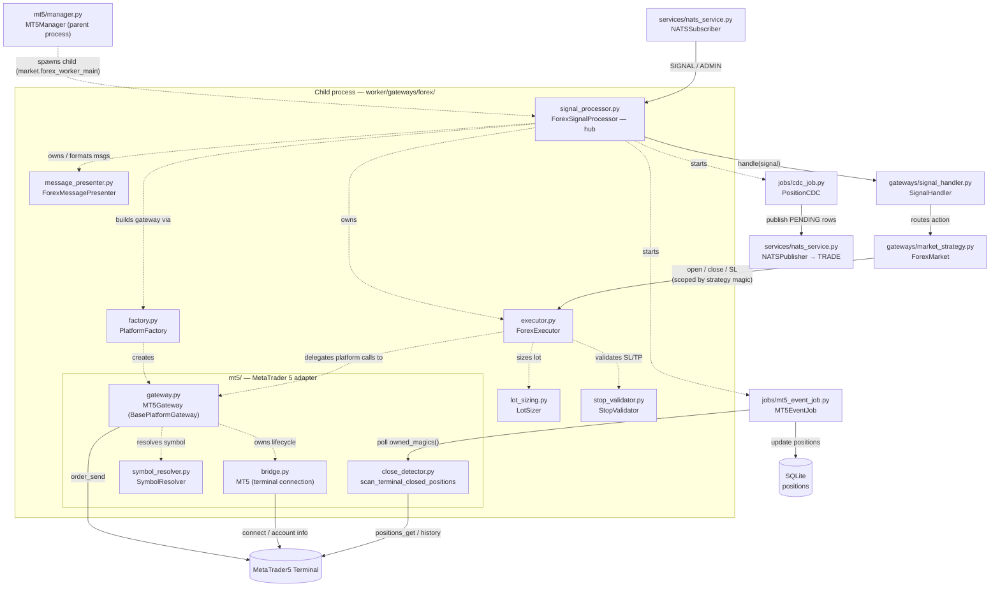

# 🚀 Algo Trading Worker

This is the execution-end of the Event-Driven trading system. It acts as a NATS subscriber waiting for highly structured trading signals from the central Broker, then executes them on the configured market gateway — **FOREX** via the MetaTrader 5 Terminal (Windows) or **CRYPTO** via a centralized exchange such as Binance (any OS). The market is selected by `MARKET_TYPE`, and the two paths share the same NATS/SQLite/notification core through a factory + Template-Method design.

---

## ⚡ Quick Start

### 1. Requirements

Depends on the market:

- **FOREX (`MARKET_TYPE=FOREX`)** must run on **Windows** — the `MetaTrader5` module and the MT5 terminal are Windows-only.
- **CRYPTO (`MARKET_TYPE=CRYPTO`)** is pure Python (REST + websocket) and runs on **any OS** (Linux, macOS, Windows) — no MT5/MetaTrader5 dependency.

### 2. Setup

Because we orchestrate dependencies via `uv`, setup is instantaneous.

```bash
# Creates a virtual environment and installs all dependencies from pyproject.toml
uv sync
```

### 3. Configure .env

Run the interactive initializer — it creates `.env` from `.env.example` (or updates an existing one in place) and walks you through every setting:

```bash
make init
```

- **Defaults everywhere** — each variable shows a default (your current `.env` value if present, otherwise the `.env.example` default); press Enter to keep it.
- **Market-aware** — pick `MARKET_TYPE` (`FOREX` or `CRYPTO`) and it prompts only for the matching credential group: **MT5 connection** for FOREX, or **Crypto CEX / exchange API keys** for CRYPTO.
- **Re-runnable** — existing values are reused as defaults and edited in place (no duplicates); a timestamped `.env.bak-*` backup is written before each update.

The full list of variables and their defaults lives in [`.env.example`](.env.example).

> **FOREX only:** enable **Allow Algo Trading** under *Options → Expert Advisors* in the MetaTrader 5 Terminal before starting the worker.

### 4. Operation

Start the Worker (from the root directory):

```bash
make start
```

The Worker initialises the `worker_data.sqlite` database, starts the market worker, and subscribes to the configured NATS subjects. The worker runs differently per market:

- **FOREX** — in an isolated child **process** (GIL isolation for the MetaTrader5 C extension), supervised by a watchdog. Daemon threads inside it: MT5 health-check, `MT5EventJob` (terminal-close detection), `ForexReconcileJob` (missed-close safety net), `PositionCDC`, and `NotificationJob`.
- **CRYPTO** — in a background **thread** (the pure-Python gateway needs no process isolation). Daemon threads: the exchange user-data event stream (Binance websocket), `CryptoReconcileJob` (missed-fill safety net), `PositionCDC`, and `NotificationJob`.

You can monitor the logs printed directly to the screen. Both markets start the same way (`make start`); `MARKET_TYPE` decides which gateway is loaded.

---

## 📖 Key Concepts

### Market

The `MARKET_TYPE` environment variable defines which trading market the worker operates on:

| Value | Description |
| --- | --- |
| `FOREX` | Foreign exchange — instruments like `XAUUSD`, `EURUSD`, etc. Execution goes through the **MT5** gateway (Windows only). |
| `CRYPTO` | Cryptocurrency — perpetual futures on instruments like `BTCUSDT`. Execution goes through a **CEX** gateway (any OS). |

The market type drives the entire execution path: which gateway is loaded, which environment variables are required, and whether the worker runs as a subprocess (FOREX) or a background thread (CRYPTO).

### Gateway

A gateway is the integration layer between this worker and the actual trading platform. Each market has its own gateway implementation:

| Market | Gateway | Technology |
| --- | --- | --- |
| `FOREX` | **MT5** (`worker/gateways/forex/mt5/`) | MetaTrader 5 terminal via the `MetaTrader5` C extension. Windows-only. Managed as an isolated child process due to GIL constraints. |
| `CRYPTO` | **CEX** (`worker/gateways/crypto/`) | Centralized Exchange via REST + WebSocket. Exchange-agnostic by design — the first concrete implementation is **Binance** Futures (`worker/gateways/crypto/binance/`). Adding a new exchange only requires implementing `BaseExchangeGateway` and registering it in `ExchangeFactory`. |

The selected gateway handles all order execution, position queries, and real-time event streaming (MT5 terminal events for FOREX; exchange user-data WebSocket for CRYPTO). Business logic above the gateway layer is market-agnostic.

---

## ⏰ Clock sync / NTP requirement (CRYPTO)

Binance rejects any **signed** request whose timestamp runs more than **1000 ms
ahead** of server time (error `-1021`); `recvWindow` only forgives a clock that
is *behind*, so it cannot rescue a fast clock. The worker self-defends — it
measures the offset against Binance at `connect()` and re-syncs + retries once on
a `-1021` — but that is a safety net, not a substitute for a correct host clock.

**Fix the source: keep the host clock disciplined by NTP.**

- **Linux host (VPS / server):** enable a time daemon —
  `sudo timedatectl set-ntp true` (systemd-timesyncd), or install `chrony`
  (`sudo apt install -y chrony && sudo systemctl enable --now chrony`). Verify
  with `timedatectl` / `chronyc tracking`.
- **Windows host:** make sure the Windows Time service is running and synced —
  `w32tm /resync` (and `w32tm /query /status` to verify). Clocks commonly drift
  after the machine sleeps/hibernates, the usual cause of `-1021` in dev.

**Verify:** the worker logs the measured skew at startup —
`[Binance] Clock offset vs server: <X> ms (rtt=… ms)`. After NTP is healthy this
should be a few tens of ms (≈ rtt), not seconds. A large offset there, or
repeated `-1021 … re-syncing` warnings, means the host clock is not disciplined.

---

## 🏗️ System Architecture



### Crypto (CEX) integration

`MARKET_TYPE=CRYPTO` selects the crypto worker instead of the MT5 worker. The
crypto path is fully **exchange-agnostic** via the factory pattern and never
imports MetaTrader5 or any `worker.gateways.forex.mt5.*` module:

| Layer | Type | Role |
| --- | --- | --- |
| `worker/gateways/crypto/base.py` | `BaseExchangeGateway` (ABC) | CEX contract: orders, positions, stops, account |
| `worker/gateways/crypto/factory.py` | `ExchangeFactory` | Builds the configured exchange (first: Binance) |
| `worker/gateways/crypto/binance/gateway.py` | `BinanceFuturesGateway` | Binance USDⓈ-M Futures REST via the official `binance_common` transport (signing, retries, rate-limit errors) |
| `worker/gateways/crypto/binance/user_data_stream.py` | `BinanceUserDataStream` | Official-SDK websocket User Data Stream ingesting fills / SL / TP / liquidation / external manual closes (+ pure parser) |
| `worker/gateways/crypto/executor.py` | `CryptoExecutor` | Implements the generic executor protocol over a gateway |
| `worker/gateways/crypto/signal_processor.py` | `CryptoSignalProcessor` | NATS loop + executor/handler + crypto jobs |
| `worker/gateways/crypto/reconcile_job.py` | `CryptoReconcileJob` | Periodic reconciler — diffs DB-open rows against live exchange positions in both directions: marks missed closes, and imports untracked live positions as `MANUAL`-strategy DB rows; two-scan confirmation either way |

Adding a new exchange = implement `BaseExchangeGateway` + register it in
`ExchangeFactory`. No business-logic change.

Binance specifics use the **official** `binance-sdk-derivatives-trading-usds-futures`
(and its `binance_common` transport): REST calls go through `binance_common.send_request`
(HMAC signing, timestamps, retries/backoff, typed rate-limit errors) and the User
Data Stream uses the SDK websocket (auto-reconnect). All of this lives only inside
`worker/gateways/crypto/binance/` — the gateway abstraction keeps it out of the
executor/strategy/processor, so it never leaks upward.

Required env when `MARKET_TYPE=CRYPTO` (Binance): `CRYPTO_API_KEY`,
`CRYPTO_API_SECRET`, `CRYPTO_ACCOUNT_ID`, and `CRYPTO_QUOTE_ASSET` (defaults to
`USDT`) — enforced by the settings validator. `CRYPTO_EXCHANGE` defaults to
`BINANCE`; `CRYPTO_TESTNET` is optional, and `CRYPTO_HEDGE_MODE` (default
`true`) is the Position Mode the worker enforces on the account at startup (see
below). MT5 credentials are **not** required. See `.env.example`.

### Position Mode — Hedge vs One-way (CRYPTO / Binance)

Binance Futures accounts run in one of two **Position Modes**. Rather than
relying on the operator to set it on the exchange (Binance app/web → Futures →
Preferences → Position Mode), the worker **reconciles** the account into
`CRYPTO_HEDGE_MODE` right after connecting — the generic
`BaseExchangeGateway.set_position_mode()` hook, implemented by the Binance
gateway via `POST /fapi/v1/positionSide/dual`. So `CRYPTO_HEDGE_MODE` is the
mode the worker *drives the account into*, and it selects the order payload:

| `CRYPTO_HEDGE_MODE` | Exchange mode | Order payload |
| --- | --- | --- |
| `true` (default) | Hedge | Every order (market open/close, stop-loss, take-profit) carries an explicit `positionSide` (`LONG`/`SHORT`); `reduceOnly` is omitted entirely — Binance rejects it in Hedge Mode. |
| `false` | One-way | No `positionSide` sent; `reduceOnly` marks closing orders instead. Binance infers direction from `side` alone. |

The switch is best-effort: Binance returns `-4059` ("*No need to change
position side.*") when the account is already in the requested mode (treated as
success), and can reject the switch (e.g. `-4068`) when open positions or orders
exist — that is logged and the worker proceeds on the account's current mode, in
which case a mismatch still surfaces as Binance error `-4061` ("*Order's
position side does not match user's setting.*") on the first order.

The worker still only ever tracks **one net position per symbol** regardless
of this setting: it does not open or manage simultaneous LONG and SHORT
positions on the same symbol even when the account is in Hedge Mode. Strategy
isolation on a shared symbol remains logical-only, as described in [Signal
Execution — Key Design Decisions](#-signal-execution--key-design-decisions).

### Per-symbol leverage initialisation (CRYPTO)

USDⓈ-M futures leverage is **sticky on the exchange**: whatever value was set
the last time on a symbol (manually in the UI or by a previous worker run) is
what the next order is sized against. Without an init pass, a sub-account
capped at 5x can silently leave a symbol at its old 20x setting (or vice
versa), and an order can fail with `-2019 Margin is insufficient` even when
risk-sizing math is correct.

`CryptoSignalProcessor` runs `LeverageInitJob` on demand, never at startup. Two
things trigger it, both from the broker (see
[SYSTEM Subject](#-system-subject)): the `crypto_leverage_init` section of the
`WORKER_CONNECTED_ACK` on connect, and a runtime `CRYPTO_LEVERAGE_INIT` broadcast
when an admin changes the account's leverage settings later. Neither one arriving
means no leverage is touched. For each symbol in `CRYPTO_LEVERAGE_INIT_SYMBOLS`:

1. `gateway.get_max_leverage(symbol)` (Binance: `GET /fapi/v1/leverageBracket`)
   returns the account-side ceiling. Sub-account / VIP caps are reflected here
   automatically — a sub-account limited to 5x returns 5; an unrestricted
   account returns the exchange-wide max (e.g. 125 for BTCUSDT).
2. The target is `min(exchange_max, MAX_LEVERAGE_CAP)`.
3. `gateway.set_leverage(symbol, target)` (Binance: `POST /fapi/v1/leverage`)
   applies it.

Some account-level caps (sub-account / VIP tier) are **not** exposed by
`leverageBracket` and surface only when `set_leverage` is POSTed, as a `-4421`
rejection whose message names the real ceiling (e.g. *"…greater than 5x"*). The
gateway parses that ceiling and retries once at it, so the symbol still lands on
its true limit instead of being abandoned. If Binance ever rewords the message
so the parser misses it, `set_leverage` retries one last time at
`min(MIN_LEVERAGE_CAP, target)` — a known-safe floor — rather than leaving the
symbol at its dangerous default. If the account is restricted below that floor,
the retry also fails and the symbol is logged for manual fixing.

| Env var | Default | Purpose |
| --- | --- | --- |
| `CRYPTO_LEVERAGE_INIT_SYMBOLS` | empty (skip) | Comma-separated raw signal symbols to initialise (`BTCUSDT.P,ETHUSDT.P` or `BTCUSD,ETHUSD`). Resolved through the executor's symbol resolver, so the form mirrors how upstream signals address the symbol. |
| `MAX_LEVERAGE_CAP` | `10` | Upper bound applied per symbol. A sub-account at 5x lands on 5; an unrestricted account lands on this cap. |
| `MIN_LEVERAGE_CAP` | `5` | Last-resort floor used only when a `-4421` account cap cannot be parsed from the error message. Set to the lowest leverage your sub-accounts can take; if an account is restricted below it, the retry still fails and the symbol is left for manual fixing. |

Failure modes are isolated: a failed `get_max_leverage` (network blip, symbol
typo) skips that symbol with a warning and **never falls back to the cap**
blindly — picking the cap for an account that is actually limited to 5x is
the failure mode this job exists to prevent. Any uncaught crash inside the
job is logged and swallowed so the worker keeps running; symbols are left at
their current exchange-side leverage until the next trigger.

The pass can be re-triggered at any time — without restarting the worker — via a
[`CRYPTO_LEVERAGE_INIT`](#action-crypto_leverage_init-crypto-runtime) broadcast,
which may also override the symbol set and cap for that one run. It also re-runs
on every reconnect handshake whose ACK carries the section, since the worker
re-announces `WORKER_CONNECTED` after a broker/NATS restart.

---

## 🧩 FOREX Gateway Module Flow (`worker/gateways/forex/`)

How the FOREX files wire together at runtime. `ForexSignalProcessor` is the hub: it builds the platform gateway via `PlatformFactory` (today an `MT5Gateway` — the **only** MT5-coupled code), wraps it in a platform-agnostic `ForexExecutor` (with `LotSizer` + `StopValidator`), formats messages via `ForexMessagePresenter`, and starts the background jobs. The `MT5Gateway` owns the terminal connection (`bridge`) and symbol resolution (`SymbolResolver`). The handler and market strategy are market-agnostic and shared with CRYPTO. Solid arrows are the live signal path; dotted arrows are composition (who builds/owns whom).



---

## 📂 Project Structure

```text
worker/
├── gateways/            # External trading-platform integrations + shared signal pipeline
│   ├── config.py                 # ExecutionConfig value object (risk/volume params)
│   ├── market_strategy.py        # MarketStrategyFactory + ExecutorBackedMarket / Forex / Crypto
│   ├── processor.py              # BaseSignalProcessor — shared NATS loop (Template Method)
│   ├── reconcile_job.py          # BasePositionReconcileJob — shared broker↔DB reconciler (Template Method)
│   ├── signal_handler.py         # Routes signals to the correct execution flow
│   ├── forex/           # FOREX — platform-agnostic layer + per-platform adapters (mt6 slots in beside mt5)
│   │   ├── base.py                   # BasePlatformGateway (ABC) + SymbolSpec / Tick / PlatformPosition
│   │   ├── factory.py                # PlatformFactory — selects the forex platform
│   │   ├── executor.py               # ForexExecutor (TradeExecutorProtocol)
│   │   ├── lot_sizing.py             # LotSizer — risk-based lot-size math
│   │   ├── stop_validator.py         # StopValidator — SL/TP distance validation
│   │   ├── message_presenter.py      # ForexMessagePresenter (Telegram strings)
│   │   ├── reconcile_job.py          # ForexReconcileJob — missed-close safety-net (ticket/slot matching, two-scan confirmation)
│   │   ├── signal_processor.py       # ForexSignalProcessor — forex hooks over the base
│   │   └── mt5/             # First concrete platform — MetaTrader 5 (Windows only)
│   │       ├── gateway.py            # MT5Gateway (BasePlatformGateway over the MetaTrader5 C extension)
│   │       ├── bridge.py             # MT5 terminal connection lifecycle (initialize/login/shutdown)
│   │       ├── symbol_resolver.py    # SymbolResolver — base → tradeable platform symbol
│   │       ├── close_detector.py     # Terminal-close event scanner (polling)
│   │       └── manager.py            # MT5Manager (alias of WorkerProcessManager)
│   └── crypto/          # CRYPTO — centralized exchanges (CEX); any OS
│       ├── base.py                   # BaseExchangeGateway (ABC) + ExchangePosition
│       ├── executor.py               # CryptoExecutor (TradeExecutorProtocol)
│       ├── factory.py                # ExchangeFactory — selects the CEX
│       ├── message_presenter.py      # CryptoMessagePresenter
│       ├── reconcile_job.py          # CryptoReconcileJob — missed-fill safety-net + manual-position import (two-scan confirmation)
│       ├── signal_processor.py       # CryptoSignalProcessor — crypto hooks over the base
│       └── binance/                  # First concrete exchange
│           ├── gateway.py            # BinanceFuturesGateway (official binance_common transport)
│           └── user_data_stream.py   # BinanceUserDataStream (official-SDK websocket) + parser
├── interfaces/          # Protocol types for dependency inversion
│   ├── db_protocol.py            # Segregated persistence protocols
│   ├── executor_protocol.py      # TradeExecutorProtocol (broker-neutral)
│   ├── mt5_executor_protocol.py  # MT5ExecutorProtocol (legacy alias)
│   ├── mt5_gateway_protocol.py   # Mt5GatewayProtocol (MetaTrader5 surface, used by MT5Gateway)
│   ├── publisher_protocol.py     # MessagePublisherProtocol
│   ├── message_sender_protocol.py # MessageSenderProtocol (notifier send_message contract)
│   └── trade_presenter_protocol.py # TradePresenterProtocol
├── jobs/                # Background polling jobs (daemon threads)
│   ├── cdc_job.py                # PositionCDC — Change Data Capture to NATS TRADE
│   ├── mt5_event_job.py          # MT5EventJob — terminal-close detection (FOREX)
│   └── notification_job.py       # NotificationJob — outbox dispatcher (Telegram retries)
├── schemas/             # Pydantic / dataclass data schemas
│   ├── admin_schema.py           # AdminActionEnum + AdminMessageSchema + Specific action Schema (NATS ADMIN subject)
│   ├── inbox_schema.py           # WorkerConnectedSchema / WorkerConnectedAckSchema / WorkerConnectedErrorSchema (WORKER_CONNECTED request/reply handshake)
│   ├── job_schema.py             # LogAuthorEnum (broker / terminal / exchange)
│   ├── trade_result.py           # TradeResult value object (ok()/fail() factories)
│   ├── metatrader_schema.py      # Back-compat re-export of TradeResult
│   ├── nats_schema.py            # NatsSubjectEnum (SIGNAL, ADMIN, SYSTEM, TRADE)
│   ├── notification_schema.py    # NotificationPlatformEnum / NotificationChannelEnum / NotificationModeEnum
│   ├── position_schema.py        # PositionStatusEnum + PositionEvent / PositionEventType
│   ├── signal_schema.py          # Signal validation schemas
│   └── system_schema.py          # SystemActionEnum + SystemSchema envelope + CryptoLeverageInitSchema (NATS SYSTEM subject)
├── services/            # Infrastructure services
│   ├── db_service.py             # Persistence facade (positions, logs, outbox)
│   ├── nats_service.py           # NATSSubscriber & NATSPublisher (over the NatsClient lifecycle)
│   └── notification_service.py   # TelegramNotification + OutboxNotifier wrapper
├── db/                  # SQLite persistence layer
│   ├── connection.py             # Connection factory
│   ├── repository.py             # SQL + gateway-neutral column ↔ app-domain mapping
│   └── schema.py                 # Table DDL (gateway-neutral columns)
├── utils/               # Shared utilities
│   └── logging.py                # Structured logging helpers
├── app.py               # Application factory, FastAPI lifespan
├── context.py           # WorkerContext — market-agnostic services (DB, notifiers, outbox)
├── logger.py            # Structured logging configuration
├── main.py              # Application entry point
├── market.py            # Gateway orchestrators (FOREX=process, CRYPTO=thread) + worker entry points + factory
├── nats_client.py       # NatsClient — single NATS connection lifecycle in a daemon thread
├── process_manager.py   # WorkerProcessManager — generic subprocess supervisor
├── worker_runtime.py    # run_worker() — shared child-process bootstrap
└── settings.py          # Environment & app configuration (grouped nested settings + per-market validation)
```

---

## ⚙️ Settings (`worker/settings.py`)

Configuration is grouped into nested `<specific>Settings` sub-models on the main `Settings`, so related options live together:

| Group | Access | Covers |
| --- | --- | --- |
| `LoggingSettings` | `settings.logging` | `notification_mode`, `log_level` |
| `NatsSettings` | `settings.nats` | `url`, `token`, `subjects` |
| `ForexSettings` | `settings.forex` | `platform`, MT5 `server`/`login`/`password`/`path`/`name` |
| `CryptoSettings` | `settings.crypto` | `exchange`, API keys, `hedge_mode`, leverage caps, … |
| `StrategySettings` | `settings.strategy` | `slippage_deviation`, entry-drift limits, `magic_map`, TP1 overrides |
| `RiskSettings` | `settings.risk` | `capital`, `risk_percentage`, `max_open_orders`, … |
| `TelegramSettings` | `settings.telegram` | `enabled`, tokens, chat ids, error-log hook |
| `DatabaseSettings` | `settings.database` | `file` |
| `WebSettings` | `settings.web` | `host`, `port` |
| `BrokerSettings` | `settings.broker` | `api_url`, `api_key` |

`market_type` and the derived `account_id` stay at the top level (`settings.market_type` / `settings.account_id`).

- **Env vars are unchanged.** Each group is its own `BaseSettings` that reads the same flat variable names as before (e.g. `NATS_URL`, `MT5_LOGIN`, `MAX_LEVERAGE_CAP`) via per-field `validation_alias` — `.env` files and the initializer in `.env.example` need no changes.
- **Flat dict for subprocesses.** `Settings.flat_dump()` reproduces the original flat `settings_dict` (legacy keys, with `SecretStr`/enum values intact) that is handed across the multiprocessing fork boundary and consumed by gateways, factories and presenters via `settings_dict.get("<flat_key>")`. Read config off the nested objects (`settings.nats.url`); consume the fork-boundary dict off the flat keys (`settings_dict["nats_url"]`).

### Telegram chat ids: many chats, and group topics

`TELEGRAM_WORKER_LOG_CHAT_IDS`, `TELEGRAM_PRIVATE_BROADCAST_CHAT_IDS` and `TELEGRAM_LOG_CHAT_ID` all run through the same `notification_service.parse_chat_targets()` — none of them is special — so each can reach several chats and can address a **topic** inside a group that has the Topics feature switched on:

```bash
# Two groups + one topic inside a third, all from one setting
TELEGRAM_PRIVATE_BROADCAST_CHAT_IDS="-1001111111111,@public_channel,-1002173777783_924584"
# The same syntax works for the management chat and the error-log chat
TELEGRAM_WORKER_LOG_CHAT_IDS="-1001111111111,-1002173777783_100"
TELEGRAM_LOG_CHAT_ID="-1002173777783_555"
```

| Entry | Delivered to |
| ----- | ------------ |
| `-1001111111111` | The group/channel itself (a group with Topics enabled gets it in **General**) |
| `@public_channel` | Public channel by username |
| `-1002173777783_924584` | Topic `924584` of supergroup `-1002173777783` |

The `_<topic id>` suffix makes the worker add [`message_thread_id`](https://core.telegram.org/bots/api#sendmessage) to the `sendMessage` call — the Bot API's identifier for "the target message thread (topic) of a forum", and the only way a bot can post into a specific topic rather than General. Both numbers are the ones in the topic's own link: `t.me/c/2173777783/924584` → `-1002173777783_924584` (the chat id is the link's first number prefixed with `-100`).

Notes:

- Only a **numeric** chat id may carry a topic suffix — usernames may contain underscores themselves (`@my_group_2`), so those are never split.
- The suffix is sent *only* when configured: Telegram answers `400 Bad Request: message thread not found` if a `message_thread_id` is passed for a chat that has no such topic.
- Each chat gets its own Bot API call, and one failing chat (bot kicked, topic deleted) is logged without stopping the others; `send_message()` returns `False` if any of them failed.
- Whitespace and empty entries are ignored, and a chat listed twice is only notified once.
- An empty `TELEGRAM_LOG_CHAT_ID` still falls back to `TELEGRAM_WORKER_LOG_CHAT_IDS`, list and topics included.

---

## 🧠 Signal Execution Logic

Every incoming signal is parsed into a `SignalSchema` and passed to `SignalHandler.handle()`, which routes it — based on the `action` field — to the correct method on the market-agnostic `BaseMarketStrategy` (`ForexMarket` or `CryptoMarket`). The action-group logic below is identical for both markets; only the concrete executor/gateway underneath differs.

### Action Groups

| Group | Action(s) | Behaviour |
| --- | --- | --- |
| **1 — Entry** | `LONG` / `SHORT` | Force-close any stale position for the same strategy → open a fresh market order with a hard SL set on the broker/exchange server. Gated by `MAX_OPEN_ORDERS`: an entry that would exceed the open-position cap is rejected (status `REJECTED`) and never sent to the broker. Also rejected when **another** strategy already holds the symbol, unless `FOREX_ALLOW_MULTI_STRATEGY_PER_SYMBOL` is on (FOREX only) — see [Key Design Decisions](#-signal-execution--key-design-decisions). |
| **2 — Partial Exit** | `TP1` | Partial close using the resolved TP1 percent of live volume (or signal `quantity` when `VOLUME_DECISION_ENABLED=false`) → optionally move remaining SL to breakeven (`price_open`). TP1 percent and breakeven flag are resolved from the signal (`tp1_percent`, `move_sl_to_be`) or overridden by config (`USE_CUSTOM_POSITION_TP1_PERCENT` / `TP1_MOVE_SL_TO_BREAKEVEN`). |
| **3 — Full Exit** | `TP2` / `SL` / `R_SL` | Close ALL open volume using the **actual live `position.volume`** — signal `quantity` is intentionally ignored |
| **4 — Flat** | `FLAT` | Close all `OPENED`/`TP1` positions for the strategy+symbol at market price, marks status `FLATTED` |

#### Scale-In (Averaging) Positions

A signal may carry an optional `is_scale_position` boolean and a nested `scaling` object (`tp`, `sl`, `quantity`). **The broker has already applied these multipliers** — `sl`, `tp1`, `tp2`, and `quantity` arrive as their final, scaled values. The `scaling` object is passed through as metadata only. The worker therefore uses the payload's SL/TP/quantity **verbatim** for order entry, notifications, and persistence; it never re-scales them.

The one exception is risk-based sizing. When `VOLUME_DECISION_ENABLED=true`, the worker computes the entry volume itself from risk/capital/SL and **ignores** `signal.quantity`. To keep a scale-in entry proportional, the executor re-applies `scaling.quantity` to that self-computed volume (sizing is linear in risk, so the lot/qty scales by the same factor). `scaling.tp`/`scaling.sl` are never re-applied.

| Mode | What sizes the entry | Where `scaling.quantity` applies |
| --- | --- | --- |
| `VOLUME_DECISION_ENABLED=false` (payload-quantity) | `signal.quantity` (already broker-scaled) | Not re-applied — used as-is |
| `VOLUME_DECISION_ENABLED=true` (risk sizing) | risk % / capital / SL → computed volume | Re-applied to the computed volume |

A signal without `is_scale_position: true` is passed through untouched (any `scaling` object is ignored), and an absent `scaling.quantity` leaves the computed volume unchanged.

```json
{
  "strategy": "MT5_GOLD_M5_V1",
  "timestamp": "2026-04-18T21:55:00Z",
  "action": "LONG",
  "symbol": "XAUUSD",
  "price": 2000.0,
  "quantity": 1.0,
  "sl": 1791.0,
  "tp1": 2222.0,
  "tp2": 2255.0,
  "is_scale_position": true,
  "scaling": { "tp": 1.1, "sl": 0.9, "quantity": 2.0 }
}
```

With the payload above, the worker executes against the SL/TP/quantity exactly as sent (`tp1=2222.0`, `tp2=2255.0`, `sl=1791.0`, `quantity=1.0`). In payload-quantity mode it enters `1.0`; in risk-sizing mode it computes the lot from risk and then multiplies by `scaling.quantity` (`2.0`).

#### FLAT Payload (minimal — no price/quantity required)

```json
{
  "strategy": "MT5_GOLD_M5_V1",
  "signal_uxid": "9f2c4b7e18a3d605",
  "timestamp": "2026-04-18T21:55:00Z",
  "action": "FLAT",
  "symbol": "XAUUSD"
}
```

### Signal-cycle notifications

Two ids travel on every signal and they answer different questions:

| Field | Scope | Used for |
| --- | --- | --- |
| `signal_id` | This one signal — unique per action | **De-duplication**: a signal seen live and again in the ACK replay is recognised by this id |
| `signal_uxid` | The whole trade — the entry and every TP/SL/FLAT that follows share one | **Correlation**: ties every action of one trade to the single Telegram message that reports it |

`signal_uxid` is optional, so a broker that predates the field keeps working — those signals simply fall back to one message per action. When it is present, the worker reports the whole trade in **one channel message that it edits in place**, laid out as three boxes:

```
[⏳ OPENED]                       ← headline: icon + the position's latest status
📈 LONG XAUUSD                     ┐
----------------------------------  │ Box 1 — position: what the trade is,
Price: 2340.15 | Volume: 0.5 lot ⚙️ │ at what price/size, with which levels
SL: 2330 | TP1: 2350 | TP2: 2360   │
Risk: 3% ⚙️ | Ticket: 778899        ┘
----------------------------------
📡 Actions                         ┐
----------------------------------  │ Box 2 — the timeline, one entry per
✅ LONG — Filled                    │ action, appended as the trade moves.
Price: 2340.15 | Volume: 0.5 lot ⚙️ │ The icon is the *outcome*, so a TP1
2026-04-10 22:55:00                 │ the broker refused never looks like a
                                    │ TP1 that hit.
🎯 TP1 — Filled                     │
Price: 2350.4 | Volume: 0.25 lot (TP1 50%)
2026-04-11 15:05:00                ┘
----------------------------------
⚙️ Settings                        ┐
----------------------------------  │ Box 3 — the worker configuration this
VOLUME_DECISION_ENABLED: ENABLED    │ trade ran under (same wording as the
RISK_PERCENTAGE: ENABLED (3.0%)     │ startup banner), which cycle it is,
...                                 │ and the live account footer.
----------------------------------  │
Strategy: MT5_GOLD_M5_V1            │
Signal: 9f2c4b7e18a3d605            ┘
```

The headline status is **the position's**, not the action's: a TP1 the broker refused leaves an `OPENED` position `OPENED`, and once a position is closed (`TP2`/`SL`/`R_SL`/`FLATTED`/…) a late or replayed action can never advertise it as live again. An admin `FLAT` closes out the position's own cycle rather than opening a new message.

Delivery, retries and the `TELEGRAM_CYCLE_ENABLED` toggle are covered in [CycleNotificationJob](#cyclenotificationjob--one-telegram-message-per-trade-workerjobscycle_notification_jobpy).

---

## 🛡️ ADMIN Subject

ADMIN carries out-of-band administrative commands that operate outside the normal strategy signal flow, all handled by the shared `BaseSignalProcessor._handle_admin_message`. Messages travel on **one of two subjects**:

| Subject | Name | Scope | Routing fields |
| --- | --- | --- | --- |
| **Public** | `ADMIN` | Fanned out by the broker to every worker | `market` / `gateway` **optional** filters — **no `account_id`** |
| **Private** | `ADMIN.<market>.<gateway>.<account_id>` | Addressed to exactly one worker | `market` / `gateway` / `account_id` **required** |

Every worker subscribes to the public `ADMIN` subject **and** to its own private `ADMIN.<market>.<gateway>.<account_id>` subject (built from `MARKET_TYPE`, the gateway/platform setting, and the account id — `MT5_LOGIN` for FOREX, `CRYPTO_ACCOUNT_ID` for CRYPTO). This lets the broker target a single account precisely without fanning a message out to everyone.

`AdminActionEnum` actions: **`FLAT`** (both subjects — close positions), and **`BLOCK_SIGNAL`** / **`ALLOW_SIGNAL`** (private subject only — toggle whether the worker executes incoming SIGNALs).

### Action: `FLAT`

Closes open positions across one or more strategies/symbols in a single command.

#### Public subject (`ADMIN`)

The broker fans a public FLAT out to every worker; each filters only on the **optional** `market`/`gateway` dimensions. A public FLAT carries **no `account_id`** (the public subject is not account-scoped — a stray `account_id` field is ignored).

| Filter | Behaviour when present |
| --- | --- |
| `market` | Silently ignored if it does not match the worker's `MARKET_TYPE`; processed normally if it matches or is absent |
| `gateway` | Silently ignored if it does not match the worker's gateway/platform setting (`MT5_PLATFORM` for FOREX, `CRYPTO_EXCHANGE` for CRYPTO); processed normally if it matches or is absent |
| `strategy` | Restricts close to positions whose `strategy` column equals this value |
| `symbol` | Restricts close to positions for this symbol |

Omitting `market`/`gateway`/`strategy`/`symbol` closes every tracked open position on every worker that receives it.

```json
{
  "action": "FLAT",
  "timestamp": "2026-06-02T08:00:00+00:00",
  "strategy": "my_strategy",
  "symbol": "XAUUSD",
  "market": "FOREX",
  "gateway": "MT5"
}
```

#### Private subject (`ADMIN.<market>.<gateway>.<account_id>`)

An account-scoped FLAT is published to a worker's private subject. Here `market`, `gateway`, and `account_id` are **required**: the subject already addresses one worker, and the worker re-validates that all three fields match its own identity before acting (defence-in-depth against a misrouted publish). `account_id` alone is **not** a unique worker identity — the same raw id can collide across markets/gateways (e.g. an email used as `account_id` also matching a CRYPTO gateway name), which is exactly why the full composite `market`/`gateway`/`account_id` is required and re-checked. `strategy`/`symbol` remain optional close filters.

```json
{
  "action": "FLAT",
  "timestamp": "2026-06-02T08:00:00+00:00",
  "strategy": "my_strategy",
  "symbol": "XAUUSD",
  "market": "FOREX",
  "gateway": "MT5",
  "account_id": "123456"
}
```

#### Execution flow

The broker/exchange is always the source of truth: live positions are closed **first**, then the DB is reconciled against what actually closed.

1. Parse the envelope (`AdminMessageSchema`); drop silently on validation error, and dispatch by `action` (`FLAT` below; `BLOCK_SIGNAL`/`ALLOW_SIGNAL` handled separately). An unknown action is logged and ignored.
2. Parse the subject-specific payload — `AdminFlatSchema` (public) or `PrivateAdminFlatSchema` (private, which requires `market`/`gateway`/`account_id`); drop silently on validation error.
3. Route to this worker: on the **public** subject, skip unless the optional `market`/`gateway` filters match; on the **private** subject, skip unless `market`/`gateway`/`account_id` all match this worker's identity. Either way, skip is silent (no log noise).
4. Ensure the broker/exchange connection; abort if unreachable.
5. **Close live positions** (`_close_live_positions_for_flat`): fetch live positions — for a given `symbol` via `get_open_positions(symbol, strategy=…)`, otherwise account-wide via `get_all_open_positions(strategy=…)` — and call `close_single_position(pos, reason="FLAT")` on each. Track every key *attempted* and the subset that *closed successfully*.
6. **Reconcile the DB** (`_reconcile_flat_db`) against the open rows matching the filter. For each DB row:
   - **Matched a successful live close** → update `status → FLATTED`, set `closed_price`/return code, send `⚡ Admin FLAT Closed` Telegram notification.
   - **Never seen live on the broker** (not in the attempted set) → already closed externally → mark `FLATTED` to sync the DB (no order sent).
   - **Close was attempted but failed** → the position is **still live**, so the row is left **OPEN** and flagged loudly for manual attention — the DB never falsely reports a position flat.

### Actions: `BLOCK_SIGNAL` / `ALLOW_SIGNAL`

Toggle whether the worker **executes incoming SIGNALs**. `BLOCK_SIGNAL` suspends signal execution; `ALLOW_SIGNAL` resumes it. Both are **account-scoped**, so they are accepted on the **private subject only** (`ADMIN.<market>.<gateway>.<account_id>`) — the same action arriving on the public `ADMIN` subject is ignored. The payload (`PrivateAdminSignalControlSchema`) requires `market` / `gateway` / `account_id`, and the worker re-validates all three against its own identity before applying the toggle.

While blocked (`_signals_blocked = True`), every incoming SIGNAL is skipped at the single execution funnel `_process_signal` — this covers **both** live signals and the ACK's `retry_signals` replay. Open positions are **untouched**: they can still be closed out-of-band via an `ADMIN` `FLAT`, which is the escape hatch even while signals are blocked. A real state change is logged and sends a `🛑 Signals Blocked` / `✅ Signals Allowed` Telegram notification; repeating the current state is a no-op (no duplicate alert).

The flag is **in-memory only** — a worker restart resets it to *allowed*, and there is no DB/schema change. Durability comes from the broker instead of the worker: it owns the state and replays it in the [`settings` section of the `WORKER_CONNECTED_ACK`](#section-settings) on every handshake, which re-applies the block through this very same setter before the ACK's signal replay runs.

```json
{
  "action": "BLOCK_SIGNAL",
  "timestamp": "2026-06-02T08:00:00+00:00",
  "market": "FOREX",
  "gateway": "MT5",
  "account_id": "123456"
}
```

### Key Design Decisions

- **Broker is the source of truth (close-first, then reconcile):** A DB row is marked `FLATTED` only when its live close actually succeeded *or* the position was never live on the broker. A row whose close was attempted but *failed* is deliberately left OPEN, so the DB can never claim a position is flat while it is still live.
- **Per-market match key, not symbol-only:** The admin FLAT correlates each live position with its DB row via `_flat_match_key` / `_flat_db_match_keys` — FOREX matches by ticket (checking both `ref_id` and `ref_source_id` so re-ticketed positions still match), CRYPTO by resolved exchange symbol. Two FOREX strategies running the same symbol are therefore handled independently.
- **Graceful handling of already-closed positions:** If a position is tracked in SQLite but no longer live on the broker, it is marked `FLATTED` without sending a close order, so the DB stays consistent even after a connectivity gap.
- **`PositionCDC` propagation:** After status updates, the CDC job picks up the `PENDING` rows and publishes `PositionEvent(event=UPDATED, status=FLATTED, …)` to the Broker via the NATS `TRADE` subject — no special handling required.
- **The FLAT never overwrites the stored entry signal:** `positions.gateway_message` holds the *entry* signal JSON, which `PositionCDC` parses for the `signal_id` / `sl` / `tp1` / `tp2` the broker matches a `TRADE` event back to its own order. The ADMIN payload carries none of those, so it is written to the `position_logs` audit trail instead — where per-event history belongs — and the row's entry signal is left intact. (Overwriting it published an update with `signal_id: null` on both the public and the private subject, which the broker could not correlate, so the order was never updated there.)

---

## 🚦 SYSTEM Subject

The `SYSTEM` NATS subject carries the connect handshake and the broker's config pushes. Which of **two paths** a push takes is decided by *when* the config exists, not by what it contains:

| Path | Delivery | Used for |
| --- | --- | --- |
| **Connect-time** | Sections of the `WORKER_CONNECTED_ACK`, on the handshake's private reply inbox | Everything the worker needs before it trades: `settings`, `strategy_magic_map`, `crypto_leverage_init`, `retry_signals` |
| **Runtime** | A standalone action broadcast on the shared `SYSTEM` subject | A setting an admin changes *after* the worker is connected — currently `CRYPTO_LEVERAGE_INIT` |

The split exists because a request reply inbox delivers exactly **one** message (see the handshake section below), so it cannot carry a push that arrives later; the shared subject has no such limit and the worker stays subscribed to it for its whole lifetime, so a broadcast always lands.

Broadcasts are received by `BaseSignalProcessor._handle_system_message`, which validates the common envelope (`action` + `timestamp` + `account_id`), routes by worker identity, then dispatches to the market's `_handle_system_action` hook — CRYPTO handles `CRYPTO_LEVERAGE_INIT`, the base handles none of its own. An action a market does not understand is logged and ignored, so a `SYSTEM` message meant for another market type is harmless (the worker's own `WORKER_CONNECTED`, fanned back out on the shared subject, lands here too and is ignored).

### WORKER_CONNECTED handshake (request/reply)

Right after connecting to NATS, `BaseSignalProcessor._announce_worker_connected` sends `WORKER_CONNECTED` on `SYSTEM` as a NATS **request** (`nc.request`, not a fire-and-forget publish) so the broker always replies on a private inbox rather than staying silent. The broker's reply is one of these actions:

| Reply action | Meaning | Worker behaviour |
| --- | --- | --- |
| `WORKER_CONNECTED_ACK` | The normal reply — carries **all** of this worker's connect-time config in one payload (`settings`, `strategy_magic_map`, `crypto_leverage_init`, `retry_signals` — all optional) | Applies each section that is present (see [WORKER_CONNECTED_ACK payload](#worker_connected_ack-payload-broker--worker-reply)); handshake complete |
| `WORKER_CONNECTED_ERROR` | Broker received it but couldn't process it (missing settings, invalid leverage config, …) | Logged with `reason` for operator attention; not retried — a config problem on the broker side isn't fixed by resending the same request |

> **One reply per request — why the ACK carries everything.** `nc.request` opens a temporary reply inbox, resolves on the **first** message delivered to it, and unsubscribes immediately. A broker that publishes several messages to that inbox has all but the first silently discarded *by the client library*, below the worker's message handler: nothing is logged on either side, and which message "wins" is decided purely by the broker's send order. Splitting connect-time config across several sends is therefore not a delivery race the worker can retry out of — it is guaranteed loss, so every section rides in the single ACK payload.

If the broker doesn't reply within the request timeout (5s), the worker retries with backoff (5s → 10s → 20s, capped) **indefinitely** — the handshake is idempotent on the broker side and gates trading (crypto specifically needs `default_leverage` before it's safe to size an order), so the worker blocks here rather than falling back to running without config. A random 0–500ms jitter is added before the very first attempt only, to desynchronise a reconnect storm (every connected worker reconnects and re-announces at roughly the same instant after a NATS/broker restart). From the 3rd consecutive timeout onward, the retry log escalates from `WARNING` to `ERROR` so it's forwarded to Telegram (`TelegramLogHandler`), alerting an operator that the broker looks unreachable rather than just transiently slow.

Any other reply action is logged as unexpected and ignored — `WORKER_CONNECTED_ACK` and `WORKER_CONNECTED_ERROR` are the only two this worker has a contract for on the reply inbox. In particular a standalone `CRYPTO_LEVERAGE_INIT` is **not** accepted as a reply: on connect it belongs in the ACK's section, and at runtime it belongs on the shared `SYSTEM` subject.

#### WORKER_CONNECTED Payload (worker → broker, request)

```json
{
  "action": "WORKER_CONNECTED",
  "account_id": "CRYPTO-BINANCE-7654321",
  "timestamp": "2026-06-30T00:00:00+00:00",
  "market": "CRYPTO",
  "gateway": "BINANCE"
}
```

#### WORKER_CONNECTED_ACK Payload (broker → worker, reply)

The single reply carrying this worker's whole connect-time config. Every section is optional; an ACK with none of them is just "handshake complete, nothing to apply".

| Field | Market | Behaviour when present | Behaviour when omitted (or `null`) |
| --- | --- | --- | --- |
| `settings` | both | The runtime toggles this account was left with in a previous session (currently `signal_blocked`) — each one is re-applied through the very same code path the runtime ADMIN action uses | Every toggle keeps its current value; on a fresh start that is its default (`signal_blocked` → *allowed*) |
| `strategy_magic_map` | both | `{strategy_name: magic_number}` for the strategies this worker subscribes to. Entries for other strategies are ignored; an explicit `{}` **clears** the worker's magics | The worker's current map is left **untouched** — omitting the section means "nothing to push", so a reconnect ACK never wipes the magics the worker is already trading under |
| `crypto_leverage_init` | CRYPTO | `{symbols, default_leverage}` — runs the [per-symbol leverage initialisation](#per-symbol-leverage-initialisation-crypto) pass before trading | The connect-time pass is skipped, so a worker that wasn't asked never touches exchange leverage. A change made later arrives instead as a runtime [`CRYPTO_LEVERAGE_INIT`](#action-crypto_leverage_init-crypto-runtime) broadcast |
| `retry_signals` | both | A batch of full `SignalSchema` payloads to replay (deduped + age-gated, see below) | Nothing to replay (`[]` is equivalent) |

Applied by `BaseSignalProcessor._apply_worker_connected_ack`, which restores `settings` first, runs the remaining config sections next, and the **replay last**. That ordering is load-bearing: a replayed FOREX entry is routed by its strategy's magic and a replayed CRYPTO entry is sized against the exchange's leverage, so replaying first would fire orders against config that hadn't been applied yet — and because the replay goes through the same `_process_signal` funnel as live traffic, a `signal_blocked` restored *before* it suppresses the batch, while one restored after would arrive a batch of orders too late.

Merging every section into one payload would normally mean one malformed entry takes the whole ACK down, so `WorkerConnectedAckSchema` (`worker/schemas/inbox_schema.py`) validates each section — and each entry within it — **independently**, and a fault costs only the part that is actually broken:

| Fault | Effect |
| --- | --- |
| One malformed value in `settings` | That setting is left at its current value; the other settings in the same section still apply, as do the other sections |
| A `settings` key this worker has no field for | Ignored and reported (the broker believes it is in force, so the version skew is made visible); the known settings still apply |
| One malformed signal in `retry_signals` | That signal is dropped; the rest of the batch still replays and every config section still applies |
| One non-integer magic in `strategy_magic_map` | That strategy is dropped; the other magics still apply (its own signals are then rejected loudly by the unknown-strategy guard) |
| **Every** magic in `strategy_magic_map` unparseable | The section is skipped and the worker's current map is left alone — never stored as `{}`, because an empty map is the broker's explicit *clear my magics* instruction and a parse failure must not be mistaken for one |
| Malformed `crypto_leverage_init` | The leverage pass is skipped; the magic map and replay in the same payload are unaffected |
| Broken **envelope** (bad `account_id` / `timestamp`) | The whole ACK is dropped — it addresses nobody, so there is nothing to apply it to |

Every discarded entry is logged at `ERROR`, one line each (`WORKER_CONNECTED_ACK dropped retry_signals[0] — timestamp: Field required`), so an operator sees exactly what the worker is missing rather than a silent partial apply.

```json
{
  "action": "WORKER_CONNECTED_ACK",
  "account_id": "FOREX-MT5-1234567",
  "timestamp": "2026-06-30T00:00:00+00:00",
  "settings": { "signal_blocked": true },
  "strategy_magic_map": {
    "MT5_GOLD_M5_V1": 20260409,
    "MT5_FX_M15_V2": 20260410
  },
  "crypto_leverage_init": { "symbols": ["BTC", "ETH"], "default_leverage": 10 },
  "retry_signals": [
    {
      "strategy": "MT5_GOLD_M5_V1",
      "signal_id": "be6aac4d-da0d-41a3-9798-14d0d23d3f63",
      "timestamp": "2026-04-10T22:55:00Z",
      "action": "LONG",
      "symbol": "XAUUSD",
      "price": 4858.50,
      "quantity": 6.0000,
      "sl": 4850.00,
      "tp1": 4865.00,
      "tp2": 4870.00
    }
  ]
}
```

##### Section: `settings`

The **runtime toggles** the broker holds for this account, replayed so a worker comes back up in the state an operator left it in. They are the same switches the runtime [ADMIN actions](#actions-block_signal--allow_signal) flip, and the worker keeps them **in memory only** — so without this section a restart silently drops back to the defaults and resumes trading under a block nobody lifted. The broker owns the state; this is how it hands it back.

`BaseSignalProcessor._apply_worker_settings` reads each attribute in turn and applies it through the *same helper the ADMIN action calls*, so restoring a value is indistinguishable from receiving the directive live: the same already-in-that-state no-op, the same log line, the same Telegram alert. Each field is independently optional — `null` (or absent) means "not pushed, leave this setting alone", which is why `signal_blocked` is a nullable bool: `false` is the broker explicitly saying *unblocked*, not the same statement as saying nothing.

| Field | Behaviour when present | Behaviour when omitted (or `null`) |
| --- | --- | --- |
| `signal_blocked` | `true` re-applies the [`BLOCK_SIGNAL`](#actions-block_signal--allow_signal) gate (every SIGNAL — live **and** this ACK's `retry_signals` — is skipped); `false` clears it, exactly as `ALLOW_SIGNAL` does | The gate keeps its current value: its default (*allowed*) after a restart, or whatever ADMIN last set on a reconnect that kept the process alive |

Adding a toggle means adding its field to `WorkerSettingsSchema` (`worker/schemas/inbox_schema.py`) plus one branch in `_apply_worker_settings` that delegates to the existing ADMIN-side setter — the ADMIN path stays the single implementation of *what the setting does*.

##### Section: `strategy_magic_map`

The **per-strategy MT5 magic-number map**. The broker owns this mapping centrally, so it is **no longer configured per worker in `.env`** — `STRATEGY_MAGIC_MAP` in `.env` is now only an offline/legacy fallback default (empty by default), and a broker push always replaces it. It lands during `connect()`, before `start_market_jobs` builds the CDC and terminal-close jobs, so those jobs read the freshly-stored map.

Handled generically by `BaseSignalProcessor._apply_strategy_magic_map` for every market (CRYPTO stores it too — its `PositionCDC` stamps `strategy_code` from it — but has no executor magic to refresh):

1. **Scope to this worker:** keep only entries whose key is one of the strategies this worker subscribes to (its `NATS_SUBJECTS` minus the control subjects, via `_subscribed_strategies()`). Any entry for a strategy the worker does not trade is ignored with a warning, so the worker never claims a magic it shouldn't own.
2. Store the filtered map into the live settings under `strategy_magic_map` — the exact key the old `.env` value populated, so `PositionCDC` and every other consumer read it unchanged.
3. Refresh the already-built executor via the `_set_executor_magic_map` hook. FOREX calls `ForexExecutor.set_strategy_magic_map`, so `_magic_for` (order stamping) and `owned_magics()` (account-wide queries + `MT5EventJob` terminal-close detection) reflect the new map immediately; CRYPTO no-ops.

##### Section: `crypto_leverage_init`

Runs the [per-symbol leverage initialisation](#per-symbol-leverage-initialisation-crypto) pass on connect. The base cannot execute it itself (it imports no exchange SDK), so it hands the parsed section to the `_apply_market_init` market hook, which `CryptoSignalProcessor` overrides to call `_run_leverage_init`. Per-symbol failure isolation and the "never fall back to the cap blindly" guarantee are unchanged; an uncaught crash inside the job is logged and swallowed so it never takes the worker down. The example above shows every section at once as a schema reference — a real ACK carries only the ones that apply to that worker, so a FOREX worker never receives this one.

| Field | Behaviour when present | Behaviour when omitted |
| --- | --- | --- |
| `symbols` | Initialise exactly this list of raw signal symbols | Falls back to `CRYPTO_LEVERAGE_INIT_SYMBOLS` |
| `default_leverage` | Used as the cap — each symbol is set to `min(exchange_max, default_leverage)` | Falls back to `MAX_LEVERAGE_CAP` |

##### Section: `retry_signals`

A replay of recent SIGNALs for the worker's subscribed strategies, so a worker reconnecting after an outage catches up on what it missed. Handled by `BaseSignalProcessor._apply_retry_signals`, identically for FOREX and CRYPTO: each signal is (1) deduped against `position_logs.signal_id` — one we've already processed (successfully or as a REJECT) is skipped — and (2) age-gated against `MAX_RETRY_TIMEOUT` using the signal's own `timestamp`, so a stale entry/exit is dropped rather than fired hours after the market moved. Eligible signals go through the normal `_process_signal` pipeline, so a replayed entry is indistinguishable from a live one, and one failing signal never aborts the rest of the batch.

#### WORKER_CONNECTED_ERROR Payload (broker → worker, reply)

```json
{
  "action": "WORKER_CONNECTED_ERROR",
  "account_id": "CRYPTO-BINANCE-7654321",
  "timestamp": "2026-06-30T00:00:00+00:00",
  "reason": "missing leverage settings for account"
}
```

### Action: `CRYPTO_LEVERAGE_INIT` (CRYPTO, runtime)

The **runtime** counterpart of the ACK's `crypto_leverage_init` section: same payload, flattened into a `SYSTEM` envelope and broadcast to an **already-connected** worker when an admin edits a sub-account's leverage cap or onboards new symbols. It cannot ride in the ACK because the handshake is long over by then, and the reply inbox it used is gone — the shared `SYSTEM` subject, which the worker stays subscribed to for its whole lifetime, is the path that still reaches it.

`CryptoSignalProcessor._handle_system_action` parses `SystemCryptoLeverageInitSchema` and funnels it into the same `_leverage_init_from` → `_run_leverage_init` path the ACK section uses, so both deliveries behave identically; only the log line differs (`via SYSTEM` vs `via ACK`), which is what tells an operator whether a pass was a connect-time init or a runtime change.

| Field | Behaviour when present | Behaviour when omitted |
| --- | --- | --- |
| `symbols` | Initialise exactly this list of raw signal symbols | Falls back to `CRYPTO_LEVERAGE_INIT_SYMBOLS` |
| `default_leverage` | Used as the cap — each symbol is set to `min(exchange_max, default_leverage)` | Falls back to `MAX_LEVERAGE_CAP` |

```json
{
  "action": "CRYPTO_LEVERAGE_INIT",
  "account_id": "CRYPTO-BINANCE-7654321",
  "timestamp": "2026-06-30T00:00:00+00:00",
  "symbols": ["BTC", "ETH"],
  "default_leverage": 10
}
```

`action`, `timestamp` and `account_id` are required; `symbols` and `default_leverage` are optional overrides. `account_id` scopes the broadcast to one worker — every other worker logs a skip and ignores it.

---

## 🧠 Signal Execution — Key Design Decisions

- **Per-strategy position isolation on a shared symbol:** `get_open_positions`, `close_all_positions`, `partial_close_position`, and `update_position_sl` all accept an optional `strategy` parameter that `SignalHandler` populates from `signal.strategy`. This ensures two strategies trading the same symbol (e.g. a Long-only and a Short-only strategy) cannot accidentally touch each other's positions — every entry, exit, and SL update is scoped to the originating strategy. Isolation differs per gateway:

  - **FOREX (magic-based):** Each strategy is assigned a dedicated MT5 magic number, supplied by the broker in the [`WORKER_CONNECTED_ACK`](#section-strategy_magic_map) (stored in settings under `strategy_magic_map`). `open_position` stamps a new order with `_magic_for(signal.strategy)` and `get_open_positions(symbol, strategy)` filters live MT5 positions by that same magic — native MT5-level isolation, no DB lookup. Every FOREX strategy that trades must be mapped (an unmapped strategy raises). Closing operations stamp the closing deal with `pos.magic`, and `owned_magics()` (all mapped values) defines the magics the worker recognises as its own, used by account-wide queries (`get_all_open_positions`) and terminal-close detection (`MT5EventJob`).
  - **CRYPTO (logical):** A centralized exchange holds a single net position per symbol in one-way mode, so there is no magic equivalent (`strategy_code` is `NULL`). Strategy isolation is logical only — enforced by the one-active-per-`(strategy, symbol)` DB invariant and the `strategy` column.

- **Multiple strategies on one symbol — FOREX only (`FOREX_ALLOW_MULTI_STRATEGY_PER_SYMBOL`, default `false`):** By default a `LONG`/`SHORT` entry on a symbol **another strategy already holds** is rejected as a netting conflict (`SignalHandler._handle_entry`, before any cleanup runs). With the toggle on, a FOREX worker lets the entry through and the two strategies hold *parallel* positions on that symbol. The handler asks the market for the capability (`BaseMarketStrategy.allows_multi_strategy_per_symbol`) rather than reading config directly, and only `ForexMarket` ever reports it:

  - **FOREX** can isolate the two: each strategy trades under its own magic number, `get_open_positions`/`close_all_positions` filter on it, and closes/SL edits target a specific ticket (`request["position"]`), so neither strategy can touch the other's orders. Requires a **hedging** account — on a netting account the broker merges both strategies into one position, and the second strategy would own nothing while its exits fail with "No open position". `ForexSignalProcessor._warn_if_multi_strategy_needs_hedging` checks `account_info().margin_mode` once at connect and escalates (log + Telegram) if the account is not hedging; it warns rather than refuses, so a mid-migration deployment still trades. The toggle also makes a **unique magic per strategy** load-bearing, so `Settings` rejects a `STRATEGY_MAGIC_MAP` .env fallback with duplicate magics at startup when it is on.
  - **CRYPTO cannot**, so `CryptoMarket` never reports the capability and the rejection stands regardless of config: `CryptoExecutor.get_open_positions` ignores the `strategy` argument (there is no magic-number equivalent on a CEX) and `cancel_all_orders` is symbol-scoped, so a second strategy's entry would force-close the first strategy's position and wipe its resting SL/TP. `CRYPTO_ALLOW_MULTI_STRATEGY_PER_SYMBOL` only relaxes the redundant `CryptoExecutor._netting_conflict` check behind that guard.

  What the toggle does **not** relax: **one open order per `(strategy, symbol)`**. A strategy re-entering (or scaling into) its own symbol still force-closes and *replaces* its existing position — enforced by the stale cleanup below and the `uidx_positions_one_active_per_strategy_symbol` unique index, which is unchanged. One extra safeguard rides along with the flag: when it is on, a `FLAT` that finds no strategy-scoped position **skips** the unscoped retry (`close_all_positions(strategy=None)`), which would otherwise flatten the other strategies' live positions while cleaning up this one.

- **Stale position cleanup (Entry):** Before opening any new LONG/SHORT, the handler queries the broker/exchange for stale positions belonging to the *same strategy* on that symbol and force-closes them — leaving positions from other strategies on the same symbol untouched. It then reconciles **every** active (`OPENED`/`TP1`) DB row for that `(strategy, symbol)` to `FORCED_CLOSED`, independently of whether the broker still reported a live position: a prior position may have been closed externally (exchange SL/liquidation, a manual close, or a missed close event), leaving an orphaned `OPENED` row the broker no longer reports. Clearing it is required — otherwise the fresh entry below would collide with the one-active-per-`(strategy, symbol)` unique index on insert and leave the new trade live but untracked. Only then is the new position opened.

- **Max-open-orders exposure cap (`MAX_OPEN_ORDERS`):** Before any new `LONG`/`SHORT` is sent to the broker, the shared `BaseSignalProcessor._max_open_orders_rejection` guard counts the active (`OPENED`/`TP1`) positions across **every** strategy and symbol. If the count is already at the cap, the entry is rejected: `_reject_signal` audit-logs it, inserts a `REJECTED` position row (via `PositionRepository.insert_rejected_position`), and sends an `Order Rejected` operator notification — but **no order is placed**. The `REJECTED` row is picked up by `PositionCDC` and forwarded to the broker on the `TRADE` subject with status `REJECTED`, so a blocked signal is visible end-to-end even though nothing was traded. A re-entry or scale-in on a symbol the strategy already holds **replaces** the existing position rather than opening a new slot, so it is never counted against the cap. Exits (`TP1`/`TP2`/`SL`/`R_SL`/`FLAT`) are never gated — a position can always be closed even at the cap. The guard is market-agnostic (identical for FOREX and CRYPTO); `MAX_OPEN_ORDERS=0` disables it.

- **Stale-signal guard (`MAX_ENTRY_DRIFT_R_PERCENT` / `MAX_ENTRY_DRIFT_PERCENT`):** Entries are **market** orders (`TRADE_ACTION_DEAL` on MT5, `MARKET` on a CEX), so they fill at the live quote — never at the `price` the signal was built on. When the market has already run past the signal's own levels, filling it opens a position that is broken from the first tick, so `guard.stale_signal_rejection` rejects it before anything reaches the broker (same `REJECTED` path as `MAX_OPEN_ORDERS` above). Three rules, evaluated against the price the entry would *actually* pay (ask for a LONG, bid for a SHORT; mark price on a CEX — `BaseMarketStrategy.entry_price`):
  - **Already through `tp2`** — the position would open beyond its own target: instantly in loss by at least the spread, with no profit left to capture. Always rejected, no threshold. (Without this, `StopValidator` would silently rewrite the now-unreachable TP to one point above the entry, hiding the problem instead of surfacing it.)
  - **Already through `sl`** — the position would open at or past its stop and be stopped out on entry. Always rejected, no threshold.
  - **Drifted too far** — no level passed yet, but the market has moved enough that the trade no longer resembles the one signalled. Measured as a percentage of the signal's own entry-to-SL distance ("R"), which is why one setting fits every market: `MAX_ENTRY_DRIFT_R_PERCENT=50` means the same thing on BTCUSDT at 100,000 as on EURUSD at 1.08, and tightens automatically for a tight-stop signal — no per-symbol tuning, and no MT5-only `point` unit that a CEX has no equivalent for. `MAX_ENTRY_DRIFT_PERCENT` (percent of price) is the fallback for a signal carrying no SL. Either set to `0` disables that rule; the two level checks above are unaffected.

  Note this is **not** what `SLIPPAGE_DEVIATION` does: that is MT5's `deviation` field, a *maximum tolerance* passed to the broker (an order filling further than that from the requested price is rejected/requoted), and on a **Market Execution** account most brokers ignore it entirely. It cannot stop an entry that is already stale when the quote is read — this guard can. The guard runs last of the three entry guards because it needs a live quote (a tick read / REST round-trip), so an entry already rejected by the DB-only guards never pays for one; a quote that can't be read skips the guard rather than blocking the entry.

- **Entry lot is sized on the stop that is actually placed (FOREX):** `StopValidator` widens an SL that violates the broker's minimum stop distance (`stops_level`), so the order can carry a wider stop than the signal asked for. Risk sizing spreads `risk_cash` over the SL distance, so `ForexExecutor.open_position` validates the stops **before** sizing and feeds the *effective* SL into `LotSizer` — sizing on the signal's narrower stop and then submitting the widened one would silently make the position risk more than `RISK_PERCENTAGE` of capital. When a stop is widened, the sizing log line records both levels.

- **The stops actually placed are what gets recorded (`TradeResult.sl` / `.tp`):** an entry reports back the SL/TP it really registered with the broker, not the signal's requested levels — FOREX after any `StopValidator` adjustment, CRYPTO as the resting orders that were successfully placed (a `tp` of `None` means the take-profit did not register and the position is running without a target). The `position_logs.sl` column and the `Order Filled` notification both read this, and the notification flags a level the broker moved by showing the signal's request beside it. Reading the signal's own numbers back out of a notification while the terminal holds different ones is how an adjusted stop goes unnoticed. Note `position_logs.tp1` deliberately keeps the signal's *partial-close* target — a different concept from the full-exit TP (`tp2`) resting at the broker, which the column does not track.

- **Every close reports its PnL (`TradeResult.profit`):** a close — partial or full, whatever triggered it — books money, so its Telegram notification always carries a `PnL:` line. That covers `Order Filled` for an exit action (`TP1`/`TP2`/`SL`/`R_SL`/`FLAT`), `Force Closed`, `Admin FLAT Closed`, `Terminal Close`, `Exchange Close`, `Position Reconciled` and the emergency close behind `Unprotected Position`. An **entry** carries no such line: it has booked nothing yet, and a `0.00` there would read as a break-even trade. Where the figure comes from differs by market, and each path reports the most authoritative number it can get:

  | Path | Source | Label |
  | --- | --- | --- |
  | FOREX, worker-placed close (signal / FLAT / force close) | the position's deals (`history_deals_get(position=…)`) narrowed to this close's own order, net of commission/swap/fee | `PnL` |
  | FOREX, terminal close (SL / TP / stop-out / manual) | the closing deal the detector already read | `PnL` |
  | FOREX, reconciled close | every deal of the position, summed | `PnL (position total)` |
  | CRYPTO, worker-placed close | `(exit − entry) × qty`, signed by side — or the exchange's `realizedPnl` for the order when there is no usable fill price | `PnL` |
  | CRYPTO, exchange close (SL / TP / liquidation / manual) | the stream's own `realizedPnl` | `PnL` |
  | CRYPTO, reconciled close | the DB row against the approximate close price | `PnL (est.)` |

  `order_send` returns no money figure at all, which is why FOREX reads the deal back (a bounded retry absorbs the terminal's history lag; the close has already succeeded, so a failed read never affects the trade). The CRYPTO product is not an approximation of the exchange's number — a linear USDⓈ-margined contract settles in the quote asset, so it *is* how Binance computes the `realizedPnl` it reports for exchange-side closes; both exclude commission and funding, so the two crypto close paths stay consistent with each other. That product needs a fill price, and Binance can answer a filled MARKET order with `avgPrice=0` **and** `cumQuote=0` (routinely on testnet, occasionally live — the same quirk `_order_result` and the processor's price fallback already work around). With no fill price there is nothing to measure the entry against, and because the processor's repair lands *after* the executor, the PnL would otherwise read `n/a` on every crypto close while the price beside it looked normal. So when the local computation cannot be made, the exchange is asked for that order's own `realizedPnl` (`/fapi/v1/userTrades`) — exact, consistent with the stream's figure, and a round-trip paid only in that case. Only the reconciler estimates, because the close it is reacting to was never observed — hence the distinct labels.

  An amount that could not be read renders `PnL: n/a` rather than disappearing: a dropped line reads as break-even, and `0.00` would be a fabrication. `0.00` is reserved for a close that genuinely broke even. Where one logical exit fans out into several broker closes (a symbol held as multiple tickets, a netted FLAT), the reported figure is their **sum** — unlike `price`/`volume` on the same message, which describe the last fill.

  Both FOREX reads go through `history_deals_get`, which answers a filter that matches nothing with an empty result rather than an error — so every way of reaching for it wrongly costs a permanent `n/a` and nothing else. Both are therefore pinned by tests against a fake that filters and type-checks exactly as the terminal does. Two rules came out of getting it wrong on a live account:

  - **Query by position, narrow in Python.** `ticket=` selects the deals of one **order** (`DEAL_ORDER`) and never a deal by its own ticket — but even asked by order it returned nothing on a live close, for a position the reconciler then read in full through `position=` (`DEAL_POSITION_ID`). So a close reads the position's deals and picks out its own order's here. That narrowing is not optional: the entry deal and any earlier TP1 sit in the same result, and summing them would report the position's running total under a plain `PnL:` label.
  - **Both arguments must be integers.** The reconciler's ticket comes out of the DB, where every reference is TEXT, so `MT5Gateway._as_ticket_id` normalises at the one place that talks to the extension.

  A close reads its PnL *before* the DB status write and the notification, so the retry that absorbs the terminal's history lag is bounded (~1.25 s) and gives up rather than stalling the pipeline. Giving up logs how many deals the position held and which order was missing from them, which is what separates "history unreadable" from "this close has not landed yet" — a distinction a missing `PnL` line cannot make on its own.

- **Data self-healing on inconsistency:** `SignalHandler._get_db_position` enforces the one-active-position-per-(strategy, symbol) invariant at read time. If more than one `OPENED`/`TP1` row is found (possible after a crash before the unique index existed), the oldest row is kept and all extras are immediately marked `FORCED_CLOSED` with an explanatory comment, so the DB self-heals on the next signal rather than silently producing split-brain state.

- **SQLite as source of truth for exit signals:** Before executing any exit action (`TP1`, `TP2`, `SL`, `R_SL`), `SignalHandler` queries the local SQLite `positions` table for a tracked record matching the signal's `strategy + symbol`. If no record is found the signal is rejected — this prevents acting on untracked or already-closed positions. On success, `source_ticket` in the result is always taken from the DB record (not from the live broker ticket) so `_process_message` always updates the correct DB row, even in edge cases where the broker re-tickets a position after a partial close.

- **`source_ticket` Lifecycle Tracking:** The `source_ticket` acts as the unique identifier for a specific trading *position*. When a new trade is opened (Entry), the broker/exchange assigns an ID which becomes the `source_ticket`. When subsequent signals (`TP1`, `TP2`, `SL`, `R_SL`) arrive, they are resolved against the SQLite record to retrieve the original `source_ticket`. For a given trade, the `source_ticket` remains completely constant across its entire lifecycle. This prevents ambiguity across multiple concurrent active trades on different symbols.

- **Ticket-linked partial close (TP1):** The partial close request always carries the original `position=ticket` so MT5 correctly treats it as a partial close rather than an opposing hedge order.

- **TP1 volume — percent-based or signal quantity:** When `VOLUME_DECISION_ENABLED=true`, TP1 closes a percentage of the current live position volume instead of using `signal.quantity`. The percentage is resolved in priority order: if `USE_CUSTOM_POSITION_TP1_PERCENT=true`, always use `POSITION_TP1_PERCENT` from config; otherwise use `signal.tp1_percent` if present, falling back to `POSITION_TP1_PERCENT`. The executor's `normalize_volume()` rounds the result to the broker/exchange's quantity step and clamps it to the `[min, max]` range before sending the order.

- **Actual volume on full close (TP2/SL/R_SL):** The signal `quantity` is **never used** for full exit calculations. The handler reads the live `position.volume` directly from the broker/exchange to avoid dust-lot rounding errors.

- **Breakeven SL after TP1 (configurable):** After the partial close succeeds, whether to move the server-side SL to `price_open` (entry price) is resolved in priority order: `TP1_MOVE_SL_TO_BREAKEVEN` in config (if set, overrides everything) → `signal.move_sl_to_be` (per-trade flag from the broker) → `false` (default when neither is set). When the resolved value is `true`, `update_position_sl` moves the SL to `price_open`, protecting the remaining runner against connectivity loss (a `TRADE_ACTION_SLTP` on MT5, a `STOP_MARKET` on a CEX); if the breakeven SL cannot be placed, the runner is immediately emergency-closed. When `false`, TP1 is partial-close-only: the original entry SL stays in place.

- **Local Execution Forensics (`worker_data.sqlite`):** To aid in immediate execution debugging and lifecycle tracking natively on the VPS, every processed signal is persisted to the local `position_logs` SQLite table. This audit trail captures the full original NATS JSON message, the target order reference (`ref_id`), the originating reference (`ref_source_id`), and all execution context mapping directly back to the Broker's state.

- **GIL-isolated subprocess (FOREX only):** All MT5 and NATS blocking code runs in a separate OS process (`market.forex_worker_main`, via the shared `worker_runtime.run_worker`). The parent FastAPI process only manages subprocess lifetime via `GatewayProcessOrchestrator` + the generic `WorkerProcessManager` (`MT5Manager` is a thin alias), keeping the event loop fully responsive. The manager accepts a `worker_fn` parameter so the entry point is injectable and testable. **CRYPTO** skips this entirely: the pure-Python gateway runs in a background thread (`ThreadGatewayOrchestrator`) under the app.

- **Dependency-injection boundary — the gateway is the seam:** The `MetaTrader5` module is a native C extension that exposes a single **process-global** connection — `mt5.initialize()` / `mt5.login()` mutate ambient process state, and every `mt5.*` call implicitly targets that one connection. There is no connection *object* to construct or pass around, and because the calls are GIL-blocking the connection is confined to the child process and its daemon threads (the parent FastAPI process never imports the module at all). This dictates where dependency injection actually pays off:

  - **`ForexExecutor` depends only on a `BasePlatformGateway`** (built by `PlatformFactory`), never on MetaTrader5. The agnostic order logic — translating a signal into an order, lot-size math (`LotSizer`), stop validation (`StopValidator`) — runs against the gateway contract, so the whole order layer is unit-testable with a fake gateway and runs off-Windows. This mirrors `CryptoExecutor` over `BaseExchangeGateway`.
  - **`MT5Gateway` (the concrete adapter) takes an injected `mt5_api: Mt5GatewayProtocol`.** Its order/data methods (`place_order` / `close_position` / `modify_sl` / `get_symbol_spec` / `get_tick` / `get_positions`) hold the only `mt5.*` call-sites in the order path, so production injects the live `MetaTrader5` module while unit tests inject a `FakeMt5`. Symbol resolution (`SymbolResolver`) takes the same injected handle.
  - **`bridge.py` and `close_detector.py` deliberately call the module-global `MetaTrader5` directly.** `bridge` *owns* the singleton's lifecycle (`initialize` / `login` / `shutdown`), and `close_detector` is a free-function scanner that runs **inside the `MT5EventJob` daemon thread**, reading the very same process-global connection. There is no FastAPI-level composition root in those background threads to thread an injected handle down from, and "injecting" a singleton that can only ever have one real instance would be ceremony with no testability payoff.

- **Hard SL vs. NATS SL — callback gap (mitigated by MT5EventJob):** When a LONG/SHORT is opened, the SL is registered directly on the MT5 server (`request["sl"]`), so MT5 will auto-close the position even if the NATS signal pipeline is delayed. If the hard SL fires before the NATS `SL` signal arrives, `_handle_full_close` finds no open position, returns `success=False`, and no event is published. `MT5EventJob` closes this gap by detecting the disappearance independently and updating the SQLite `positions` table, which then triggers `PositionCDC` to publish the `TRADE` event to the Broker.

- **Notification outbox (store-and-forward):** In-process notification calls (`ctx.notifier` and `ctx.channel_notifier`) do **not** hit the Telegram API directly — they enqueue a row in the SQLite `notifications` table via `OutboxNotifier`. A separate `NotificationJob` daemon thread drains the table every 1 s and performs the actual HTTP send, retrying failed messages with exponential backoff (`5s → 30s → 2m → 10m`) up to `max_attempts` (default `5`). This decouples signal handling from Telegram's availability/latency and prevents Telegram outages from blocking the NATS event loop. **Startup/shutdown banners** are sent **directly** via `ctx.direct_notifier` (bypassing the outbox) so the user sees them immediately — even before the DB/notification dispatcher is ready or after they are torn down.

- **Error-log forwarding (opt-in):** With `TELEGRAM_ENABLED` and `TELEGRAM_LOG_ERRORS_ENABLED` set, `get_logger` attaches a shared `TelegramLogHandler` that forwards every `ERROR`-level (or above) log record to Telegram. `emit` only formats the record and pushes it onto a bounded queue; a background **thread** performs the blocking `send_message`, so logging never stalls the NATS loop and works even inside the FOREX child process (which has no event loop). The handler is process-aware — a forked child (re)starts its own worker thread — and self-limits: a filter drops records from the send path itself (no feedback loop), identical messages are deduplicated within `TELEGRAM_LOG_DEDUP_WINDOW` seconds, and the queue drops records under saturation. `TELEGRAM_LOG_BOT_TOKEN` / `TELEGRAM_LOG_CHAT_ID` route these alerts through a dedicated bot/chat (falling back to `TELEGRAM_BOT_TOKEN` / `TELEGRAM_WORKER_LOG_CHAT_IDS`), and the log chat id takes the same list/topic syntax as every other chat id — see [Telegram chat ids](#telegram-chat-ids-many-chats-and-group-topics).

### MT5EventJob — Terminal-Close Polling (`worker/jobs/mt5_event_job.py`)

`MT5EventJob` runs as a daemon thread inside the child process alongside the NATS signal loop and the MT5 health-check thread. Its sole purpose is to detect positions that the MT5 server closed autonomously — without a corresponding NATS signal reaching the pipeline in time.

#### How it works

Every 5 seconds the job calls `scan_terminal_closed_positions()` (`worker/gateways/forex/mt5/close_detector.py`), which:

1. Calls `mt5.positions_get()` filtered by **every magic number this worker owns** — resolved **per scan** via the `ForexExecutor.owned_magics` callable, not snapshotted when the job was built, because the broker re-pushes `strategy_magic_map` on every `WORKER_CONNECTED_ACK` (a NATS reconnect re-runs the handshake) → `current_tickets`. An empty result logs one `No owned magics — terminal-close detection is INACTIVE` warning, since it makes the job a silent no-op.
2. Diffs against an internal `seen_tickets` set maintained across polls
3. For each ticket that disappeared, calls `mt5.history_deals_get(position=ticket)` and picks the **newest** closing deal (`DEAL_ENTRY_OUT` / `DEAL_ENTRY_OUT_BY`, by `deal.time`). A position can have several: taking the *first* let our own TP1 partial (`DEAL_REASON_EXPERT`, which maps to nothing) mask a later manual close, silently discarding the whole event.
4. Reads `deal.reason` to classify the closure:

| MT5 `deal.reason` | `TerminalCloseReason` | Action |
| --- | --- | --- |
| `DEAL_REASON_SL` | `SL` | DB updated → `PositionCDC` publishes TRADE event |
| `DEAL_REASON_TP` | `TP` | DB updated → `PositionCDC` publishes TRADE event |
| `DEAL_REASON_SO` | `STOP_OUT` | DB updated → `PositionCDC` publishes TRADE event |
| `DEAL_REASON_CLIENT` / `MOBILE` / `WEB` | `MANUAL` | DB updated → `PositionCDC` publishes TRADE event |
| `DEAL_REASON_EXPERT` | *(skipped)* | none — closed by our own `order_send` (covered by [`ForexReconcileJob`](#forexreconcilejob--missed-close-reconciliation-workergatewaysforexreconcile_jobpy)) |

1. For terminal-initiated closures, emits a `TerminalClosedEvent` dataclass carrying: `source_ticket`, `deal_ticket`, `symbol`, `close_reason`, `close_price`, `close_volume`, `close_time`, `entry_price`, `sl`, `tp`, and an `AccountSnapshot`.

On each event the job then:

- **4.1** Sends a Telegram notification with full position and account context.
- **4.2** Writes a row to `position_logs` with `author = 'terminal'` (vs `'broker'` for NATS-triggered rows) and updates `positions.status → TERMINAL_CLOSED`. `PositionCDC` then picks up the pending row and publishes a `TRADE` event to the Broker via NATS.

#### Resilience during MT5 reconnect

| MT5 state | `positions_get()` result | `seen_tickets` | Events fired |
| --- | --- | --- | --- |
| Connected | valid list | updated each scan | normal |
| Disconnected | `None` | **preserved** | none — scan skipped |
| Reconnected | valid list | diff against preserved state | catch-up for any SL/TP that fired during outage |

When `positions_get()` returns `None` (terminal offline), the scan is skipped and `seen_tickets` is left untouched. This prevents false-positive "position closed" events and ensures that once MT5 comes back online, any positions that were closed during the outage are detected on the next scan.

Polling is gated on the **live connection** (`MT5Gateway.is_connected`), not on the FOREX calendar: once the health thread parks the connection for the weekend the job idles rather than logging a "terminal offline" warning every 5 s, but while the terminal is up it keeps scanning — including right through the weekend window, where 24/7 instruments still trade. See [FOREX weekend market-closed handling](#forex-weekend-market-closed-handling).

The job shares the process-level `stop_event` (`multiprocessing.Event`) with the health-check thread and the NATS loop, so it shuts down cleanly as part of the normal worker lifecycle — no independent restart mechanism is needed.

### Position Reconciliation — the shared broker↔DB safety net (`worker/gateways/reconcile_job.py`)

Every market has a channel that reports broker-side closes (FOREX: `MT5EventJob`; CRYPTO: the user-data websocket) and every one of them can miss one. A missed close leaves the row stuck `OPENED`/`TP1` **forever**, which then blocks later signals (`MAX_OPEN_ORDERS`, the netting guard) even though nothing is live on the broker.

`BasePositionReconcileJob` is the market-agnostic backstop behind both: a daemon thread that polls the live broker positions and diffs them against the DB's open rows. It owns the poll loop, the two-scan confirmation, both reconcile directions, and the safety rules below; each market subclasses it and supplies only **how a live position correlates with a DB row** (`_live_keys` / `_db_keys` — the same variation point `BaseSignalProcessor._flat_match_key` / `_flat_db_match_keys` solves for ADMIN FLAT).

| Subclass | Thread | Correlates a row with a live position by | Manual-position import |
| --- | --- | --- | --- |
| `ForexReconcileJob` (`worker/gateways/forex/reconcile_job.py`) | `forex-reconcile`, 60 s | Ticket (`ref_id` / `ref_source_id`) **or** its `(resolved symbol, magic)` slot | not wired (a manual MT5 trade carries a foreign magic, so the worker never owns it) |
| `CryptoReconcileJob` (`worker/gateways/crypto/reconcile_job.py`) | `crypto-reconcile`, 45 s | Resolved exchange symbol (the CEX nets one position per symbol) | wired — see below |

Safety properties, identical for both markets:

- **Two-scan confirmation** — a row must be DB-open *and* broker-flat on two consecutive scans before it is reconciled, absorbing the lag between a fill and the position appearing in (or disappearing from) the broker's position list.
- **No empty-fetch mass close** — if the live-position fetch raises or reports "unavailable", the whole scan is skipped and both suspect sets are left untouched. An API blip or an offline terminal is never read as "everything is flat".
- **Never reconcile what cannot be verified** — if a row's match keys cannot be computed (symbol resolution failed, magic unknown), the row is treated as live and left alone.
- **Idempotent** — only `OPENED`/`TP1` rows are ever handled; a closed row drops out of the next scan.

### ForexReconcileJob — Missed-Close Reconciliation (`worker/gateways/forex/reconcile_job.py`)

`MT5EventJob` is the *primary* close detector for FOREX, but by design it only reports closes the **terminal** initiated: a close carrying `DEAL_REASON_EXPERT` is our own `order_send` and is skipped so the pipeline never double-fires. That leaves a real gap this job closes:

- a **TP1 partial close whose volume equals the whole position** — common when the entry was already at the broker's minimum lot (e.g. `0.01`, as auto-sizing from equity often yields): the partial close flattens the position outright, yet the row stays `TP1`, no terminal event will ever arrive for it, and the next entry on that strategy is rejected as "still open";
- a close that landed while the worker was down, or a ticket that vanished during a reconnect gap.

Every 60 s the job calls `ForexExecutor.get_all_open_positions()` (scoped to the magics this worker owns) and marks any DB-open row matching none of them as closed — after the two-scan confirmation above, so a stuck row clears within ~2 minutes.

#### Ticket **and** slot matching

A row is matched primarily by ticket (`ref_id` / `ref_source_id`, normalised to `str` since the platform reports `int`). Ticket alone is not enough: some brokers **re-ticket** a position after a partial close, and the new ticket appears in neither DB column. So each row also carries its `(resolved symbol, magic)` **slot** key — while any live position occupies that strategy's slot on that symbol, the row counts as live and is never reconciled.

| Row's keys | Live position | Outcome |
| --- | --- | --- |
| ticket `111` | ticket `111`, magic `101` | live — never reconciled |
| `ref_source_id` `111`, `ref_id` `222` | ticket `222` | live — either ref may match |
| ticket `111`, slot `XAUUSDc:101` | ticket `999`, magic `101`, `XAUUSDc` (re-ticketed) | live — slot matched |
| ticket `111`, slot `XAUUSDc:101` | ticket `999`, magic `202`, `XAUUSDc` (another strategy) | **stale** — magics isolate strategies |
| strategy missing from `strategy_magic_map` | any position on the symbol | live — key degrades to symbol-only |
| any | *(none)* | **stale** → reconciled after the second scan |

The slot key is deliberately conservative: it can only ever *prevent* a reconcile, never cause one — the right trade-off when the alternative is marking a live position closed and losing management of it.

#### Connection guards

`MT5Gateway.get_positions` maps `positions_get() → None` (terminal offline) to an empty list, which is indistinguishable from a genuinely flat account and would otherwise reconcile the entire book. Scans are therefore skipped whenever the platform is not connected, **including a re-check before an empty position list is trusted**.

Connectivity — not `is_market_closed()` — is the gate. Scans used to be skipped for the whole weekend window on the assumption that nothing can trade then; 24/7 instruments break that assumption, and a close there went unreconciled all weekend. Only the *cadence* still consults the calendar: the job idles at `MT5_HEALTH_INTERVAL_WEEKEND` when the market is closed **and** the connection has actually been parked, and keeps the normal 60 s cadence otherwise (including a weekday disconnect, so it resumes the moment the health thread reconnects).

#### Missed-close handling (`ForexSignalProcessor._on_missed_close`)

The exact close reason/price is unknown (the deal-history event is what carries those), so the row is marked `TERMINAL_CLOSED` — the same status `MT5EventJob` uses for a platform-side close — with a best-effort mid price (`gateway.get_tick`), an author-`terminal` `position_logs` row, and a comment flagging it as reconciled. `PositionCDC` then publishes the status downstream as usual, and a `Position Reconciled — Closed on Broker` Telegram notification is sent.

### CryptoReconcileJob — Missed-Fill & Manual-Position Reconciliation (`worker/gateways/crypto/reconcile_job.py`)

`CryptoReconcileJob` runs as a daemon thread (`crypto-reconcile`, 45 s poll) alongside the Binance user-data websocket stream, `PositionCDC`, and `NotificationJob`. It is the CRYPTO half of the shared reconciler above (`BasePositionReconcileJob`), and the durability backstop behind the user-data stream: the exchange only exposes positions via a single point-in-time snapshot (no `history_deals_get` equivalent), so instead of classifying a close reason it diffs one `get_all_open_positions()` call (Binance `positionRisk`) against the DB's open rows in **both directions**:

1. **Missed closes** — a DB-open row (`OPENED`/`TP1`) whose resolved symbol is no longer live on the exchange. Backstops the user-data stream for a fill it missed (reconnect gap, handler exception, worker downtime during an SL/TP/liquidation).
2. **Manual opens** — a live exchange position whose resolved symbol matches no DB-open row, i.e. opened directly on the exchange (UI / app / a third party) and never routed through a worker signal. This is the opposite drift from (1), and is what lets **manually-opened positions get imported and managed by the worker** even though they never came from a NATS `SIGNAL`.

#### Two-scan confirmation

Both directions require the same symbol to be flagged on **two consecutive scans** before acting, mirroring `MT5EventJob`'s use of `seen_tickets` across polls:

| Case | Suspect set (kept across scans) | Confirmed action |
| --- | --- | --- |
| Missed close | `_suspected`, keyed by `ref_source_id` | DB-open + exchange-flat this scan **and** the previous one → `handler(row)` |
| Manual open | `_suspected_manual`, keyed by resolved exchange symbol | Exchange-open + DB-untracked this scan **and** the previous one → `manual_handler(pos)` |

This absorbs the brief lag between a fill and its appearance in (or disappearance from) `positionRisk`: a freshly opened worker position is never mistaken for a missed close, and a worker-opened position still mid-persist (DB insert not yet committed) is never mistaken for a manual one. If the live-position fetch itself raises, the entire scan is skipped and **both** suspect sets are left untouched — a transient API error can never be read as "everything is flat" or "everything is manual".

#### Missed-close handling (`CryptoSignalProcessor._on_missed_close`)

The exact close reason/price is unknown (the live user-data event is what normally carries those), so the row is marked `TERMINAL_CLOSED` with a best-effort mark price (`gateway.get_mark_price`) and a comment flagging it as reconciled. `PositionCDC` then publishes the status downstream as usual, and a `Position Reconciled — Closed on Exchange` Telegram notification is sent.

#### Manual-position import (`CryptoSignalProcessor._on_manual_position`)

A confirmed manual position is persisted as a brand-new `OPENED` row so the worker manages it exactly like a signal-opened position from this point on — `PositionCDC` publishes it as a `CREATED` TRADE event, and the existing close backstops (user-data stream, missed-close reconciliation above) later flatten it by resolved symbol, same as any other position:

| Field | Value |
| --- | --- |
| `strategy` | Synthetic `MANUAL` strategy — never a real signal strategy, so it can never collide with the one-active-per-`(strategy, symbol)` invariant |
| `ref_id` / `ref_source_id` | `MANUAL-<symbol>-<uuid8>` — the uuid suffix means a symbol that is manually opened, closed, then re-opened gets a fresh id each time instead of upserting onto the prior, already-closed trade |
| `action` / `volume` / `opened_price` | Read straight off the live `ExchangePosition` (`side`, `volume`, `price_open`) |
| `sl` / `tp1` / `gateway_message` | `None` — there is no originating signal to record |

Idempotency doesn't depend on the generated id: the reconciler only ever imports a symbol the DB isn't already tracking, so the same live position can't be imported twice even though each import mints a fresh id. A `Manual Position Imported` Telegram notification (`CryptoMessagePresenter.position_imported_manual`) is sent per import, with the symbol, side, quantity, entry price, and generated `ref_source_id`.

`manual_handler` is an optional constructor argument on `CryptoReconcileJob` — leaving it unset keeps the job close-only (its original behaviour before manual-position import existed); `CryptoSignalProcessor` wires `_on_manual_position` in when it starts the job.

### PositionCDC — NATS Trade Publisher (`worker/jobs/cdc_job.py`)

`PositionCDC` implements Change Data Capture on the local SQLite `positions` table. It polls every 2 seconds for rows whose `sync_status` is `PENDING` (set automatically on insert or update), serialises them as `PositionEvent` messages, and publishes them to the NATS `TRADE` subject. After a successful publish the row is marked `PUBLISHED`.

#### PositionEvent fields

| Field | Source |
| --- | --- |
| `event` | `CREATED` (first sync) or `UPDATED` (subsequent syncs) |
| `account_id` | Worker account id — `MT5_LOGIN` (FOREX) or `CRYPTO_ACCOUNT_ID` (CRYPTO) |
| `account_name` | `MT5_NAME` (FOREX) or `CRYPTO_ACCOUNT_ID` (CRYPTO) |
| `market` | `MARKET_TYPE` from settings (e.g. `forex`, `crypto`) |
| `gateway` | Gateway/platform name (e.g. `MT5`, `BINANCE`) — sent alongside `account_id` because the raw account id is not unique on its own (it can collide across markets/gateways) |
| `account_balance` / `account_leverage` | Snapshot from the gateway's account (`account_info_fn`) at poll time (CRYPTO reports balance only; leverage is `null`) |
| `signal_id`, `sl`, `tp1`, `tp2`, `risk_percent`, `magic` | Extracted from the original signal JSON stored in `positions.gateway_message` |

The Broker handler is expected to be idempotent (upsert by `market + gateway + account_id + ticket`), so at-least-once delivery is safe even if the worker restarts mid-publish.

### NotificationJob — Telegram Outbox Dispatcher (`worker/jobs/notification_job.py`)

`NotificationJob` is the worker side of the notification outbox pattern. It polls the SQLite `notifications` table every 1 second and dispatches due rows via the appropriate Telegram sender, keeping Telegram I/O completely off the NATS event loop.

#### Routing

The job is constructed with a `{channel → TelegramNotification}` map built by `WorkerContext`:

| `channel` value | Maps to | Backing chat IDs |
| --- | --- | --- |
| `INDIVIDUAL` | `ctx.direct_notifier` | `TELEGRAM_WORKER_LOG_CHAT_IDS` (management) |
| `COMMUNITY` | `ctx.direct_channel_notifier` | `TELEGRAM_PRIVATE_BROADCAST_CHAT_IDS` (signal channels), falling back to `TELEGRAM_WORKER_LOG_CHAT_IDS` when unset |

Both are comma-separated lists and both accept a `-<chat id>_<topic id>` entry to post into one topic of a group — see [Telegram chat ids](#telegram-chat-ids-many-chats-and-group-topics).

In-process callers stay decoupled: they hold an `OutboxNotifier` whose `send_message()` just inserts a row tagged with the right `channel` and `category` — the dispatcher does the routing.

#### Retry semantics

| Outcome | Action |
| --- | --- |
| Success (HTTP 200 for every chat ID) | `DELETE` the row (hard-delete; no `status` column required) |
| Partial / total failure | `attempts += 1`, set `next_attempt_at = now + backoff[attempts]`, store `last_error` |
| `attempts >= max_attempts` (default `5`) | Row becomes dead-letter — skipped by the polling query and left in place for inspection |

Backoff schedule (indexed by attempt, capped at last): **5s → 30s → 2m → 10m**. The polling query is `WHERE attempts < max_attempts AND (next_attempt_at IS NULL OR next_attempt_at <= now)` and is served by the `idx_notifications_pending` index.

#### Direct-send escape hatches

Two notification paths intentionally bypass the outbox:

1. **Startup / shutdown banners** sent via `ctx.direct_notifier` — must surface even before `NotificationJob` is running or after it has been torn down.
2. **NATS connection events** still go through the outbox via `ctx.nats_enqueue`, but they use the `NATS_EVENT` category so they can be filtered out of analytics if desired.

### CycleNotificationJob — One Telegram message per trade (`worker/jobs/cycle_notification_job.py`)

Every action of one trade folds into a **single** channel message that is **rewritten in place** as the trade progresses, instead of an entry, a TP1, a TP2 and a FLAT arriving as four unrelated boxes a reader has to stitch together by eye. A trade is identified by the broker's `signal_uxid` (see [Signal-cycle notifications](#signal-cycle-notifications)); the write and the send are split across two halves that never call each other:

| Half | Class | Responsibility |
| --- | --- | --- |
| Writer | `CycleNotifier` (`worker/services/cycle_notification_service.py`) | Appends the action to the cycle's timeline, re-renders the whole body, stores it. Never touches Telegram. |
| Reader | `CycleNotificationJob` | Polls every 1 s for chats whose message is behind the cycle, and posts or edits. |

Splitting them is what makes delivery recoverable: the timeline is durable the moment the signal is executed, so a Telegram outage can neither delay a signal nor lose an action.

#### Delivery semantics

Unlike the outbox — where a row is sent once and deleted — nothing here is ever deleted, and "delivered" means *this chat has been shown revision N*:

| Chat state | Action |
| --- | --- |
| No `message_id` yet | `sendMessage`, store the id Telegram returns |
| `message_id` present | `editMessageText` on that same message |
| Edit → `message is not modified` | Counted as delivered (a no-op edit; re-posting would duplicate the trade) |
| Edit → message deleted / too old | Forget the `message_id`; the next pass posts a fresh message |
| Anything else failed | `attempts += 1`, back off **5s → 30s → 2m → 10m**, dead-letter at `max_attempts` |

Ordering is guarded by a `revision` counter: recording an action bumps the cycle's `revision`, each chat records the highest `delivered_revision` it has been shown, and `delivered_revision` only ever moves forward. A slow edit therefore can never overwrite a newer body with an older one — a burst of signals on one trade always renders in order.

#### Falling back to per-action messages

The cycle takes over reporting only when it can. `CycleNotifier.record()` returns `False` — and the caller sends the standalone message it always sent — when:

- the signal carries **no `signal_uxid`** (a broker that predates the field: there is nothing to group actions by);
- `TELEGRAM_CYCLE_ENABLED=false`, `TELEGRAM_ENABLED=false`, or no channel chat resolves (the same list `ctx.channel_notifier` posts to: `TELEGRAM_CHAT_CHANNEL_ID`, falling back to `TELEGRAM_CHAT_ID`);
- `NOTIFICATION_MODE` is not `VERBOSE` (SILENT suppresses the community channel, exactly as for the outbox);
- the cycle write itself failed.

Exactly one of the two fires — never both, never neither.

### ForexExecutor Primitives (`worker/gateways/forex/executor.py`)

`ForexExecutor` implements the broker-neutral `TradeExecutorProtocol` (the same surface `CryptoExecutor` provides), delegating every platform call to its injected `BasePlatformGateway`:

| Method | Used By |
| --- | --- |
| `open_position(signal)` | Entry (Group 1) |
| `partial_close_position(symbol, close_volume, position_ticket?, strategy?)` | TP1 (Group 2) |
| `update_position_sl(symbol, new_sl, position_ticket?, strategy?)` | TP1 breakeven update |
| `close_all_positions(symbol, reason, strategy?)` | Full exit (Group 3) & broker FLAT |
| `close_single_position(pos, reason)` | Admin FLAT — closes one position by position object |
| `get_open_positions(symbol, strategy?)` | Pre-flight guard in all groups |
| `get_all_open_positions(strategy?)` | Admin FLAT — all positions, by strategy |
| `convert_quantity_to_lots(symbol, quantity)` | Entry & TP1 volume calc |
| `normalize_volume(symbol, volume)` | Rounds/clamps volume to broker lot step & limits |

Risk-based entry sizing (`calculate_lot_size`) and lot-step rounding live in the `LotSizer` collaborator; `_resolve_entry_volume` invokes it internally during `open_position`.

---

## 🗄️ SQLite Schema (`worker_data.sqlite`)

Three tables are created on startup by `db_init()` using WAL journal mode. There are no runtime migrations — the schema is created from scratch (drop the sqlite file to recreate).

The `positions` / `position_logs` columns are **gateway-neutral** because the same tables back both markets (FOREX/MT5 and CRYPTO/CEX). `worker/db/repository.py` is the single boundary that maps these physical columns to the application-domain names callers use (and parses the TEXT ref ids ↔ `int`), so the NATS `PositionEvent` contract and consumers are unaffected:

| DB column (generic) | App-domain key | Notes |
| --- | --- | --- |
| `ref_id` | `ticket` | TEXT in DB, `int` in app |
| `ref_source_id` | `source_ticket` | TEXT in DB, `int` in app |
| `strategy_code` | `magic` | INTEGER (MT5 magic; `NULL` for crypto) |
| `gateway_return_code` | `mt5_retcode` | INTEGER broker/exchange status code |
| `gateway_message` | `message` | Raw signal/event JSON |

### `positions` — Live position state

The canonical record for each open trade. `PositionCDC` watches this table for `sync_status = PENDING` rows to publish as NATS `TRADE` events.

| Column | Type | Description |
| --- | --- | --- |
| `id` | INTEGER PK | Auto-increment row ID |
| `ref_source_id` | TEXT UNIQUE | Originating order/position reference at open — never changes across the position's lifetime |
| `ref_id` | TEXT | Current order/deal reference (may differ from `ref_source_id` after a partial close re-tickets) |
| `strategy` | TEXT | Strategy name from signal (e.g. `MT5_GOLD_M5_V1`) |
| `symbol` | TEXT | Instrument symbol (e.g. `XAUUSD`, `BTCUSD`) |
| `action` | TEXT | `long` or `short` |
| `volume` | REAL | Lot/contract size at open |
| `opened_price` | REAL | Fill price at entry |
| `closed_price` | REAL | Fill price at close (null while open) |
| `status` | TEXT | See **Position Status Lifecycle** below |
| `gateway_return_code` | INTEGER | Last broker/exchange return code |
| `comment` | TEXT | Last broker/exchange comment string |
| `gateway_message` | TEXT | Full original signal JSON (used by `PositionCDC` to extract `signal_id`, `sl`, `tp1`, etc.) |
| `strategy_code` | INTEGER | Broker isolation handle (MT5 magic; `NULL` for crypto) |
| `market_type` | TEXT | `FOREX` / `CRYPTO` tag |
| `sync_status` | TEXT | `PENDING` → `PUBLISHED` — drives CDC delivery |
| `sync_time` | DATETIME | Timestamp of last successful publish |
| `created_at` / `updated_at` | DATETIME | Row timestamps; `updated_at` is used as an optimistic-lock key in `mark_position_synced` |

#### Constraints

A partial unique index `uidx_positions_one_active_per_strategy_symbol` enforces at most one `OPENED` or `TP1` row per `(strategy, symbol)` pair. Closed/force-closed rows are unrestricted. The index is created together with the table (`CREATE UNIQUE INDEX IF NOT EXISTS`).

#### Position Status Lifecycle

```text
(entry rejected) ──► REJECTED           (entry guard: open-order cap / symbol already
                                         held / stale signal — never sent to broker)

OPENED ──► TP1 ──► TP2
       │         └──► SL
       │         └──► R_SL
       │         └──► TERMINAL_CLOSED  (MT5EventJob: SL/TP/Stop-Out fired server-side)
       │         └──► FORCED_CLOSED    (new entry signal arrived while position open)
       └──► FLATTED                    (FLAT signal)
```

| Status | Set by | Meaning |
| --- | --- | --- |
| `OPENED` | Entry signal (or `CryptoReconcileJob` manual-position import, `strategy=MANUAL`) | Position is live |
| `TP1` | TP1 signal | Partially closed; runner is still active |
| `TP2` | TP2 signal | Fully closed at take-profit 2 |
| `SL` | SL signal | Fully closed at stop-loss (NATS-triggered) |
| `R_SL` | R_SL signal | Fully closed at revised stop-loss |
| `TERMINAL_CLOSED` | `MT5EventJob` / exchange event / either market's reconcile job | Broker/exchange closed the position (SL/TP/Stop-Out/manual) before a NATS signal arrived, or the reconciler found the position gone from the broker while the row was still open |
| `FORCED_CLOSED` | New entry signal / liquidation | Position was force-closed (opposing/same-direction entry, or a crypto liquidation) |
| `FLATTED` | FLAT signal | Position was closed by an administrative flat command |
| `REJECTED` | `MAX_OPEN_ORDERS` / open-order-per-symbol / stale-signal guard | Entry blocked by a worker-side policy before it reached the broker — recorded for audit and forwarded to the broker, but no order was placed |

### `position_logs` — Immutable execution audit trail

An append-only log of every signal processed and its execution result. Never updated — only inserted.

| Column | Type | Description |
| --- | --- | --- |
| `strategy` / `symbol` / `action` | TEXT | Signal identity |
| `ref_id` / `ref_source_id` | TEXT | Order/deal references at time of execution (`ticket` / `source_ticket` in the app) |
| `volume` / `price` / `sl` / `tp1` | REAL | Execution parameters |
| `gateway_return_code` | INTEGER | Broker/exchange result code (`10009` = MT5 filled, etc.) |
| `gateway_message` | TEXT | Full signal/event JSON |
| `market_type` | TEXT | `FOREX` / `CRYPTO` tag |
| `author` | TEXT | `broker` (NATS signal), `terminal` (MT5 detection), or `exchange` (CEX event) |
| `timestamp` | DATETIME | Wall-clock time of insertion |

### `notifications` — Telegram outbox (store-and-forward)

A durable queue of pending Telegram messages. `NotificationJob` polls this table every 1 s, sends due rows, and hard-deletes on success. Failed sends increment `attempts` and reschedule via exponential backoff (`5s → 30s → 2m → 10m`). Rows whose `attempts >= max_attempts` become dead-letters and are left in place.

| Column | Type | Description |
| --- | --- | --- |
| `id` | INTEGER PK | Auto-increment row ID |
| `platform` | TEXT | `TELEGRAM` (extensible to Slack/Discord/etc.) |
| `channel` | TEXT | `INDIVIDUAL` (management chat) or `COMMUNITY` (signal channels) |
| `category` | TEXT | Free-form tag (e.g. `TRADE_EVENT`, `MT5_MANAGEMENT`, `NATS_EVENT`) for filtering/analytics |
| `message_text` | TEXT | HTML payload sent to Telegram |
| `mode` | TEXT | `VERBOSE` / `SILENT` / `ERROR` from `NOTIFICATION_MODE` (default `VERBOSE`). `INDIVIDUAL` rows are always enqueued `VERBOSE`; only `COMMUNITY` rows carry the configured mode |
| `attempts` | INTEGER | Number of failed delivery attempts so far |
| `max_attempts` | INTEGER | Cap (default `5`); row becomes dead-letter when reached |
| `last_error` | TEXT | Error string from the last failed attempt |
| `next_attempt_at` | DATETIME | Earliest retry time; `NULL` = ready immediately |
| `created_at` / `updated_at` | DATETIME | Row timestamps |

Indexed on `(next_attempt_at, id)` to make the dispatcher's poll query O(log n).

### `notification_cycles` / `notification_cycle_chats` — One message per trade

Notification state, not trade state: dropping these tables loses chat formatting, never a position. A cycle holds the whole timeline of one trade plus the body last rendered from it; a chat row holds the id of the message being edited in that chat.

**`notification_cycles`**

| Column | Type | Description |
| --- | --- | --- |
| `id` | INTEGER PK | Auto-increment row ID |
| `signal_uxid` | TEXT | The broker's trade-cycle id, shared by the entry and every close that follows |
| `strategy` | TEXT | Part of the cycle key — a uxid is only unique within the strategy that minted it |
| `symbol` | TEXT | Instrument the trade is on |
| `status` | TEXT | Latest position status (`OPENED`/`TP1`/…/`FLATTED`, plus `FAILED`/`REJECTED` when nothing opened) — the message's headline |
| `events` | TEXT | JSON array: the full timeline, one entry per action the worker executed |
| `message_text` | TEXT | The body rendered from `events`, ready to send or edit |
| `revision` | INTEGER | Bumped on every recorded action; drives what each chat still owes |
| `created_at` / `updated_at` | DATETIME | Row timestamps |

Unique on `(strategy, signal_uxid)`.

**`notification_cycle_chats`**

| Column | Type | Description |
| --- | --- | --- |
| `id` | INTEGER PK | Auto-increment row ID |
| `cycle_id` | INTEGER | The cycle this delivery belongs to |
| `chat_id` | TEXT | One entry of `TELEGRAM_CHAT_CHANNEL_ID` |
| `message_id` | TEXT | Telegram's id for the message being edited; `NULL` = nothing posted yet |
| `delivered_revision` | INTEGER | Highest cycle revision this chat has been shown; only ever moves forward |
| `attempts` / `max_attempts` | INTEGER | Retry bookkeeping, dead-letter at the cap (default `5`) |
| `last_error` | TEXT | Error string from the last failed attempt |
| `next_attempt_at` | DATETIME | Earliest retry time; `NULL` = ready immediately |
| `created_at` / `updated_at` | DATETIME | Row timestamps |

Unique on `(cycle_id, chat_id)`, and indexed on `(delivered_revision, next_attempt_at, id)` for the dispatcher's poll.

---

## 🔄 Process Lifecycle & Watchdog

How the worker is hosted depends on the market (`create_market_orchestrator`):

- **FOREX** — a child **process** (the parent FastAPI process never loads the MT5 C extension), supervised by a watchdog:

  ```text
  FastAPI (parent)
    └── GatewayProcessOrchestrator (FOREX)
          ├── WorkerProcessManager.start()  — spawns child process
          ├── Watchdog task                 — checks every 10 s (WATCHDOG_INTERVAL)
          │     └── if child died → WorkerProcessManager.restart()
          └── WorkerProcessManager.stop()   — on FastAPI shutdown
  ```

- **CRYPTO** — no GIL isolation needed (pure-Python gateway), so it runs in a background **thread** under the FastAPI app (`ThreadGatewayOrchestrator`, same watchdog/restart contract as FOREX), launched the same way via `make start`.

Daemon threads running alongside the NATS message loop:

| Thread | Markets | Interval | Purpose |
| --- | --- | --- | --- |
| `forex-health` | FOREX | 15 s (`MT5_HEALTH_INTERVAL`); 15 min while market closed | Checks MT5 connection; sends Telegram alert on disconnect/reconnect, and relaunches/restarts the terminal when needed. Parks the connection over the weekend-closed window (see below) |
| `MT5EventJob` | FOREX | 5 s; paused only while the terminal connection is parked | Detects terminal-side position closes (SL/TP/Stop-Out/manual) |
| `binance-user-stream` | CRYPTO | push | Websocket user-data stream → exchange-side fills / SL / TP / liquidation |
| `forex-reconcile` | FOREX | 60 s; paused only while the terminal connection is parked | `ForexReconcileJob` — polls live platform positions; reconciles DB-open rows that match no live ticket/slot on two consecutive scans (missed-close safety net, incl. a TP1 partial that closed the whole position) |
| `crypto-reconcile` | CRYPTO | 45 s | `CryptoReconcileJob` — polls live positions; reconciles DB-open rows that are exchange-flat on two consecutive scans (missed-fill safety net) and imports exchange-open positions untracked in the DB (manual opens) on two consecutive scans |
| `PositionCDC` | both | 2 s | Publishes `PENDING` position rows to NATS `TRADE` subject |
| `NotificationJob` | both | 1 s | Drains the `notifications` outbox and dispatches Telegram messages (with exponential-backoff retries) |

All threads share the same `stop_event` — a `multiprocessing.Event` for FOREX, a `threading.Event` for CRYPTO — and exit cleanly when it is set.

### FOREX weekend market-closed handling

The FOREX market is closed from **Friday 22:00 UTC to Sunday 22:00 UTC**, when the broker's trade server is offline for its weekly maintenance. During this window MT5 legitimately reports "disconnected" — it is **not** a crash, and reconnecting cannot succeed until the market reopens. Left unchecked, the `forex-health` thread would treat it like a weekday outage and hammer the server every 15 s (up to 15 reconnect attempts, then `taskkill terminal64.exe` + relaunch + 15 more), flooding the logs and Telegram all weekend.

Only `forex-health` is driven by the calendar (`is_market_closed()` in `worker/settings.py`, `True` inside the Fri 22:00 → Sun 22:00 UTC window). The two close-detection jobs are driven by the **connection** instead:

| Thread | While the market is closed |
| --- | --- |
| `forex-health` | Closes the MT5 connection **once** (`gateway.close()`), sends a single **"Market Closed"** Telegram notice, then idles at `MT5_HEALTH_INTERVAL_WEEKEND` (default 15 min) — no reconnect attempts, no terminal relaunch — until the market reopens. |
| `MT5EventJob` | Keeps its 5 s polling **while the terminal is still connected**, and only pauses (at the 15-min cadence) once `forex-health` has parked the connection — a closed connection makes `positions_get()` return `None`, so without that it would warn on every scan. |
| `forex-reconcile` | Same rule: normal 60 s cadence while connected, 15-min idle once the connection is parked. |

> **Why not gate the close detectors on the calendar too?** Because a broker's **24/7 instruments** — crypto CFDs such as `BTCUSD` — trade straight through the FOREX weekend window. The terminal stays up (the health thread parks it only at its *next* check, up to 15 min in), signals still fill, and positions can still be closed by hand in the terminal. Gating on `is_market_closed()` made both detectors sleep through exactly that: a manual weekend close was never reported, the row stayed `OPENED`, and it blocked every later signal on the symbol until an operator sent an ADMIN FLAT. Connectivity is the only state that actually makes `positions_get()` meaningless, so it is the only thing that gates a scan.

On **reopen** (Sunday 22:00 UTC = Monday 05:00 UTC+7) the first health check reconnects through the normal path and emits the usual *reconnecting → connected* Telegram pair; both jobs resume their normal cadence and catch up on anything that fired while the connection was parked (`MT5EventJob` still holds the pre-park `seen_tickets`, so a close during the window surfaces on the first scan after reconnect). Open-market behaviour is otherwise unchanged — a genuine disconnect still triggers the full aggressive relaunch/reconnect path immediately.

The window and cadence are module constants in `worker/settings.py`:

| Constant | Default | Meaning |
| --- | --- | --- |
| `MARKET_CLOSE_HOUR_UTC` | `22` | Friday: market is closed at/after this UTC hour |
| `MARKET_OPEN_HOUR_UTC` | `22` | Sunday: market reopens at/after this UTC hour |
| `MT5_HEALTH_INTERVAL_WEEKEND` | `900` (15 min) | Health-check / poll cadence while the market is closed |

> **DST note:** `22:00 UTC` matches the New-York close (17:00 ET) in winter. During northern-hemisphere summer the market opens/closes an hour earlier — set both hour constants to `21` if your broker follows it.
